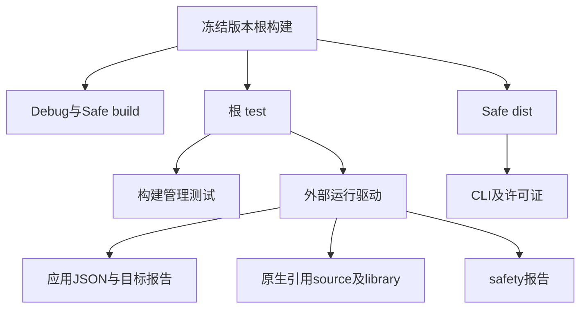
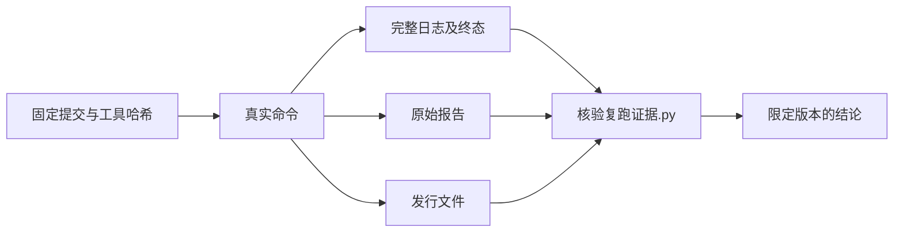

# 根目录完整复跑实施记录

## IDEA

- Intent：在同一干净源码版本上完成根构建、完整测试和安全模式发行门禁，留下可追溯的真实结果。
- Data：冻结提交、源码树、七个入口文件哈希、本地 Zig 归档和 Z3 哈希、完整构建日志、每模式39份外部报告、发行产物哈希、实际终态记录。
- Edges：仅证明 `ebe3d60553c01252fd13341ab6e7304e4737dd2b`。后续 main 的类型表、名义来源及引用重映射实现不继承本次结论。根目标未包含的硬件求值、发布平台和可选门禁须独立执行；缓存步骤不转换为本次实际测试数量。
- Answer：保存各模式的成功终态、原始报告及核验程序；独立英文 Conventional Commit 并 push。不增加新目录用例，不改生产源码。

## 固定输入

源码检出位于 `/Users/xiewendao/.codex/worktrees/native-reference-conformance/zxc`，开始和证据核验时均无工作区改动。源码树为 `384392a37b5773294830d32e8ace96328c44b502`。

命令显式传入同一本地 Zig 归档及 `ZXC_TEST_SOLVER`。路径和完整 SHA-256 保存在[复跑起点](复跑起点.json)。本机根构建的优化模式是 `debug`、`safe`；文档中的 Debug、ReleaseSafe 为面向读者的模式名称。

## 门禁结果

| 门禁                  | 步骤      | 本次实际构建管理测试        | 测试步骤缓存命中 | 退出码 |
| --------------------- | --------- | --------------------------- | ---------------- | ------ |
| Debug build           | 35/35     | 不适用                      | 不作测试结论     | 0      |
| Debug test            | 5752/5752 | 87545/87545，1220个执行步骤 | 33               | 0      |
| ReleaseSafe build     | 35/35     | 不适用                      | 不作测试结论     | 0      |
| ReleaseSafe test 续跑 | 5752/5752 | 19610/19610，314个执行步骤  | 939              | 0      |
| ReleaseSafe dist      | 34/34     | 不适用                      | 不作测试结论     | 0      |

两个模式的测试执行步骤加缓存步骤均为1253。构建树只对实际执行步骤输出数字测试数量；缓存步骤的声明数量记录为 `null`，不推算。构建管理测试数量也不等于唯一 Test262 文件、目录 ID 或断言总数。

TypeScript 直接类型检查成功，原始日志为空，退出码保存在起点记录。预检的61份历史格式差异未为本次任务重写；完整根门禁成功也不代表全仓库格式检查成功。

## 中断及续跑

第一次 ReleaseSafe test 在用户轮次中断后已无执行进程，工具句柄无法取得终态，日志没有 Build Summary。该执行的退出码保持 `null`，不认定通过或生产失败。[中断记录](复跑ReleaseSafe测试中断记录.json)及原始日志完整保留。

随后使用相同干净源码、归档、求解器和参数完整重启根 test，实际取得退出码0。六份 safety 报告在第一次执行期间生成；续跑构建树明确显示六个报告生成节点缓存命中。证据逐份保留其生成阶段与时间，验证安装副本字节一致。其464项通过是先前独立报告观察，不能称为续跑新执行464项。

续跑的缓存 test 步骤准确数量为939。曾按不完整观察估计477，最终核验改为直接枚举完整构建树并与总执行步骤1253交叉检查，未沿用估计。

## 外部报告边界

每模式报告分组相同，总计39份，单独于构建管理测试计数。

| 分组         | 报告数 | 观察范围                                                           | 结果                                 |
| ------------ | ------ | ------------------------------------------------------------------ | ------------------------------------ |
| 应用 JSON    | 4      | 372个ID；1094个执行位置；22个明确排除位置                          | 所有执行位置通过                     |
| 原生引用运行 | 28     | 14个测试源码，经 source/library 两种身份运行；合计90个路由声明位置 | 子进程状态0，无signal或error         |
| 原生目标     | 1      | 9项目标检查                                                        | 全部通过                             |
| safety       | 6      | 464个ID                                                            | 全部通过；Safe来自中断阶段的缓存报告 |

这些位置在不同路由、模式和目标下重复出现，不相加为新增唯一用例。所有原始报告保存为 `.txt`，避免提交格式钩子改写其字节；索引包含逐份 SHA-256。

## 发行产物

ReleaseSafe dist 成功，保存 `zig-out/bin/zxc`、根 LICENSE、libyaml 和 Zig 许可证的字节数和哈希。核验确认四份文件实际存在，根许可证与源码 LICENSE 字节一致。二进制不提交到仓库。

发行步骤大量命中已生成产物的安装缓存。它证明此冻结版本发行图完成、产物存在且可核验，不证明新版本重新编译，也不证明跨平台发行矩阵。

## 架构关系

## 证据数据流

## 复核与自我批判

执行 `python3 docs/2026-10-06/根目录完整回归/核验复跑证据.py` 可重新核验保存的日志和报告，并与仍保留的冻结检出、工具和发行文件核对。本程序仅验证证据，不重跑长门禁。

采集器初次读取 Safe 安装报告时误用 `ReleaseSafe` 目录，实际目录为 `safe`，属于本任务的采集路径错误。按构建源码修正为真实优化模式目录后重新采集，全部报告完成；没有将采集失败发送为编译器缺陷。

另一次 Safe build 的归档路径抄写错一位，实际退出1，错误日志保留。修正命令后 build 成功；此错误不归因于生产实现。首轮历史诊断生成器差异已独立修复，本次固定版本包含该修复。

本次结束的是冻结版本根门禁证据收口。Test262全量审阅、后续新增特性的独立测试和最新 main 的完整回归仍需继续；不得把本次成功作为整体目标完成。
