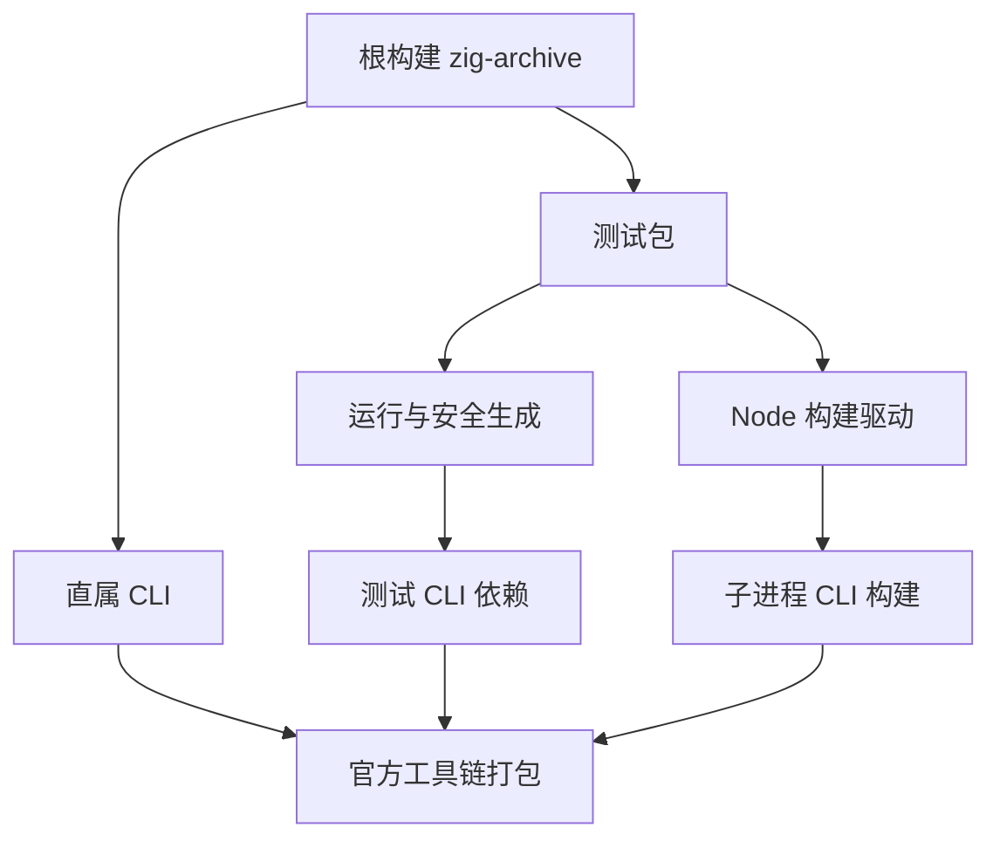
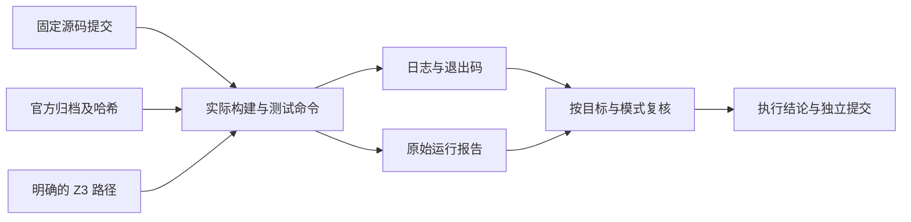

# 根目录完整回归计划

## IDEA

- Intent：对固定源码检出执行根目录 Debug 与 ReleaseSafe 构建、完整 `test`、ReleaseSafe `dist`，补齐最近实现变化后的实际回归证据，并避免构建工具链重复访问网络。
- Data：根 `build.zig`、`packages/test/build.zig` 与各构建驱动的当前源码；本地官方 Zig 归档的 SHA-256；构建配置复现日志；后续真实命令、退出码与测试报告。
- Edges：根 `test` 不等于仓库所有可选目标；硬件 RTL 求值须另跑专用目标，六个平台发布矩阵也不能由本机测试证明。缓存编译与实际执行分开记录，未执行或无法量化的内部断言不填充计数。根完整回归不得由先前窄范围通过结果代替。
- Answer：提交本计划、预检证据、命令日志与执行结论；每个命令绑定源码提交和工具版本。发现实现问题仅向已授权的实现会话发送可复现问题；完成本部分后单独提交并 push。

## 预检发现

在固定提交 `1a7241d67ddde1fa475f5f696e5077b9b3899cdf`，根构建接受 `-Dzig-archive`，但只传给直属 CLI 依赖，没有传给 conformance。测试包自己也不声明此选项；实际执行 `zig build --help -Dzig-archive=/tmp/zxc-local-archive-probe` 退出 1，报告 `invalid option: "zig-archive"`。

测试包内部的 runtime、safety 和 child_process 还创建不带归档选项的 CLI 依赖。build_modes 的 Node 驱动再次执行 CLI 包构建，也没有传入本地归档。工具链打包实现中，空归档路径明确进入 `std.http.Client.fetch`。这是已确认的参数传播缺口；此处没有触发 HTTP，也不将它描述为已经发生的下载失败。

检索还找到旧 plugins/bridge_test.ts 的同类构建调用，但进一步追踪确认它没有接入当前构建图，且依赖已删除的运行库。它不能列为本次根回归的活动入口，不应为修复参数而重新启用旧插件实现。

最小修复范围为根构建向 conformance 传参、测试包声明并向全部 CLI 依赖传参、明确把同一参数传给嵌套 CLI 构建驱动。不为测试加入吞掉网络错误的兜底，也不将暖缓存视为离线保证。由并行实现会话处理生产构建链路，测试会话负责复验。

## 构建关系

## 证据数据流

## 执行顺序

1. 留存配置复现、参数调用点与官方归档校验，通知实现会话。
2. 修复提交到达后检查实际传参链，更新干净固定检出。继续独立的 JSON 原文审阅，不让等待修复阻塞整体测试工作。
3. 使用显式本地归档和 `ZXC_TEST_SOLVER`，依次执行根 Debug build/test、ReleaseSafe build/test/dist。长命令通过后台进程句柄观察，保留原始日志。
4. 补齐测试包 TypeScript 类型检查和源码格式检查，并记录它们与根目标的边界。
5. 对照源码、缓存与运行报告复核范围，记录未覆盖项和自我批判后提交 push。

## 状态

预检配置复现已完成，实现会话已提交并推送 `5e6aaecc` 修复活动构建图的参数传播。完整根回归尚未开始，不能据此宣称通过。
