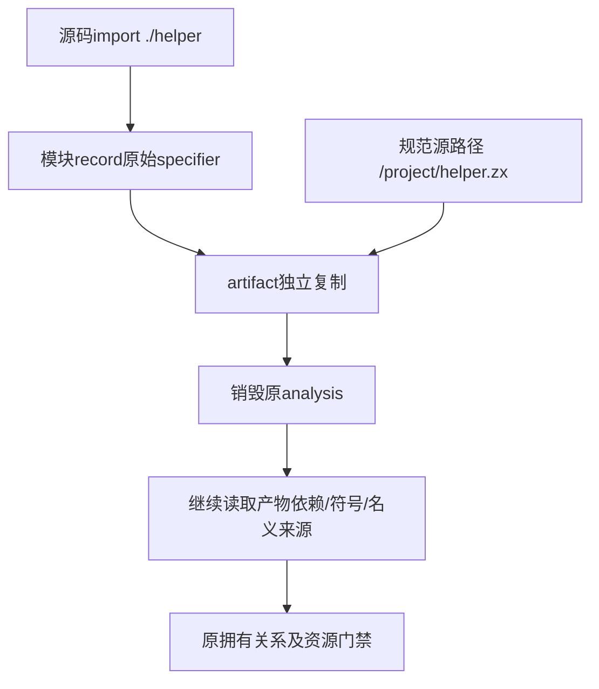

# 模块产物依赖名断言同步计划

## Intent：最终目标

恢复既有模块产物拥有关系断言，使原分析销毁后，提取产物的原始依赖名与规范文件路径仍可独立读取。

## Data：可用证据

根第二轮的test-module-artifacts提取组5通过1失败，唯一差异是旧预期./helper.zx、真实./helper。共享module_records/fixture.zig的main已明确import helper from "./helper"；artifact/build.zig直接复制record.imports的specifier，不补文件后缀。target.source则保留规范文件路径/project/helper.zx。因此属于输入契约迁移后遗漏的一个精确断言，不是artifact丢失后缀或拥有关系实现失败。

## Edges：边界与限制

只改extract_test.zig一个specifier预期。保持原分析在读取前deinit的生命周期结构，以及路径、依赖名字、target.source、符号名、名义类型/成员/来源断言。共享fixture、规范源文件路径、artifact复制逻辑和生产实现不改，不根据实测输出放宽为字符串前缀或任意值。fixture源语句和复制契约共同确定./helper预期。

## Answer：交付格式与成功标准

一份正式来源、草稿、固定检出一致；运行既有test-module-artifacts，Debug和ReleaseSafe，完整保留提取/非法产物/分配失败组，记录实际/缓存及退出码。成功后独立提交push并核验来源和证据。新增声明、目录案例、Test262审阅均0。

## 自我批判

specifier是原始引用文字，target.source是解析出的规范路径，两者不可混用。全部删除.zx会破坏真实文件身份断言；仅同步这一处原引用名，保留相邻/project/helper.zx预期及完整生命周期条件。根日志的拥有关系测试名称不能被误解为已发现悬垂指针，本次差异由源契约直接解释。

## 最终执行记录

固定799c04cd的test-module-artifacts在Debug和ReleaseSafe均退出0，各27/27构建步骤、14/14 Zig声明实例实际通过，无运行缓存；extract6、invalid6、allocation resources2。原分析销毁后读取精确specifier ./helper、规范target.source /project/helper.zx及名义来源、符号等断言全部保持。

正式/草稿/固定检出一致。唯一变化为一个旧后缀预期；共享fixture和生产artifact复制逻辑不改。新增声明、目录案例及Test262审阅均0。原根失败保留，不能把同步测试预期表述为修复生产悬垂指针。
