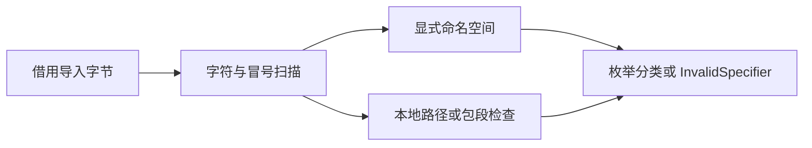

# 模块导入分类自举

## Intent：最终目标

将生产模块导入分类迁移为 RX 编排与 ZX 逻辑，保留 Zig seed，仅在构建期选择实现。覆盖统一 file/package/zig/c/std/lib 分类契约，不改变导入解析、注册或链接行为。

## Data：可用证据

当前 zx/modules/specifier.zig 由项目加载与原生 IR 校验共用。生产 frontend 已通过 parser_options 选择生成模块。RX 文件名分类已有零容量 allocator 适配方式，可作为无分配生成的接线样例。

## Edges：边界与限制

空输入、空白、反斜杠、重复冒号和未知前缀均拒绝。显式命名空间仅验证非空名称，不额外施加 package 路径规则。相对路径在分类阶段不做后续路径规范化；无前缀包路径逐段拒绝空段、点与双点。lib 保留当前 legacy 分类，不能藉迁移新增或移除语言功能。

不改变公开错误集合；生成分类器必须在零容量 allocator 下工作。迁移不是完整语义分析自举，也不能替代 AST 表示统一。不得新增测试或跑全量测试，复用既有编译路径并检查实际生成结构。

## Answer：交付格式与成功标准

草稿先保存在本目录，正式源码为 specifier/ 内的 RX 与 ZX；构建接入共享生成产物，原 Zig 分支保持原生分类实现。生成器与发行构建通过，既有模块相关专项覆盖分类的真实消费者；生成产物没有 allocator.create/alloc/dupe 调用才可宣称本路径无分配。

## 实施与自我复核

已接入 build/parser.zig 的生成清单、bootstrap 安装产物及生产 frontend 静态依赖；parser_options.generated_parser 为 false 的 seed 继续使用旧逻辑。原始 Zig 分支不接入此次迁移。

bootstrap-parser 已通过。实际产物 `/tmp/zxc-specifier-bootstrap/bootstrap/specifier.zig` 的 SHA-256 为 `d940eeacd972fc48cae4d7f15f1ed7ab99094116ca0781e034c099e592f4604b`；唯一执行 helper 明确忽略 allocator，execute 仅取得 allocator 后直接调用该 helper。扫描与包段状态都为局部 struct，未出现 create/alloc/dupe，不以空 allocator 的存在反推无分配。只导入 std，没有运行时加载层。

字符扫描先拒绝非法字节和重复/末尾冒号；命名空间分支只在 separator < length 时执行，三字符前缀访问由 separator == 3 保护。无前缀路径检查保留原先顺序，包段空值与点段判断使用短路保护索引。两次扫描为 O(n)，输入切片借用，返回标量枚举。

发行构建、既有 test-native-declarations 与 test-module-records 专项均通过。迁移后的 CLI 与原始 Zig 基线编译同一 classify.rx，生成 SHA-256 同为 `c32a24f3ca0c33acea925ed466711e02acc764a0c55f7edcfc7b1dc3a054ce15`。该一致性证据只覆盖当前入口，不是完整编译器固定点验收。未新增测试用例、未运行全量测试。

自我批判：这是模块导入分类的实际迁移，不能据此宣称模块解析、依赖图联结或编译器语义分析整体已经自举。生成函数仍带通用边界错误类型；适配器的 unreachable 依赖上述索引证明及无分配事实，若后续 ZX 逻辑引入分配必须同步调整，不能静默回退原生实现。
