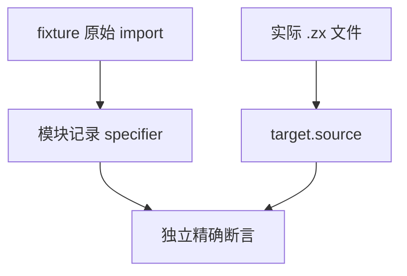

# 模块记录依赖名断言同步计划

## Intent：最终目标

恢复模块 records 原始引用名与实际文件路径各自的精确契约，继续验证依赖顺序、range、digest 和 parse cache 销毁后的拥有关系。

## Data：可用证据

module_records/fixture.zig 的 main 与 helper 已使用无后缀引用；records_test.zig 两个旧 specifier 断言仍含 .zx。target.source 保留 /project/*.zx，因为它代表规范文件路径。此前 artifact 独立复制门禁已验证相同区分。

## Edges：边界与限制

只同步一个测试文件中的两个引用名断言，目标路径、源 digest、span、完成顺序、类型入口及 parse cache 生命周期条件全部保持。共享 fixture 和生产 modules 不改，不改为宽泛前缀或动态取实际值的断言。

## Answer：交付格式与成功标准

IDEA 计划、原材料、草稿、指纹、Debug 和 ReleaseSafe test-module-records 日志。固定检出实际通过后独立提交 push，核验来源和证据；新增声明、目录案例及 Test262 审阅均 0。

## 自我批判

这是输入契约迁移后遗漏的断言，并非生产模块记录丢失后缀。必须保留规范路径中的 .zx，且不能由测试读取结果自动算出期待值。

既有提交钩子要求 scripts/format.mjs：本文件在格式检查后补齐六处语义块空行；未改变任何其余断言、函数调用顺序或生命周期。完整草稿按最终格式同步，门禁以此最终来源执行。

## 最终执行记录

固定 bd38cd57 加一份最终 records 测试来源，Debug 与 ReleaseSafe 的 test-module-records 均退出 0，各 25/25 构建步骤、10/10 Zig 原声明实例实际通过（records 7、resources 3），运行缓存 0。引用名、规范路径、源顺序、range、digest 与 parse cache 销毁后继续读取全部原断言保持；资源组分配失败遍历也保留。

最终来源、完整草稿及固定检出一致。只改两个原始 specifier 期待和既有提交钩子要求的六处空行；生产 modules 与共享 fixture 不改。新增声明、目录案例和 Test262 审阅均 0；原根失败记录继续保留。
