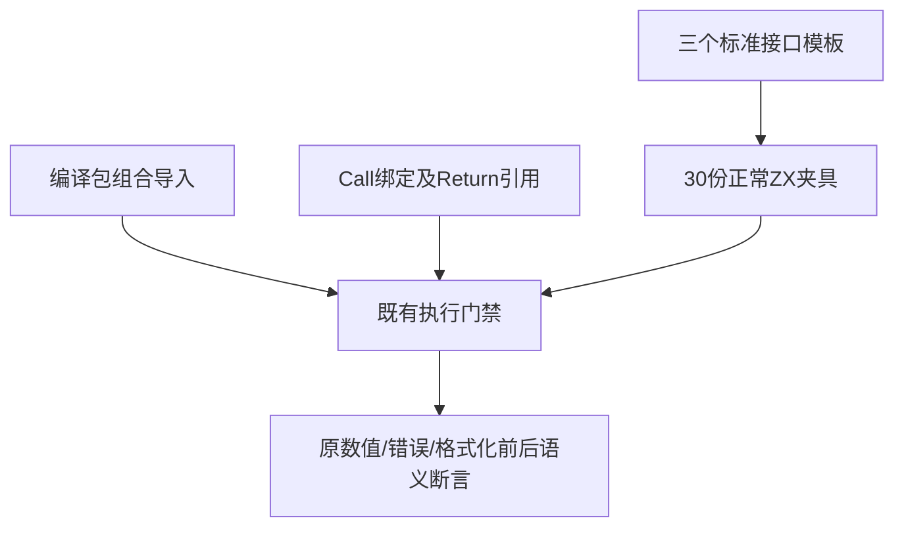
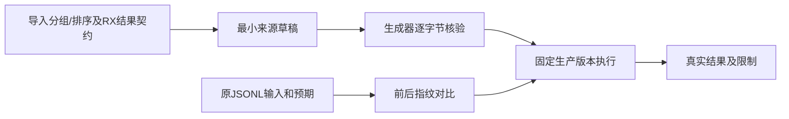

# 正常夹具格式契约同步计划

## Intent：最终目标

使 URL API、URLSearchParams、querystring、编译包组合及 RX 格式化的既有正常执行夹具遵守当前规范，继续验证原功能断言。

## Data：可用证据

固定 bd5b60f5 根 ReleaseSafe 日志中，URL 与 querystring 的 value import 紧接 type import，缺少组间空行；三个正式模板生成全部 30 份此类源。composed.zx 的 calc/nested/beta 在 calc/again 之前，且 type import 未分组。RX 格式化执行测试仍生成 Call.out 与 ctx.value，而当前规则与正式 Call 实现明确使用无 out 的调用和 $ctx.identity。

已阅读规则《文档分工》《RX开发约定》及当前 RX README；本轮只修测试包及新执行记录，不把内部规则写入 packages/skills。

## Edges：边界与限制

在三个生成模板及 30 份对应正常源之间补一行；编译包夹具只排列导入；RX 测试只同步 Call 结果引用。所有原输入、预期、目录案例、上下游链接及格式化前后执行一致性断言保留。故意乱序的格式化拒绝样例不参与处理。match/modules/reordered 涉及保留原意图的决策，另行处理，不混入本部分。当前 PATH 未暴露 grit，但在既有 /Users/xiewendao/.npm-global/bin/grit 找到工具。对本轮 31 份 ZX 源执行导入分组规则 dry-run，退出 0、匹配 0，另报告 2 处 JavaScript 文法解析错误；这不能证明 ZX 原始格式或语义正确。因此本轮按已定位来源及精确数量断言同步，禁止无差别全项目格式化。预览只读且作用于修改后源，不能冒充变换前的批量成功记录。

## Answer：交付格式与成功标准

保存三组输出指纹，制作 35 份同路径草稿并同步正式测试包。三个生成器完整 --check 必须通过；JSONL 前后指纹必须相同。随后固定生产检出执行五个既有门禁：test-url-api、test-url-search-params、test-querystring、test-compiled-packages、test-rx-formatting，ReleaseSafe、-j2。完整退出码及实际运行/缓存数量入记录，成功后独立提交 push。

## 自我批判

仅让源码通过格式门禁不能证明生成执行仍正确，必须运行原完整断言。RX Return 的 ctx.value 既有自定义名不能保留，实际值应取固定调用目标 identity；不把删除未知属性误当验证 Call 行为。运行夹具与故意拒绝样例职责不同，本轮只处理已定位的正常路径。

## 最终执行记录

三个正式生成器完整 --check 均退出 0，60 份输出指纹核对只有 30 份 ZX 增加分组空行，JSONL 差异为 0。固定 cf26b77e 的五门禁退出 0，161/161 步骤；15,375 个 Zig 声明实例全部实际运行，运行缓存为 0，其中 URL API 6,193、URLSearchParams 8,640、querystring 540，以及既有 RX 格式化分配失败声明 2。Node 66 个既有声明实际通过（编译包 13、RX 格式化 CLI 52、格式化执行 1）。

正式 35 份来源、草稿、实际检出字节一致，无生产源码修改。基线已包含标准类型生成器 a34f4eab 修复，但尚不含后来提交的 RX XML 自举 153232cb；后续根全量将单独验证新 XML 入口。本部分没有新增目录案例、独立声明或 Test262 原文审阅。
