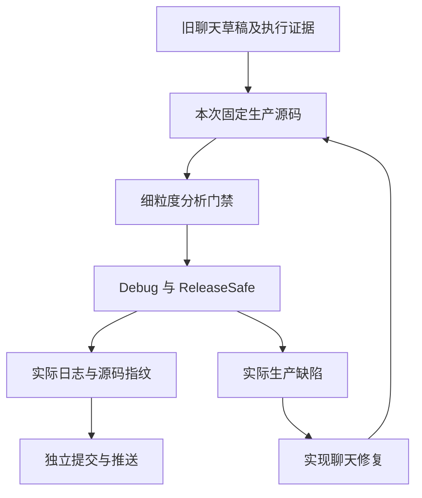
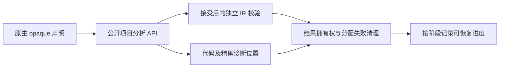

# 测试任务接替记录

## Intent：最终目标

接替聊天 `01a100fa-0001-7093-af07-49e935c29905`，继续固定 Test262 的逐份审阅和 zxc 全部已实现特性的细粒度测试。每个部分经过实际验证后单独提交和推送；实际生产缺陷发送给实现聊天 `01a1017f-f09f-7001-95ef-8e966ebd6aee`。

## Data：可用证据

接替时主检出为 `b4b4bcd9`，包含其他聊天未提交的生成器性能修改。旧聊天最后留下 `原生只读引用测试/草稿/` 的六份 Zig 文件及实施计划，尚未登记正式门禁。

本次实际运行 `node packages/test/src/audit_matrix.ts`：53,597 份上游事实、2,438 份审阅（690 adapted、103 equivalent、1,645 excluded）、51,159 份未审阅、80,155 个目录案例、4,933 个关联案例。审计不测量执行通过率。

第四轮与第三轮根回归结果仍记录 `完成: false` 且未保存门禁终态；接替时没有发现对应根回归进程。保留旧日志和结果，不推断成功或失败，不覆盖原始证据。后续重新执行使用新日志及固定检出。

## Edges：边界与限制

沿用现有 `packages/test`，不另建重复包。上游源码已在本机固定缓存，不重新下载；网络只在授权的推送和实际缺陷通知时使用。不能承诺完全不发生外部网络故障；发生时保留本地提交和精确失败证据。

独立 worktree 固定已提交的生产源码，避免把实现聊天的 WIP 混入测试结果。正式修改限定测试包及本任务记录。既有用户授权涵盖这些测试；生产修复由实现聊天处理。

原生只读引用的第一阶段只验证分析与独立 IR 接受性，不代替真实 ABI 执行、库身份、数据出口拒绝或宿主生命周期证明。目录数量和优化模式重复执行分别记录。

## Answer：执行顺序与成功标准

1. 核查旧草稿和成熟原生错误门禁，落地声明、局部容器、引用来源、并行和 Store 边界测试。
2. 在固定源码中执行 Debug 和 ReleaseSafe，保存原始日志、退出码、源码指纹和实际声明数。
3. 若失败先核查测试是否触及目标语义，再以最小复现通知实现聊天；保留正确断言。
4. 本阶段通过后更新记录，核对格式化后的最终源码，独立 commit 和 push。
5. 继续独立 IR/出口、名义身份/统一库、真实运行三个阶段，然后回到 Test262 未审阅目录。

## 自我复核

已有 80,155 个登记案例不说明整体目标完成；仍有 51,159 份未审阅上游。旧草稿中的预期必须依据源码契约和实际运行核实，不能因为接替就直接算通过。部分专项成功不与旧根回归相加为当前全量成功。

## 已完成部分

原生只读引用第一阶段40个声明在固定 `b4b4bcd9` 的Debug/ReleaseSafe中分别实际执行通过。正式注册路径和完整证据见 [实施计划](原生只读引用测试计划.md) 与 [执行结果](原生只读引用测试/声明与语言/执行结果.json)。下一部分为 [独立IR校验](原生只读引用测试/独立校验计划.md)。

第一阶段 `ee149f0a` 已推送。独立 IR 校验新增 15 个声明，两模式各 15/15 实际通过，`c35043ef` 已推送；最终日志与指纹见 [第二部分执行结果](原生只读引用测试/独立校验/执行结果.json)。接替后合计新增 55 个声明，上游审阅和 JSONL 数量保持接替时的统计。
