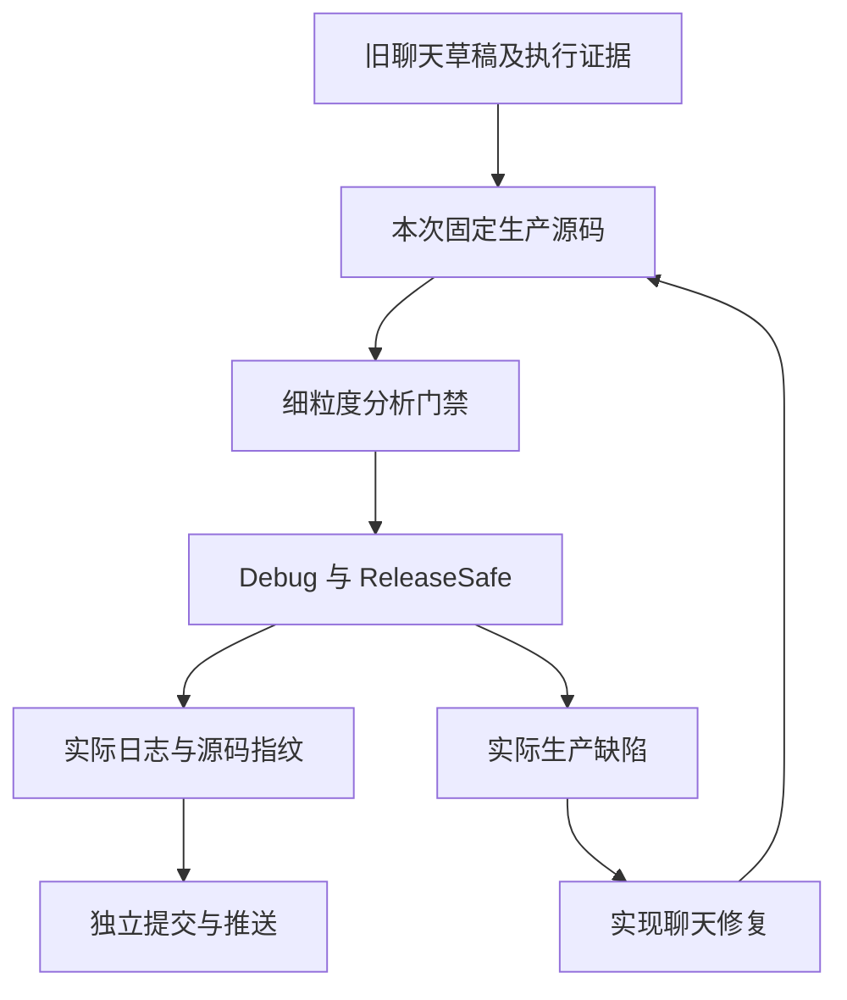

# 测试任务接替记录

## Intent：最终目标

接替聊天 `01a100fa-0001-7093-af07-49e935c29905`，继续固定 Test262 的逐份审阅和 zxc 全部已实现特性的细粒度测试。每个部分经过实际验证后单独提交和推送；实际生产缺陷发送给实现聊天 `01a1017f-f09f-7001-95ef-8e966ebd6aee`。

## Data：可用证据

接替时主检出为 `b4b4bcd9`，包含其他聊天未提交的生成器性能修改。旧聊天最后留下 `原生只读引用测试/草稿/` 的六份 Zig 文件及实施计划，尚未登记正式门禁。

本次实际运行 `node packages/test/src/audit_matrix.ts`：53,597 份上游事实、2,438 份审阅（690 adapted、103 equivalent、1,645 excluded）、51,159 份未审阅、80,155 个目录案例、4,933 个关联案例。审计不测量执行通过率。

第四轮与第三轮根回归结果仍记录 `完成: false` 且未保存门禁终态；接替时没有发现对应根回归进程。保留旧日志和结果，不推断成功或失败，不覆盖原始证据。后续重新执行使用新日志及固定检出。

## Edges：边界与限制

沿用现有 `packages/test`，不另建重复包。上游源码已在本机固定缓存，不重新下载；网络只在授权的推送和实际缺陷通知时使用。不能承诺完全不发生外部网络故障；发生时保留本地提交和精确失败证据。

独立 worktree 固定已提交的生产源码，避免把实现聊天的 WIP 混入测试结果。正式修改限定测试包及本任务记录。既有用户授权涵盖这些测试；生产修复由实现聊天处理。

原生只读引用的第一阶段只验证分析与独立 IR 接受性，不代替真实 ABI 执行、库身份、数据出口拒绝或宿主生命周期证明。目录数量和优化模式重复执行分别记录。

## Answer：执行顺序与成功标准

1. 核查旧草稿和成熟原生错误门禁，落地声明、局部容器、引用来源、并行和 Store 边界测试。
2. 在固定源码中执行 Debug 和 ReleaseSafe，保存原始日志、退出码、源码指纹和实际声明数。
3. 若失败先核查测试是否触及目标语义，再以最小复现通知实现聊天；保留正确断言。
4. 本阶段通过后更新记录，核对格式化后的最终源码，独立 commit 和 push。
5. 继续独立 IR/出口、名义身份/统一库、真实运行三个阶段，然后回到 Test262 未审阅目录。

## 自我复核

已有 80,155 个登记案例不说明整体目标完成；仍有 51,159 份未审阅上游。旧草稿中的预期必须依据源码契约和实际运行核实，不能因为接替就直接算通过。部分专项成功不与旧根回归相加为当前全量成功。

## 已完成部分

原生只读引用第一阶段40个声明在固定 `b4b4bcd9` 的Debug/ReleaseSafe中分别实际执行通过。正式注册路径和完整证据见 [实施计划](原生只读引用测试计划.md) 与 [执行结果](原生只读引用测试/声明与语言/执行结果.json)。下一部分为 [独立IR校验](原生只读引用测试/独立校验计划.md)。

第一阶段 `ee149f0a` 已推送。独立 IR 校验新增 15 个声明，两模式各 15/15 实际通过，`c35043ef` 已推送；最终日志与指纹见 [第二部分执行结果](原生只读引用测试/独立校验/执行结果.json)。接替后合计新增 55 个声明，上游审阅和 JSONL 数量保持接替时的统计。

NAPI/Gateway 数据出口新增 12 个声明，两模式各 12/12 实际通过，`c16bf432` 已推送；接替后累计 67 个新 Zig 声明。详见 [数据出口计划](原生只读引用测试/数据出口计划.md)。证据补充提交为 `ef4e537e`，也已推送。

关系表达式目录最后一份原文的两个检查已全文审查，普通/严格模式共 2/2 次执行通过，按静态语言契约登记 excluded；该目录未审阅集合为零。全局审计变为 2,439 份已审阅、51,158 份未审阅，JSONL 仍为 80,155，不能称为整体完成。说明见 [目录收尾审阅](关系表达式目录收尾审阅计划.md)。

## 下一接续点

统一库名义身份新增 20 个声明，`38698597` 已推送。真实宿主 ABI 第一批新增 14 个声明，Debug/ReleaseSafe 各通过源码 14 个及统一库 14 个真实执行，共 28/28。详见 [统一库身份计划](原生只读引用测试/统一库身份计划.md) 和 [真实运行计划](原生只读引用测试/真实运行计划.md)。接替后新增独立 Zig 声明累计 101，不与两路径或两模式相乘。

真实宿主 ABI 第一批 `f245985a` 已推送。循环与借用第二批新增 19 个声明，在该固定生产版本的 Debug/ReleaseSafe 各 66/66 次真实执行通过（33 个独立声明 × 两路线，包含第一批回归）。说明见 [循环与借用计划](原生只读引用测试/循环与借用计划.md)。接替后新增独立声明累计 120。

循环与借用第二批 `a452881b` 已推送。辅助函数缓冲第三批新增 12 个声明，在该固定版本的完整 runtime 中，Debug/ReleaseSafe 各 90/90 次真实执行通过（45 个独立声明 × 两路线，包含前两批回归）。合法嵌套调用的保守路径也保留了语义与 OOM 覆盖。说明见 [辅助函数缓冲计划](原生只读引用测试/辅助函数缓冲计划.md)。接替后累计新增 132 个独立 Zig 声明。

辅助函数缓冲 `47d699a9` 已推送。真实 CLI/Wasm/WASI 应用构建边界新增九个独立登记用例，源码/统一库、JSON/discard 两种策略均覆盖；固定 `47d699a9` 的完整原生引用门禁 Debug/ReleaseSafe 各 123/123 步骤通过。每种模式各 192 次准确拒绝构建、36 次标量结果观察，以及既有运行声明 90 次真实执行。`a8bd2219` 已推送，累计独立用例 141，详见 [应用构建边界](原生只读引用测试/应用构建边界计划.md)。

输出与任务边界新增六个 Zig 声明，包括 Gateway 独立输出拒绝、无捕获 task 引用返回分析、合法 scalar task 控制和返回/捕获引用独立 IR 拒绝。固定 `a8bd2219` 的 analysis/ir/exports 联合 Debug/ReleaseSafe 门禁各 46/46 步骤通过，73 个声明的实际执行与缓存分别保存；`4d807ccd` 已推送。原生引用接替后累计新增 147 个独立用例，其中 138 个 Zig 声明、九个 Node 应用边界登记，不按路线或模式翻倍。

does-not-equals 剩余 20 份完整原文已逐份登记 excluded，原文普通/严格模式共 40/40 次实际执行通过；只关联前三份的局部 null 观察。新增字符串 null 与空对象原值和空值对照四个 JSONL 案例，在固定 `4d807ccd` 连同既有 bool/f64 对照，Debug/ReleaseSafe 各 29/29 实际通过。完整说明见 [不等表达式目录收尾](不等表达式目录收尾审阅计划.md)。全局矩阵为 80,159 个目录案例、2,459 份已审阅、51,138 份未审阅、4,939 个关联案例。

原生引用布局与自举回归已固定在 `6f18db89`，Debug/ReleaseSafe 完整门禁各 126/126 步骤、93/93 内部声明实际通过，45 个运行声明沿两路线各 90 次实际执行，九个应用边界登记各 246 条真实命令。此次复用既有 147 个独立用例，不增加案例或审阅数；`cf4c9e33` 已推送。完整证据见 [布局与自举回归计划](原生只读引用测试/布局与自举回归计划.md)。

reverse 剩余 17 份完整原文已逐份 excluded，普通/严格模式参考执行共 34/34 通过。新增 RAB 两个稠密原值投影，复用已有 [0,1]、[1] 的准确案例；在固定 `cf4c9e33`（包含 `00208e21` 外部签名索引视图），两模式各 128/128 实际目录执行通过，无运行结果缓存。目录 18 份均 excluded、未审阅为零，不把局部值反序登记成完整动态协议兼容。见 [反转目录收尾审阅计划](反转目录收尾审阅计划.md)。

当前矩阵为 80,161 个目录案例、2,476 份已审阅、51,121 份未审阅、4,943 个关联案例；原生引用累计新增独立用例仍为 147。下一步继续选取能保留完整核心观察的 Test262 家族，并补充后续已实现特性和当前源码完整回归。专项证据始终按记录的固定生产提交解释；其他聊天未提交的修改不进入证据。旧第三/第四轮根回归终态未证实，保留原记录，本次专项通过不替代最新源码的完整根回归及发行构建。

## JSON 输入词法接续

JSON.parse g1/g2/g4/g5/g6 五个旧词法家族的 23 份完整原文已 adapted，27 个完整文本/结果观察全部保留。正式 application_json runtime kind 真实构建并运行 native/Wasm/WASI；固定 00b2b36e，两模式各 27 个具名案例、79 次实际目标观察通过，含 NUL 的两个 argv 目标观察仅作通道限制记录，Wasm 全量执行。原文普通/严格模式共 46 次完整执行及 54 次真实 JSON.parse 调用另计。见 [JSON 输入词法测试计划](JSON输入词法测试计划.md)。

当前矩阵为 80,188 个目录案例、2,499 份已审阅、51,098 份未审阅、4,970 个关联案例；原生引用新增独立用例仍为 147。默认 runtime 与生成一致性已纳入新类型门禁。本轮专项采用 00b2b36e，不自动证明期间新提交 cbd51648 的项目纯类型索引优化；下一步继续完整 JSON 词法观察与当前源码的完整回归。

## JSON空白与对象控制字符部分

本部分新增345条目录案例（344个完整上游观察和1条独立合法对象控制），19份完整文件adapted。原文38次执行通过，688次JSON.parse调用与目录逐字节一致。固定生产1a7241d6的Debug/Safe各34/34步骤、372条JSON案例通过；每模式实际1094目标观察，包含本批上游1012、独立控制3和旧词法79，22个argv NUL目标明确未执行。类型、生成一致性、格式、审计通过。

证据：[执行结论](JSON空白与对象控制字符测试/执行结论.md)、[执行结果](JSON空白与对象控制字符测试/执行结果.json)、[IDEA计划](JSON空白与对象控制字符测试计划.md)。

当前目录80533条（runtime62990、frontend5313、order1084、safety464、graphs10446、stores236）；2518份审阅=732 adapted+103 equivalent+1683 excluded，51079份未审，5314个关联案例。统计不等于全量实际执行或Test262完成。

根预检已复现本地zig-archive参数未传入conformance；实际缺陷已通知实现会话，收到5e6aaecc修复。根全量尚未执行，详见[根目录完整回归计划](根目录完整回归计划.md)。下一步在含修复的新固定提交执行根Debug/Safe build/test与Safe dist；JSON.parse其余完整文件保持逐份审阅，不删除ToString/原型/reviver观察来登记通过。

## JSON.parse剩余完整原文边界

剩余35份完整原文均与固定索引SHA一致，70次普通/严格原样Node执行通过；没有替换JSON.parse。完整观察涉及函数反射、ToString、原型、descriptor、reviver、Proxy与context/source，逐份登记excluded，新增ZX案例0，不计为兼容通过。

JSON.parse共77份全部有审阅结论（42 adapted、35 excluded），家族查询未审阅0。证据：[IDEA计划](JSON剩余原文边界审阅计划.md)、[逐份审阅结论](JSON剩余原文边界审阅/逐份审阅结论.md)、[执行结果](JSON剩余原文边界审阅/执行结果.json)。

当前矩阵80533条，2553份审阅=732 adapted+103 equivalent+1718 excluded，51044份未审，5314个关联案例。根完整回归继续进行；首轮Debug固定765b927d，只发现路径生成器文案落后的一致性失败，仍等待完整终态并保存报告后复跑。根外围61份格式差异全部与此前1a基线字节一致，不为本次无关改动重写。

## 根首轮与路径生成器一致性维护

固定765b927d根Debug build实际35/35通过，首轮Debug test因旧Service诊断的生成器一致性检查确定失败；保留原始日志与已完成三个JSON报告后主动SIGINT中止，退出130，不能计为完整通过。只有测试生成器分支同步到当前Call.module的Module诊断，原有154条目录记录完全不改，--check及Prettier通过。根格式61份差异全部与1a基线字节相同；并行pnpm首次自动安装造成本地staging冲突，直接调用已安装tsc后成功。

本维护改动单独提交push，随后固定含修复的源码执行新的Debug/Safe build/test与Safe dist。证据在[根目录完整回归计划](根目录完整回归计划.md)和[路径生成器同步结果](根目录完整回归/路径生成器同步结果.json)。完整Test262目标继续，未把首轮失败或中止改写成成功。

## JSON非有限输出的真实缺陷

固定ebe3d605，六个普通应用三目标共21次实际观察：12次Infinity成功输出非法JSON，3次NaN从f64变为JSON字符串，6次有限控制正常；实际20条进程命令。实现会话已提交fbdae9c5采用写出前NonFiniteJsonNumber，保留IEEE运算。

另实际构建一个Gateway，7个同进程请求中4次HTTP200 application/json输出裸inf/-inf，1次NaN变字符串，2次有限控制正常；已通知实现会话扩展HTTP出口。两组都只有普通恒等或除法，无输入特判，原始字节、响应wire、产物与来源SHA均保留。

证据：[三目标IDEA计划](JSON非有限输出核验计划.md)、[三目标核验结论](JSON非有限输出核验/核验结论.json)、[Gateway IDEA计划](Gateway非有限JSON核验计划.md)、[Gateway核验结论](Gateway非有限JSON核验/核验结论.json)。本部分新增正式目录案例0，缺陷证据不计为通过；下一批42个普通JSON输出回归在独立固定检出验证修复。根ebe3d605全量Debug复跑继续，基线不混入修复。

## JSON输出数值边界正式回归

固定e5d21277，最终新增50个独立ID，8组普通ZX覆盖f64/f32、除法、嵌套列表、混合tuple、可选对象/标量及非有限输入和运算转布尔输出。Debug/Safe都实际44/44步骤通过；每模式422个JSON ID完成1244次三目标观察，另22个argv NUL排除；HTTP复用新增50个ID各50次观察，不新加ID。两个模式共2588次实际观察，其中新增50个ID四出口各模式共400次。

HTTP每模式34个成功、16个非有限错误，16条对应日志、stdout为空，并在同一进程继续成功请求。类型、审计、本次diff格式与源码/报告SHA核对通过。目录80583条、runtime63040，上游审阅2553与未审51044不变，关联5314不变；没有把新内部案例计为Test262适配文件。

证据：[IDEA计划](JSON输出数值边界回归计划.md)、[执行结论](JSON输出数值边界回归/执行结论.md)、[执行结果](JSON输出数值边界回归/执行结果.json)。自我复核明确短前缀尚未覆盖超过writer缓冲容量的输出；后续单独补齐。根ebe3d605全量仍在运行，不能以本专项通过替代根终态。

## JSON大前缀错误输出边界

固定fef9471a，只追加object.jsonl两条8192字节prefix案例，源码和驱动不改，旧6条记录字节保留。Debug/Safe均实际40/40步骤通过，52共享ID四出口两模式416次观察，其中本次2ID共16次。非有限深层列表错误时原生/WASI stdout完全为空、Wasm报同名错误、HTTP完整500；随后相同体积的有限JSON输出正常。目录80585条、runtime63042，上游审阅仍2553、未审51044，关联5314。

证据：[IDEA计划](JSON大前缀错误输出边界计划.md)、[执行结论](JSON大前缀错误输出边界/执行结论.md)、[执行结果](JSON大前缀错误输出边界/执行结果.json)。这补齐上一部分自我批判的具体边界，不证明任意体积或OOM，未发现新的生产缺陷，不发送健康消息。根完整回归继续独立运行。

## JSON.stringify完整原文审阅

66份固定完整原文逐份登记excluded，132次原样Node普通/严格执行通过，未替换JSON.stringify；Node参考不计ZX通过。两份数值原文可完整表达，其六个核心观察用六个普通恒等/除法应用在native、WASI、Wasm完成18次精确文本核验：负零保留-0；非有限结果按明确政策报NonFiniteJsonNumber，均不同于JS原文文本要求。其余64份保留完整反射、回调、Proxy、PropertyList、盒装、UTF-16或动态属性边界，不截取普通值冒充整份。

证据：[IDEA计划](JSON字符串化完整原文审阅计划.md)、[逐份审阅结论](JSON字符串化完整原文审阅/审阅结论.md)、[执行结果](JSON字符串化完整原文审阅/执行结果.json)。家族未审阅0是审阅闭合，不是JS兼容通过；整体2619份审阅、50978份未审，目录80585及关联5314不变。未发现新生产缺陷，不发送健康消息；根ReleaseSafe全量回归继续。

## 普通输入不可变与原生引用迁移回归

固定f38d9b4f包含ac024c3a迁移，复用194个核心独立声明，补验RX并行、object append、iterate buffer、module generation。Debug核心153/153步骤、190/190管理实例，另90个外部原生实例。Debug相邻首轮694/698，四个失败是夹具从拒绝改成功后遗漏完整类型或Store槽数；三份测试文件补足精确检查，最终105/105本次实际实例，80缓存步骤对应首轮已通过593实例。Safe七门禁521/521、888/888全部实际管理实例，另90外部实例。

证据：[IDEA计划](输入不可变与原生引用回归计划.md)、[执行结论](输入不可变与原生引用回归/执行结论.md)、[执行结果](输入不可变与原生引用回归/执行结果.json)。未增加目录案例或Test262审阅；不增加既有声明计数，未改生产源码，不通知实现聊天。较早ebe3d605根ReleaseSafe完整回归仍独立执行，不混为迁移版本证据。

## 布尔转文本完整原文适配

完整适配 S9.8_A3_T2.js 两项 primitive false/true 转文本观察，普通 bool 输入通过显式模板输出完整字符串。固定 f38d9b4f 编译器，两模式四次具名 Zig 执行、三目标十二次补充观察全部通过；原样 Node 普通/严格参考各一次。新增两个独立 ID、一份完整 adapted 审阅，目录 80587、runtime 63044；审阅 2620、未审 50977，唯一关联 5316。

证据：[IDEA计划](布尔转文本完整原文适配计划.md)、[执行结论](布尔转文本完整原文适配/执行结论.md)、[执行结果](布尔转文本完整原文适配/执行结果.json)。注册复用既有模板聚合门禁；新四空格格式迁移仅影响缩进，JSON 语义除新增注册外与 HEAD 完全相同。不声称通用隐式加法兼容，未发现生产缺陷，不通知实现聊天。根 ReleaseSafe 完整回归继续。

## URI编解码完整原文适配

固定 a7662c5c，完整保留 encodeURIComponent 九份、decodeURIComponent 七份成功原文的 134 项观察。99 项观察复用 95 个已有唯一 ID，仅新增 35 个缺少的输入，合计关联 130 个唯一案例。两个模式正式 querystring 门禁均 54/54 步骤、575/575 具名执行通过；另完成 780 次三应用目标实际观察。32 次原样 Node 普通/严格执行与 32 次真实 intrinsic 辅助观察另行记录，不计作 ZX 通过。

证据：[IDEA计划](URI编解码完整原文适配计划.md)、[执行结论](URI编解码完整原文适配/执行结论.md)、[执行结果](URI编解码完整原文适配/执行结果.json)。新增 16 份完整 adapted 审阅，目录 80622、runtime 63079，审阅 2636、未审 50961、唯一关联 5446。两旧 catalog 字节前缀保留，ZX 应用不改，生成数据纳入既有 generator 和缓存依赖；不声明损坏编码 URIError 或孤立 surrogate 兼容。未发现生产缺陷，不通知实现聊天；根 ReleaseSafe 完整回归继续独立执行。
