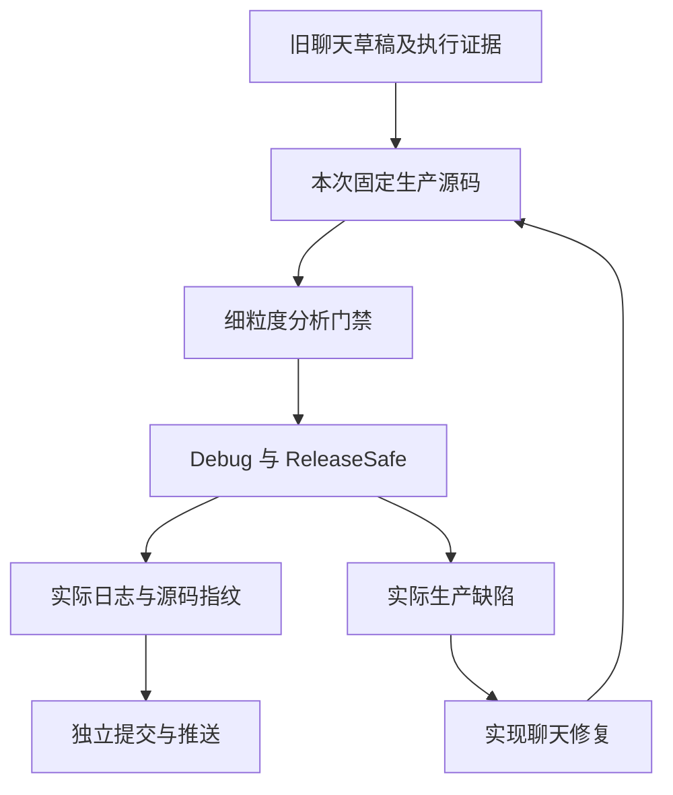
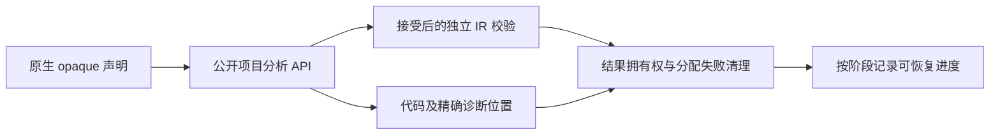

# 测试任务接替记录

## Intent：最终目标

接替聊天 `01a100fa-0001-7093-af07-49e935c29905`，继续固定 Test262 的逐份审阅和 zxc 全部已实现特性的细粒度测试。每个部分经过实际验证后单独提交和推送；实际生产缺陷发送给实现聊天 `01a1017f-f09f-7001-95ef-8e966ebd6aee`。

## Data：可用证据

接替时主检出为 `b4b4bcd9`，包含其他聊天未提交的生成器性能修改。旧聊天最后留下 `原生只读引用测试/草稿/` 的六份 Zig 文件及实施计划，尚未登记正式门禁。

本次实际运行 `node packages/test/src/audit_matrix.ts`：53,597 份上游事实、2,438 份审阅（690 adapted、103 equivalent、1,645 excluded）、51,159 份未审阅、80,155 个目录案例、4,933 个关联案例。审计不测量执行通过率。

第四轮与第三轮根回归结果仍记录 `完成: false` 且未保存门禁终态；接替时没有发现对应根回归进程。保留旧日志和结果，不推断成功或失败，不覆盖原始证据。后续重新执行使用新日志及固定检出。

## Edges：边界与限制

沿用现有 `packages/test`，不另建重复包。上游源码已在本机固定缓存，不重新下载；网络只在授权的推送和实际缺陷通知时使用。不能承诺完全不发生外部网络故障；发生时保留本地提交和精确失败证据。

独立 worktree 固定已提交的生产源码，避免把实现聊天的 WIP 混入测试结果。正式修改限定测试包及本任务记录。既有用户授权涵盖这些测试；生产修复由实现聊天处理。

原生只读引用的第一阶段只验证分析与独立 IR 接受性，不代替真实 ABI 执行、库身份、数据出口拒绝或宿主生命周期证明。目录数量和优化模式重复执行分别记录。

## Answer：执行顺序与成功标准

1. 核查旧草稿和成熟原生错误门禁，落地声明、局部容器、引用来源、并行和 Store 边界测试。
2. 在固定源码中执行 Debug 和 ReleaseSafe，保存原始日志、退出码、源码指纹和实际声明数。
3. 若失败先核查测试是否触及目标语义，再以最小复现通知实现聊天；保留正确断言。
4. 本阶段通过后更新记录，核对格式化后的最终源码，独立 commit 和 push。
5. 继续独立 IR/出口、名义身份/统一库、真实运行三个阶段，然后回到 Test262 未审阅目录。

## 自我复核

已有 80,155 个登记案例不说明整体目标完成；仍有 51,159 份未审阅上游。旧草稿中的预期必须依据源码契约和实际运行核实，不能因为接替就直接算通过。部分专项成功不与旧根回归相加为当前全量成功。

## 已完成部分

原生只读引用第一阶段40个声明在固定 `b4b4bcd9` 的Debug/ReleaseSafe中分别实际执行通过。正式注册路径和完整证据见 [实施计划](原生只读引用测试计划.md) 与 [执行结果](原生只读引用测试/声明与语言/执行结果.json)。下一部分为 [独立IR校验](原生只读引用测试/独立校验计划.md)。

第一阶段 `ee149f0a` 已推送。独立 IR 校验新增 15 个声明，两模式各 15/15 实际通过，`c35043ef` 已推送；最终日志与指纹见 [第二部分执行结果](原生只读引用测试/独立校验/执行结果.json)。接替后合计新增 55 个声明，上游审阅和 JSONL 数量保持接替时的统计。

NAPI/Gateway 数据出口新增 12 个声明，两模式各 12/12 实际通过，`c16bf432` 已推送；接替后累计 67 个新 Zig 声明。详见 [数据出口计划](原生只读引用测试/数据出口计划.md)。证据补充提交为 `ef4e537e`，也已推送。

关系表达式目录最后一份原文的两个检查已全文审查，普通/严格模式共 2/2 次执行通过，按静态语言契约登记 excluded；该目录未审阅集合为零。全局审计变为 2,439 份已审阅、51,158 份未审阅，JSONL 仍为 80,155，不能称为整体完成。说明见 [目录收尾审阅](关系表达式目录收尾审阅计划.md)。

## 下一接续点

统一库名义身份新增 20 个声明，`38698597` 已推送。真实宿主 ABI 第一批新增 14 个声明，Debug/ReleaseSafe 各通过源码 14 个及统一库 14 个真实执行，共 28/28。详见 [统一库身份计划](原生只读引用测试/统一库身份计划.md) 和 [真实运行计划](原生只读引用测试/真实运行计划.md)。接替后新增独立 Zig 声明累计 101，不与两路径或两模式相乘。

真实宿主 ABI 第一批 `f245985a` 已推送。循环与借用第二批新增 19 个声明，在该固定生产版本的 Debug/ReleaseSafe 各 66/66 次真实执行通过（33 个独立声明 × 两路线，包含第一批回归）。说明见 [循环与借用计划](原生只读引用测试/循环与借用计划.md)。接替后新增独立声明累计 120。

循环与借用第二批 `a452881b` 已推送。辅助函数缓冲第三批新增 12 个声明，在该固定版本的完整 runtime 中，Debug/ReleaseSafe 各 90/90 次真实执行通过（45 个独立声明 × 两路线，包含前两批回归）。合法嵌套调用的保守路径也保留了语义与 OOM 覆盖。说明见 [辅助函数缓冲计划](原生只读引用测试/辅助函数缓冲计划.md)。接替后累计新增 132 个独立 Zig 声明。

继续 CLI/Wasm 实际构建拒绝与不含宿主引用接口的正例。之后优先审查 does-not-equals 的 20 份剩余原文，不用新增数值排列替代其动态协议或 BigInt 观察。

测试固定检出已安全更新为 `native-reference-conformance/zxc` 的 `a452881b`，包含已同步的本次测试注册与最终来源；未覆盖后续提交及其他聊天未提交的性能修改。旧第三/第四轮根回归终态未证实，保留原记录；本次各专项通过不替代最新源码的完整根回归及发行构建。
