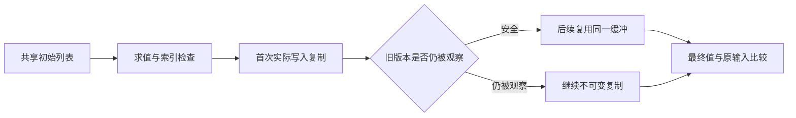

# 状态迭代列表复用回归

## Intent

验证 iterate 列表复用不会破坏不可变输入、旧别名或分支结果，并为已接入的直接列表和静态嵌套字段路径建立资源门禁。复制优化必须来自一般别名分析，不能为测试输入添加生产特例。

## Data

基线 fd09023f。共享实现已接入 iteration_buffer 的逻辑版本传播、分支汇合、首次写入复制和对象／元组静态路径；设计记录说明动态嵌套列表尚未放行。沿用上一阶段真实源码生成 Zig、execute 与分配失败验证组织。

## Edges

只修改测试包与本轮文档。列表复用与对象布局分别验证：嵌套对象仍可能每轮构造，不把列表复用误写成整个循环零分配。过期别名读取和回边携带旧列表必须保持正确结果，允许回退复制。测试数据为普通程序输入，不改变生产语义。

## Answer

新增独立 test-iterate-buffer 聚合门禁并接入全量回归。用直接列表、扁平字段、嵌套对象、元组、条件写入、switch、旧局部别名、分支与 switch 汇合后读取旧别名、旧字段别名和共享初始列表两字段十一个真实程序覆盖边界。检查零轮、一轮、长轮、输入保持、无写入指针共享、所有分配失败；安全扁平路径比较固定列表长度下不同轮数的分配成本，嵌套路径用大列表与有限内存预算区分列表重复复制和外壳构造。Debug 与 ReleaseSafe 实际执行后记录结果、自我批判并提交 push。

## 实施结果

入口 `test-iterate-buffer` 已接入测试包全量构建。十一个真实 ZX 程序覆盖 direct、flat、branch、switch、nested、tuple、stale_local、stale_branch、stale_switch、stale_state 与 two_fields，每个程序运行六个 Zig 测试声明。它们不是新增 66 份 Test262 原文，也不加入目录案例数量。

| 检查     | Debug              | ReleaseSafe        |
| -------- | ------------------ | ------------------ |
| 构建步骤 | 57/57 成功         | 57/57 成功         |
| Zig 测试 | 66/66 实际执行通过 | 66/66 实际执行通过 |

覆盖 0、1、2、3、17、64 轮，列表使用负数及重复数字模式。旧局部列表在更新后读取，包含 if / switch 汇合；旧列表作为另一状态字段跨循环保留；左右字段最初借用同一输入列表，随后分别更新不同位置，结果保持独立。输出和原始输入逐项比较，无写入结果与输入保持同一指针，有写入结果必须使用独立存储。分配失败验证使用四轮真实写入，并禁止分配器 resize/remap 绕过失败点。

资源门禁有不同强度：直接列表与安全扁平字段路径在长度 257 固定时，4 轮和 64 轮的累计分配字节相同；无写入的条件路径执行 64 轮、长度 65,537，分配总量小于一次完整列表复制；嵌套对象和元组路径执行 64 轮、长度 65,537，累计分配小于八个完整列表的字节总量。这会拒绝每轮复制整个列表，同时允许当前外壳构造成本。旧版本仍可观察的四条路径只要求快照结果正确，不强迫复用。

另重跑已有 Debug `test-iterate`，核对带原生输出的初值／条件／步骤顺序、索引失败前后效果与 RX 应用，防止纯度与复用条件扩展改变这些已有行为。结果记录在 [验证结果](状态迭代列表复用回归/验证结果.json) 和对应日志中。

## 自我批判与边界

最初九个基础程序通过后，复核认为直线旧别名读取不能覆盖版本在分支中汇合后的风险，补充 stale_branch 和 stale_switch，并重新执行全部十一个程序。资源测试中不适用的分支改用独立三轮或九轮功能路径，避免重复零轮检查来堆测试声明。格式复核发现语义空行工具与 Zig fmt 对多行 if 表达式的换行有冲突，将期望值计算改为普通带结果局部块，并再次执行两种模式。最终两种模式没有失败，也未发现新的生产缺陷，未向实现会话发送消息。

内存字节相同是有限输入下的成本证据；嵌套路径的预算仅证明没有 64 次完整列表复制，不证明只复制一次或整个循环零分配。静态字段路径不等于任意动态嵌套列表路径；聚合元素、optional 解包、回调返回列表别名和消费型调用仍需独立覆盖。共享生产实现仍有未提交修改，日志证明各次构建时的实际执行，不等同于固定生产版本全仓库通过。
