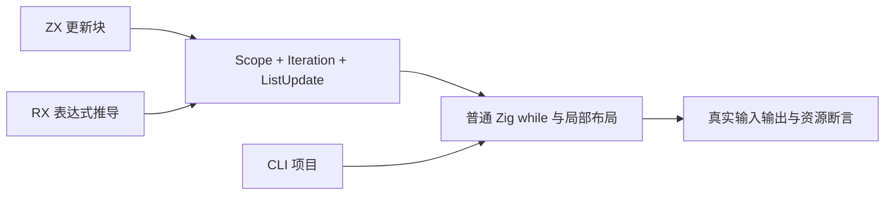
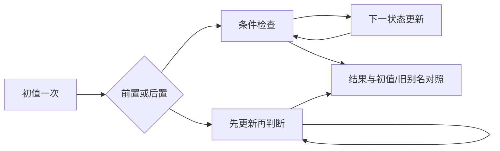

# 状态迭代执行回归

## Intent

为正在接入的 loop 建立真实执行门禁：前置与后置条件准确，初值与旧状态别名不被修改，分支与动态索引更新正确，失败传播，类型与作用域约束有效。保留最终性能目标，不以当前可执行基线代替完整交付。

## Data

当前基线 `d9b57371`，实现会话在共享检出推进 loop，尚未独立提交全部实现。依据 [顺序遍历与状态迭代设计](顺序遍历与状态迭代设计.md) 和当前分析、IR、Scope/Iteration/ListUpdate、Zig 降级代码。现有文档仅有列表调整与计数应用，不是仓库回归。

成熟组织参考 `tests/collections/for_each`：真实源码生成普通 Zig 模块，直接 execute 检查输入与 Arena 生命周期，再由 CLI 构建实际应用观察顺序和失败。

## Edges

只写测试包与文档，发现生产缺陷才通知用户指定实现会话。测试基于活动共享检出，记录具体结果，不宣称固定版本全仓库通过。

前置 while 可执行零次；后置 do 至少执行一次且在新状态上判断。回调无捕获，next/do 必须为更新块。旧初值与局部旧状态别名保持不变。列表路径当前可能逐次复制；功能验证不能证明最终缓冲复用完成。只对纯标量与已接受的扁平对象路径提出无每轮分配要求。

## Answer

1. 注册独立 loop 测试入口并接入全量回归；真实生成程序覆盖 scalar next/do、对象旧别名与 if/switch、动态列表路径。
2. 检查超过千轮的执行、零轮/一轮、输入保持不变、索引错误、分配失败清理；对标量拒绝所有分配，对扁平对象比较不同轮数下的分配成本。
3. CLI 用真实标准输出观察初值、条件、步骤的次数与先后，并通过 RX 项目验证同样语义。类型/作用域错误按当前公开契约拒绝。
4. Debug、ReleaseSafe、类型检查、格式检查通过后保存日志与自我复核，提交推送。生产问题与未完成性能边界单独记录。

## 实施结果

正式入口为 `packages/test/build/iterate.zig`，已由测试包全量入口依赖。测试全部保存在 `packages/test/tests/collections/iterate/`；没有修改生产源码，也没有新增运行库。实现仍在共享检出中推进，本轮验证基线为 `d9b57371` 加该会话当时的未提交实现。

| 检查               | Debug               | ReleaseSafe         |
| ------------------ | ------------------- | ------------------- |
| 聚合构建步骤       | 33/33 成功          | 33/33 成功          |
| Zig 测试           | 26/26 实际执行通过  | 26/26 实际执行通过  |
| CLI 场景           | 5/5 实际执行通过    | 5/5 实际执行通过    |
| 真实应用构建与调用 | 5 个应用、18 次调用 | 5 个应用、18 次调用 |

26 个 Zig 测试包括公开分析/编译入口的 2 个声明，以及 4 个生成程序各自执行的 6 个声明。分析声明内另有 13 个非法源码案例，检查错误码、消息和源码范围。CLI 的 18 次调用包含 15 次成功和 3 次预期索引越界；失败前只观察到索引函数的输出，未观察到对应右侧函数或后续步骤的输出。

- next/do：初值只求值一次，前置条件允许零轮，后置条件至少一轮；CLI 精确比较初值、条件、步骤的输出序列。
- 对象状态：保存旧状态别名后更新多个字段，验证旧值、原始初值、if/switch 后的汇合值，以及 4096 轮的结果。
- 列表更新：使用动态索引与负增量，验证每项结果、更新前的值、汇总值和原始输入；RX 应用也保留原始列表。
- 名称边界：导入名 loop 遵守普通导入函数的单参数签名，遮蔽内置名。
- 资源：编译入口与生成程序检查所有分配失败；标量路径用失败索引 0 拒绝所有分配，并确认未触发分配失败、Arena 容量为零。扁平对象执行 1 轮与 4096 轮的累计分配字节相同。

类型检查、Zig 格式、语义空行、Prettier 和本轮 diff 空白检查通过。日志与源码指纹保存在 [验证结果](状态迭代执行回归/验证结果.json)。

本轮没有新增 Test262 原文审阅或目录案例。上一阶段审计数量保持为 80,171 个目录案例、2,256 份审阅（692 adapted、103 equivalent、1,461 excluded）、51,341 份待审阅和 4,937 个关联案例。这些数字不等同于本轮执行量。

## 自我批判与边界

首轮测试代码中的 Zig if/for 分支写法存在语法错误；修复后完成库层执行。随后非法数值条件的诊断预期误用了通用布尔错误；实际分析器在数值字面量进入布尔上下文时先拒绝，按该语义修正预期并重新执行两种模式。两次失败日志保留，没有把测试错误归咎于生产实现。

当前通过的是 loop 的执行基线，不能据此宣称全部语言特性或当前全仓库通过。扁平对象的固定分配成本是有限输入下的回归证据，不是任意状态结构的证明。列表路径尚未提出每轮零复制或缓冲复用门禁，嵌套对象与列表旧别名逃逸仍需后续独立覆盖。测试没有为生产实现添加特例，执行的是生成的普通 Zig 应用。

本轮没有发现新的生产缺陷，因此未向指定实现会话发送消息。此部分结束后继续固定 Test262 原文审阅及新实现的独立回归，整体对齐任务尚未完成。
