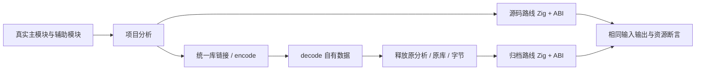
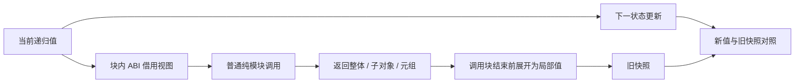

# 状态迭代聚合调用与归档回归

## Intent

验证 loop 递归值布局中的聚合调用边界：临时 ABI 视图在调用期间有效，返回参数或子对象别名在调用块结束前被正确转换为独立局部值；后续更新不污染旧快照。相同程序经统一库归档、释放原分析和归档字节后仍能正确重放。

## Data

基线 6034a86b。实现会话已接入 iteration_value 的递归布局、聚合参数局部 ABI 视图及调用结果转换；文档明确指出返回聚合别名仍只有静态推理证据。当前已通过的 scalar-return 应用不能替代该边界。成熟测试组织参考 object_reduce 的源码／统一库双路线生成，保持公开 ABI 与普通 Zig 输出。

## Edges

只写测试包与本轮文档，发现生产缺陷才通知指定实现会话。调用方和被调方使用真实多模块源码；不把手工 IR 当作前端执行证据。只对不构造新聚合且不消费输入的借用返回函数要求固定轮数成本。元组构造与列表更新保留语义所需分配，不强迫错误复用。共享生产检出仍在推进，记录实际验证范围，不宣称固定生产版本或全仓库通过。

## Answer

六个程序分别覆盖返回整个嵌套状态、返回子对象、返回包含子对象的元组、分支返回不同子对象、嵌套元组状态身份返回、带列表的子对象别名。每个程序沿源码与统一库 encode/decode 两条路线生成普通 Zig，并执行零轮、单轮、多轮、负初值、长轮和分配失败。归档重放前释放原分析、链接库与原始字节，并覆盖 Scope、Iteration、ListUpdate 的序列化和类型重映射。补充真实 CLI 发布、迁移、无源消费以验证包级边界。Debug／ReleaseSafe、格式与生成一致性检查后保存证据、自我复核并提交 push。

## 实施结果

入口 test-iterate-calls 已接入活动测试包构建。源码位于 tests/collections/iterate_calls，六个主程序和六个辅助模块共用静态类型定义。每个程序分别从真实项目分析及释放原材料后的统一库重放生成 Zig/ABI；归档字节在释放前清零，原分析与链接库均在重放生成之前释放。

| 检查         | Debug                     | ReleaseSafe               |
| ------------ | ------------------------- | ------------------------- |
| 聚合构建步骤 | 60/60 成功                | 60/60 成功                |
| Zig 测试     | 119/119 实际执行通过      | 119/119 实际执行通过      |
| CLI 集成声明 | 1/1 实际执行通过          | 1/1 实际执行通过          |
| 真实应用构建 | 12                        | 12                        |
| 应用调用     | 64（62 成功、2 预期越界） | 64（62 成功、2 预期越界） |

119 个 Zig 测试包含编译／归档链路分配失败的一个声明，以及六个程序两条路线各自执行的 118 个声明：整体、子对象、分支和元组身份返回各 10 个，构造返回元组 8 个，列表子对象别名 11 个。没有把重复编译路线计作新的 Test262 原文或目录案例。

- 旧整体、旧子对象和旧元组在后续状态更新后保持旧值；分支返回左右不同子对象仍保留正确快照。负初值、0/1/2/17/257 轮均通过。
- 四个借用返回路径在 1 轮与 4096 轮的累计分配字节相同，禁止 allocator resize 时也相同。构造元组与列表路径保留自身语义成本，不据此强迫消除分配。
- 列表子对象同时观察旧标量和写入前的旧列表元素，原始输入逐项不变；空列表零轮成功，第一次写入越界传播。
- 公开项目分析、统一库链接、encode/decode、IR 校验和 Zig bundle 生成覆盖所有分配失败点；运行路径另覆盖零轮、正常轮次和预期越界路径的清理。
- CLI 发布六个公开模块，迁移产物后删除原项目与原发布目录，使用独立空消费缓存构建调用；随后从编译后 manifest 再发布并重复消费。两条路线都无 ZX/RX 源文件，公开模块清单完整，输入源码和编译包在构建前后保持不变。

类型检查、语义空行、Zig 格式、Prettier 和本轮 diff 检查通过。[验证结果](状态迭代聚合调用与归档回归/验证结果.json) 保存命令、数量和源码／日志指纹。

## 自我批判与契约同步

首轮列表越界的分配失败测试把注入的 OutOfMemory 当作错误诊断不符，导致检查器不能继续验证失败点；修正为仅处理该输入预期的 IndexOutOfBounds，其余错误继续传播。两条路线重跑后通过，没有生产修复或生产问题通知。

本轮验证期间用户在实现会话明确“只移除 forEach，其他不变”。实现已撤除其专属测试和入口，IR 升至 16；本轮停止新增 forEach 适配，iterate 聚合调用目标继续保留。共享 build.zig 的 forEach 撤除属于实现会话，本提交仅登记新增 iterate-calls 依赖，不代替该会话提交生产撤除。

固定分配成本是已测四类借用返回路径的证据，不证明所有函数返回、可选聚合、消费型调用或动态嵌套容器均满足同样成本。归档路线证明本轮程序经过释放原材料后仍能执行，不代表所有旧版本归档兼容。当前共享生产检出仍含未提交实现，因此不宣称固定生产版本或全仓库通过。
