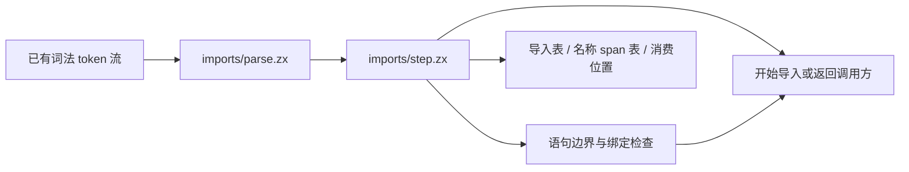
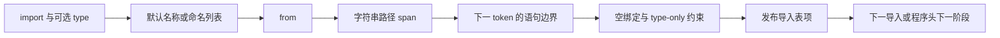
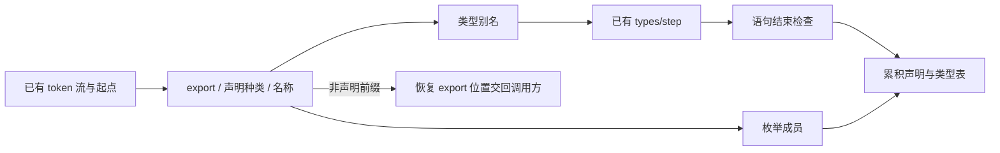

# 程序头导入序列迁移

## Intent：最终目标

把完整 Program 解析迁移到 RX+ZX 功能模块架构。本次完成可供程序头复用的导入序列解析，生产入口切换仍依赖声明、函数头、语句、状态更新块和 AST 适配。

## Data：可用证据

正式实现位于 `packages/compiler/src/zx/frontend/parser/imports/`。`parse.zx` 接受既有 token 流和起始位置；`step.zx` 处理名称、分隔、from 和路径；`finish.zx` 按旧 parser 顺序检查语句结束及绑定契约；`begin.zx` 完成下一导入的开始或把未消费的 token 留给程序头。

状态保存导入表和名称位置表，路径只保存字符串 token 的 span。名称边使用 first/count，未复制名称或路径文本。每个真实 token 推进一次 reduce；完成前一导入和开始下一导入可在同一步进行，没有经验次数预算或额外调度列表。

已用当前 CLI 生成普通 Zig 并构建可执行文件。`reference.zig` 调用正式 Zig 导入 parser 与本次生成模块，`verify_imports.py` 只重放已有 parser ZX 源码、格式化材料中的 source 字面量及关键词 JSONL。结果见[导入序列核对](导入序列核对.json)：112 份源码、485 个解析入口、2 次诊断，零差异。

核对名称 span、路径 token span、导入种类、完整导入 span、下一索引及首个诊断；失败时只比较已完成导入对应的名称，未发布的临时名称不作为 AST 输出。没有新增测试用例，没有运行全量测试。

## Edges：边界与自我复核

- 当前材料没有充分证明空命名列表、默认 type 导入和所有分隔错误的行为，不能把 2 次诊断当作完整负例覆盖。
- 路径文本解码仍留给后续 AST 适配；本次比较的是路径 token 位置，不声称验证了解码实现。
- token 流来自词法层，入口约定包含 EOF；本模块不重复词法校验，也不把任意手写 token 流当作有效输入。
- reduce 在完成后仍遍历余下 token，step 直接返回终止状态。本次不声称短路遍历或所有中间状态都无分配；后续应按完整 Program 的单次驱动接入，避免每条导入重复扫描。
- 新模块未替换生产 Parser.program，也没有解决自举表达式对 loop 更新块的语法缺口。后者需要共享 Statement/Block 表和统一调度，不应让 expression 与 statement 模块互相导入。

## Answer：交付与成功标准

交付完整导入语法的 ZX 实现、原 parser 对照工具和实际核对记录。该子阶段已生成、构建和运行核对；完整 Program、生产入口替换及 compiler stage1/2/3 固定点仍待完成。

## 共享子表达式请求入口

为完整 Program 复用表达式表，新增 `expressions/state/start.zx`：接收已有 Prepared、ExprTree、TypeState 与根源码位置，重置表达式控制和 continuation。原 initial 只创建空表后调用 start，独立 expression.rx 入口也使用同一实现。start 不重新准备词法，不合并表或重写旧节点索引；暂停中的嵌套解析仍使用现有 continuation，不调用该入口。

核对资源位于共享表达式目录，由 RX 只准备一次源码，再用 ZX 对已有 token 位置逐个发起请求。最后从累积表还原所有成功请求的 AST，并与正式 Zig parser 比较；独立 expression.rx 同时检查完整 AST、span/depth、消费位置和诊断。材料仍是已有 arguments_finish、primary、template 三份源码，没有新增用例。

[共享表达式核对](共享表达式核对.json)：2166 次请求，1103 次成功解析，零差异。核对驱动和参考程序均已构建并实际运行。核对用位置列表只用于重放，不是正式 parser 新增调度策略。该结果证明本批请求结束后旧表达式节点可继续按原索引读取，不证明所有泛型方法类型表路径或生产 Program 接入已经完成。

## 类型别名与枚举声明序列

### Intent：最终目标

完成 Program 程序头的类型别名与枚举解析，后续与导入、函数头、contracts 及语句使用同一驱动。类型子解析复用已有状态机和累积类型表，不复制源码名称，也不为每个声明生成独立词法结果。

### Data：可用证据

新增 parser/declarations，包含 header、typed、enumeration 和发布表项等职责。别名记录类型节点索引；枚举成员保存 span 和连续范围。遇到 export default 或其他非声明前缀时恢复 export 的索引，留给后续函数头。类型声明完成后检查语句结束，枚举闭合后按正式规则直接结束声明。

类型完成判断从 expressions/grammar/type_done 移到 types/done，由声明和表达式泛型解析共用；没有改变类型判断规则。

实际生成并构建 declarations/parse。参考工具直接调用正式 parser_declarations.Declaration，比较重建后的名称、类型 AST、成员顺序、声明 span、下一索引及诊断。[声明序列核对](声明序列核对.json)记录 140 份已有源码在 depth=0、254、256 的 1686 个入口，零差异。depth=256 覆盖 318 次类型深度诊断，枚举按原契约仍可完成。

### Edges：边界与自我复核

这批材料覆盖 Named、Object、List、Optional、Tuple 及枚举，尚无声明中的 Application 类型直接覆盖，也未完整覆盖所有错误分隔符或空枚举。沿用类型解析器不等于这些组合均已验证。

独立 parse 仍用真实 token 的 reduce，终止后 step 返回原状态。完整 Program 应逐步调用同一 step，避免重复扫描剩余源码；本阶段尚未完成该整合。引用解析、类型存在性与枚举重复项属于后续语义层，不在语法层新增特例。

### Answer：交付与成功标准

交付正式 ZX 声明序列实现、共享类型完成判断、原 parser 对照工具和执行记录。构建与上述已有材料对照通过，没有新增测试用例或执行全量测试。生产 Parser.program 仍待完整 Program 与语句迁移后切换。
