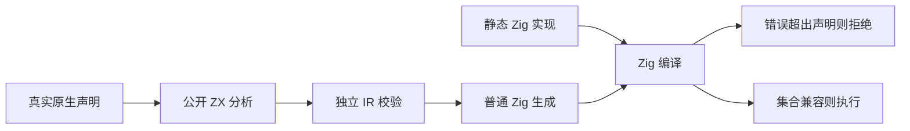
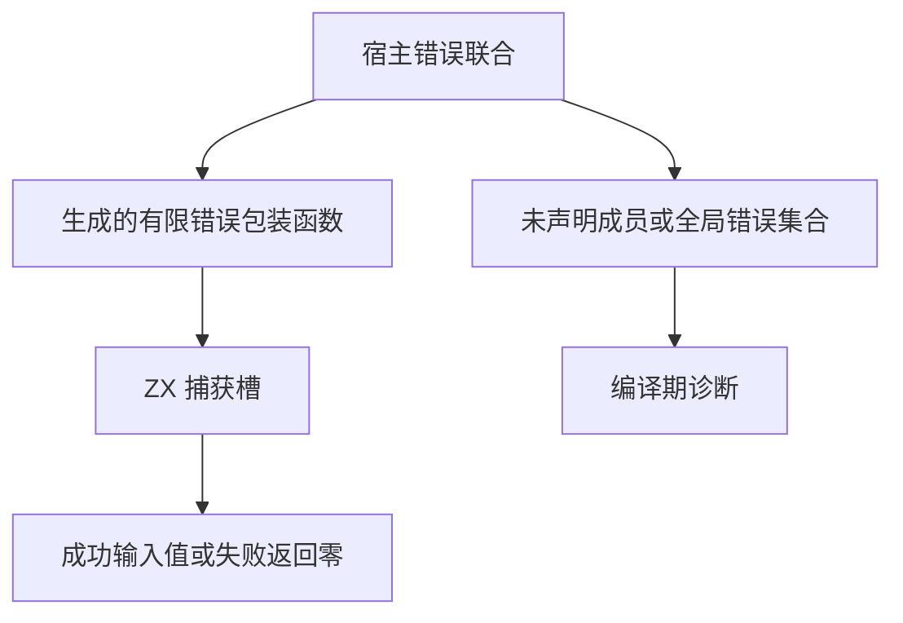

# 类型化原生错误 ABI 测试计划

## Intent：最终目标

验证有限 throws 声明是 Zig 静态原生调用边界的真实约束。声明遗漏实现可能返回的错误时，生成产物必须在编译期拒绝；错误集合相等或实现为声明子集时可编译和执行。

## Data：可用证据

genz/zx/external.zig 将原生调用包裹在显式有限错误联合中，函数体使用普通 Zig try 传播。Zig Build 的 Compile.expect_errors 是专用于校验预期编译错误的公开接口。使用真实 project.analyze、validateIr、emitBundle 与静态宿主模块，沿用前一运行部分的构建方式。

## Edges：边界与限制

只修改 packages/test 和本执行记录。源码前端无法从 .d.zx 读取 Zig 实现的真实错误类型，这一边界必须由 Zig 编译验证。负例覆盖标量、可空、void、空集合与 anyerror 实现；正例覆盖相等集合、较窄集合和不可失败实现。预期编译错误不算 Zig 测试声明；分别记录实际编译负例和正例执行。固定检出不混入实现会话的新宿主迁移。

## Answer：交付格式与成功标准

代码草稿先写本日期功能目录，再同步已授权测试目录。新建独立 test-typed-try-native-abi 门禁并加入既有聚合。Debug 与 ReleaseSafe 必须接受 5 个预期拒绝编译，执行 3 个正例。检查错误消息的遗漏成员或 anyerror 原因，禁止接受任意编译失败。完成后记录源与日志指纹、提交 push。





## 执行记录

正式范围为 21 个文件：既有聚合文件、新 ABI 构建文件、公共 ZX 源码、公开分析生成工具、共享 Zig 执行检查，以及 8 个宿主与声明对。共享执行检查有 1 个 Zig 测试声明，分别实例化在 3 个正例中；不得统计为新增 3 个独立源码声明。另有 5 个预期编译拒绝实例。

首轮 Debug 因测试传 allocator 而 execute 要求 arena 指针，全组编译失败，记录在 Debug调用签名修正前日志.txt。负例均未匹配预期错误，证明该门禁不会把无关编译失败当通过。修正测试签名后 Debug：25/25 步骤成功，5 个拒绝编译实例实际校验通过，3 个正例实际执行通过，无缓存运行步。ReleaseSafe 同样 25/25 步骤成功，5 个预期拒绝实例实际通过、3 个正例实际执行通过，无缓存运行步。两种模式退出均为 0。

在固定工作树 packages/test 内运行：

```sh
zig build test-typed-try-native-abi -Doptimize=Debug --summary all
zig build test-typed-try-native-abi -Doptimize=ReleaseSafe --summary all
```

标量、可空、void、空声明集合必须出现遗漏 ZetaFailure 的诊断；anyerror 实现必须出现全局错误集合无法收窄的诊断。Compile.expect_errors 匹配失败会令整个构建失败，成功日志中的 compile success 表示预期编译拒绝被成功验证，不表示负例产物可以编译。

## 自我批判

正例同时调用成功与错误路径，避免 Zig 惰性分析使包装函数没有被实际分析。负例必须检查具体错误原因，不能把文件缺失、生成失败或其他语法错误计为契约拒绝。本部分不证明宿主实现没有在运行时使用未定义行为，只证明 Zig 类型系统可表达的错误联合边界。
