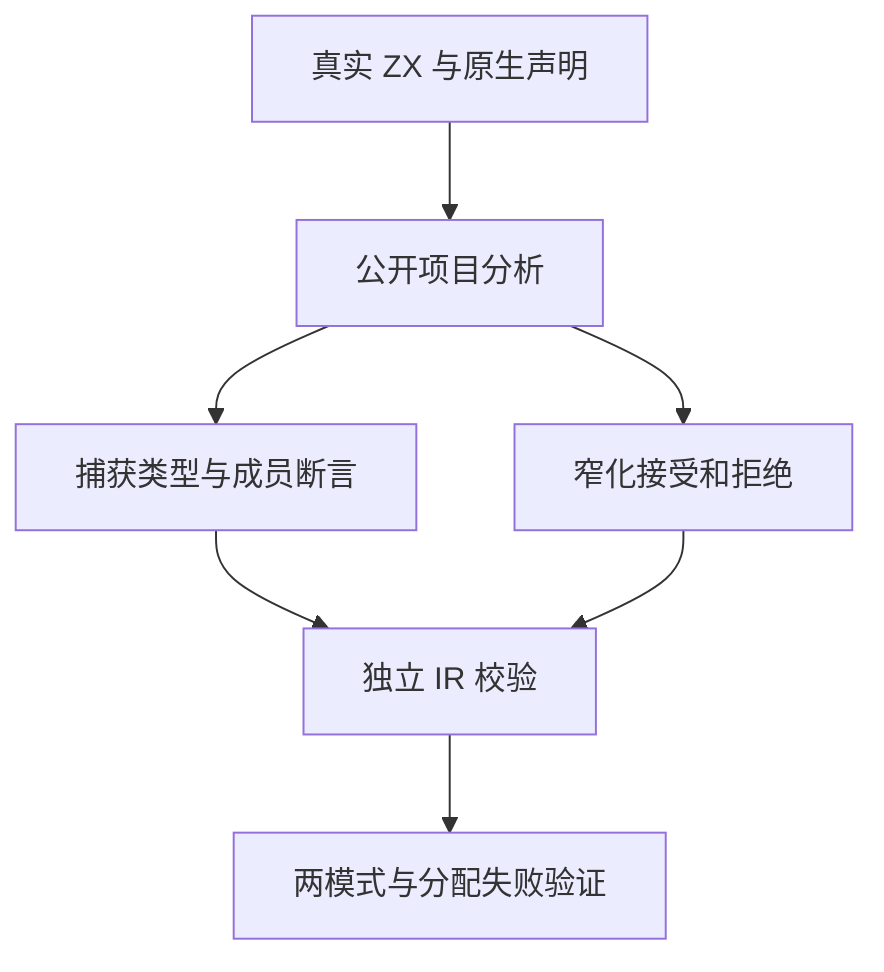
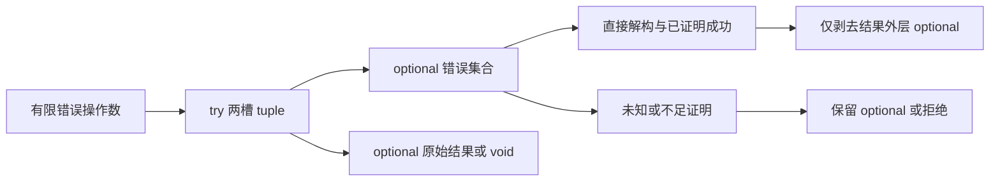

# 类型化捕获分析测试计划

## Intent：最终目标

通过真实 ZX 源码和公开 project.analyze 入口，验证 try 的两槽类型、有限错误集合和直接解构的成功关联。分别检查可以证明与不能证明的分支，避免仅凭成功示例放宽 optional 类型。

## Data：可用证据

生产基线 039a7ce0 的类型化错误参考定义了 T、T?、void 三种结果形状；原生未知 throws 不可捕获。上一部分原生声明契约已在 Debug 与 ReleaseSafe 各执行 18 个声明。本部分沿用同一固定检出，读取 statements、capture、refinement 的实现以定位契约，但预期来自公开语言语义。

## Edges：边界与限制

正式修改仅涉及 packages/test 的分析测试及构建接线。生产实现与实现会话的后续 cancel WIP 不参与本轮。分析成功必须再通过独立 validateIr；错误应断言诊断分类、消息及源范围。测试数量按独立 Zig test 声明记录，不把模式重复、参数数据和分配故障迭代算成新用例。
本轮静态分析不能证明实际 Zig 原生函数的错误集合、运行时 null 表示、任务等待与取消或编译库重放；这些另设执行和库边界部分。真实生产缺陷应反馈给实现会话，不在测试中改写期望消除失败。

## Answer：交付格式与成功标准

正式目录为 tests/language/expressions/typed_try/analysis，按捕获形状、窄化、拒绝与资源清理划分。代码草稿先保存于同日类型化捕获分析测试目录。新增 test-typed-try-analysis 构建入口，保留原生声明入口，固定生产提交后执行 Debug 与 ReleaseSafe；两模式通过、证据与提交字节一致后独立提交 push。

## 执行与自我批判

已完成 45 个独立分析声明：捕获形状与效果 13、窄化接受 13、拒绝 17、分配失败清理 2。形状直接检查捕获的二槽 tuple、有限错误成员、optional 层数及原始操作数类型；接受分析均再验证 IR。加入嵌套捕获及聚合分配错误，不把已捕获的原生错误泄漏到外层捕获。
Debug 首轮 41/41 实际执行；扩展后有 1 项测试材料错误，同类型元素的 `[a, b]` 推导为 list，原先误写 tuple 预期，已修正，未修改生产实现。修正前日志保留，不作为整组通过证据。
Debug 最终 19/19 构建步骤通过，形状组 13 个声明实际执行，其余 3 个分析组与 2 个原生声明组命中运行缓存；ReleaseSafe 最终同为 19/19 步骤，捕获分析 45/45 实际执行，2 个原生组命中缓存。联动的 18 个原生声明有上一部分同生产版本两模式实际执行证据。以上不声称 Debug 最终命令重新执行了全部 63 个声明。
两模式覆盖通过，没有发现生产缺陷，因此未向实现会话发送无问题消息。正式源码仅 6 份测试与接线文件；验证检出仍为 0f371fe5，生产仍为 039a7ce0，compiler/core/genz 无检出差异。结果 JSON 保存源文件和证据 SHA-256。
自我批判：静态类型和 IR 检查无法证明成功 null 与失败 null 在生成产物中确实区分，也不能证明原生 Zig 返回错误集合、运行时资源或库校验；这些仍待下一部分真实生成执行与库重放。分配失败声明中的多次迭代不算独立新增案例，模式复跑不计入 Test262 对齐。
