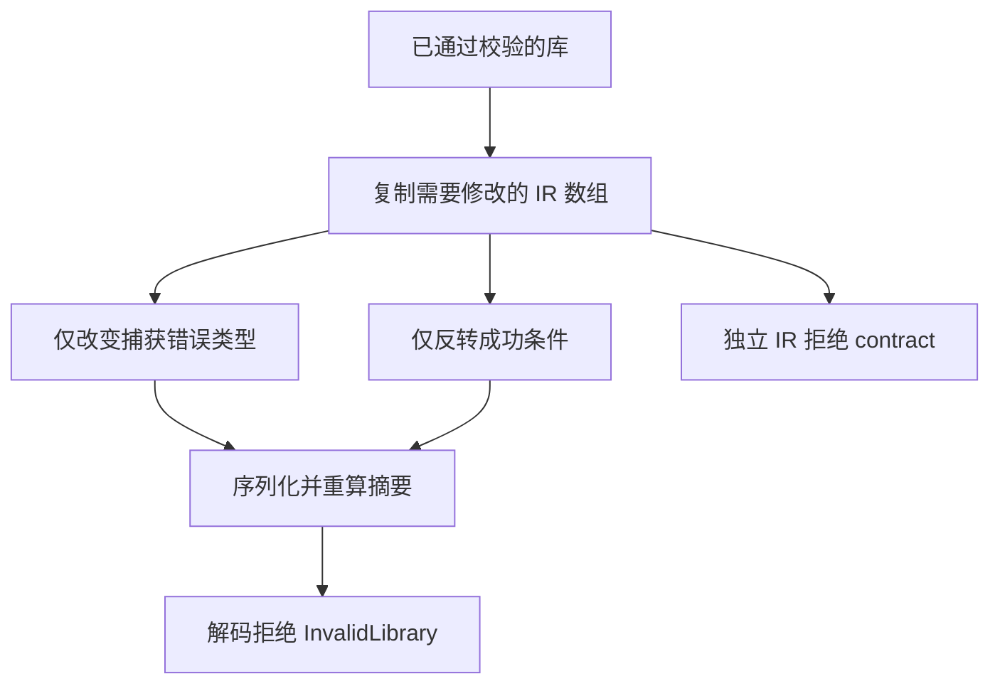

# 类型化捕获库测试计划

## Intent：最终目标

验证真实 ZX 类型化捕获通过统一编译库边界后，有限错误集合、捕获结果和成功分支窄化保持成立。拒绝摘要有效但错误集合或窄化证明不成立的库。

## Data：可用证据

生产固定检出沿用 release-safe-regression 工作树的 0f371fe5（类型化捕获生产提交 039 已包含）。前两部分已验证公开分析与真实 Zig 运行。本部分采用 project.analyze、library.link、codec.encode/decode、compiled_libraries、validateIr 等既有公开入口；参考 tests/library/imports 与 codec 的成熟实现。

## Edges：边界与限制

仅修改 packages/test 与本执行记录，不修改其他会话的生产源码。编译库是统一模块及公开接口，不增加 RX/ZX 独立库。IR ID 与数组位置由真实分析产物定位，禁止按样例位置硬编码。篡改错误集合保留原生函数的 external.errors，篡改条件保留结果类型与分支主体；使用重算摘要的合法封装进入语义校验。此部分不代替运行执行测试，不增加 Test262 上游条目计数。

## Answer：交付格式与成功标准

先保存代码草稿，随后同步已授权的正式测试。分 roundtrip、rejection、allocation 注册独立构建门禁，Debug 与 ReleaseSafe 检查。通过后记录源码与日志指纹，并提交 push。




## 执行记录

正式范围为 6 个文件：既有 typed_try 构建聚合文件，以及 library 子目录中的 fixture、mutation 和 3 组测试。共 13 个独立 Zig 测试声明：往返消费与再发布 6、语义拒绝 4、分配失败 3。每个拒绝用例同时检查 validateIr、codec.encode 与摘要有效的 codec.decode。

测试入口在 packages/test 中。最初从仓库根运行时提示不存在该独立门禁，调整为子包入口后执行：

```sh
zig build test-typed-try-library -Doptimize=Debug --summary all
zig build test-typed-try-library -Doptimize=ReleaseSafe --summary all
```

Debug：11/11 构建步骤成功，13/13 声明实际执行通过；无缓存运行步。ReleaseSafe：11/11 构建步骤成功，13/13 声明实际执行通过；无缓存运行步。两种模式均退出 0。

结构检查不是执行证据，本部分的可空与 void 用例证明库中形状和表达式被保留，其运行行为由已提交的类型化捕获运行测试覆盖。

## 自我批判

不能只断言解码未报错，必须检查捕获的错误成员和原生 external.errors，并证明 optional_value 仍存在于成功分支。篡改测试必须先证明原始库有效、修改实际发生且摘要重算；不得把摘要损坏当语义校验覆盖。分配失败采用既有检查工具枚举实际分配点，不预设次数。
