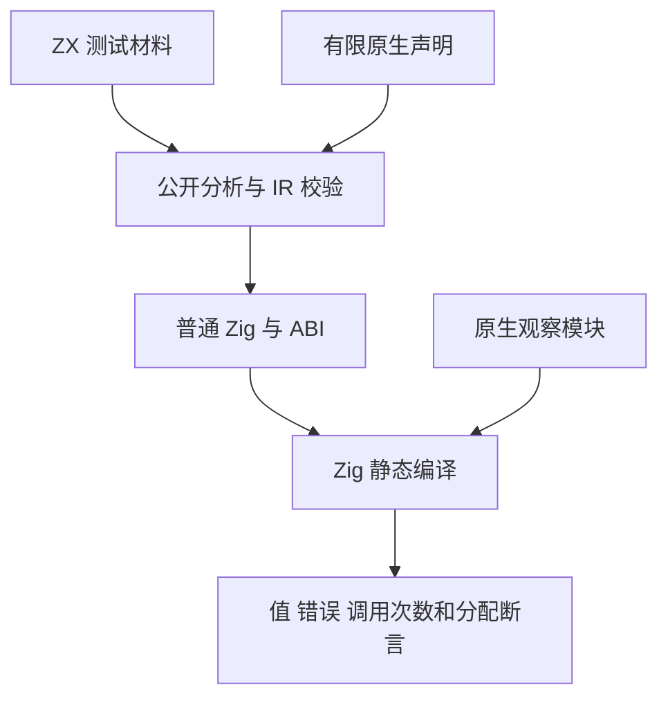
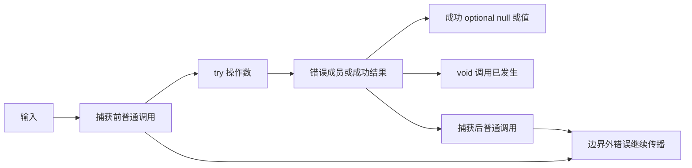

# 类型化捕获运行测试计划

## Intent：最终目标

将 typed try 的公开语义落实到普通 Zig 编译与运行，核对成功值、失败成员、optional 的两层表示、void 调用与捕获边界。测试生成产物的观察结果，补足上一部分静态分析无法证明的行为。

## Data：可用证据

039a7ce0 的类型化错误契约与异步功能已经正式提交；原生声明 18 个、捕获分析 45 个独立声明已分部分推送。成熟的 incremental/native_runtime 与 runtime/evaluation_order 使用公开项目分析、emitBundle、生成 ABI 模块、静态原生模块和 Zig addTest。沿用该路径，不通过手写 IR 或伪造输出绕过编译器。

## Edges：边界与限制

本部分只新增测试和构建接线。固定生产 039a7ce0；主工作区的 cancel 与 IO 生命周期修改不参与。原生测试模块明确声明有限错误集合；应用生命周期内的测试计数用于观察调用次数，不作为 zxc 运行库。材料中的输入分支只是可观察的原生接口实现，不向生产实现添加用例硬编码。
不同语义分别放在 runtime 的子目录。测试声明数量与生成/模式运行次数分别记录；每个独立断言属于 zxc 特性覆盖，不增加 Test262 逐份对齐数。编译库重放、异步、并行与取消仍按独立部分验证。

## Answer：交付格式与成功标准

先写入本目录的代码草稿，再同步已授权的 packages/test 正式目录。新增 test-typed-try-runtime 构建入口，公开分析与独立 IR 校验后生成 Zig/ABI，并静态链接原生模块。Debug 与 ReleaseSafe 应实际执行成功和失败路径；记录固定检出、源与日志指纹，通过后独立提交 push。

## 实施顺序与自我批判

先落实 scalar、optional、void、无错误与空 throws，再覆盖前后传播、嵌套捕获、索引和复合表达式的执行顺序。直接解构检查不引入包装分配；普通保存/嵌套 tuple 应遵守既有分配规则，其 OutOfMemory 也必须有明确观察结果。

已完成 10 组材料、30 个独立 Zig 声明：scalar 4、optional 3、void 2、infallible 2、empty throws 2、捕获前传播 3、捕获后传播 4、嵌套 4、索引 3、复合操作数 3。其中 2 项分配行为断言分别证明直接 scalar 解构不分配包装，以及外层捕获正确处理内层 tuple 的 OutOfMemory。

Debug 首轮 29/30 实际执行通过。唯一失败是测试假定内层原生调用发生后才分配 tuple；检查普通 Zig 产物及 construct 的既有分配行为后确认，存储分配可以在原生调用之前失败。公开契约只要求错误边界与包装分配规则，没有承诺失败分配时的原生调用次数，因此移除该非契约假设，并将 ZX 错误分支加强为明确比较 error.OutOfMemory。旧日志保留为材料核对记录，不作为全组通过证据。
Debug 最终 36/36 构建步骤通过，嵌套组 4 个声明实际执行，其余 9 组命中运行缓存，结合首轮相同源码的 26 个声明形成全组覆盖。ReleaseSafe 最终 36/36 步骤、30/30 声明实际执行、0 个缓存运行步。正式源码与草稿、固定检出一致；生成草稿脚本重复执行并格式化后仍与全部 26 份正式文件一致。
生产固定为 039a7ce0，检出为 0f371fe5；compiler/core/genz 无已修改或未跟踪文件。本部分未发现生产缺陷，未向实现会话发送无问题消息。生成 ABI 只含普通 Zig 类型并静态链接，无新增 zxc 运行库。
自我批判：不能以首次看到的生成顺序推定语言必须承诺该顺序，也不能将普通 tuple 存储分配与直接解构包装混淆。测试中的输入分支和返回标记是可观察原生接口，不进入生产实现。当前证明了精确声明的原生模块实际运行，但仍未覆盖漏报错误的构建拒绝、库重放及其语义篡改、异步/并行生命周期；这些继续分部分实施。30 个特性声明不算新增上游 Test262 条目。
