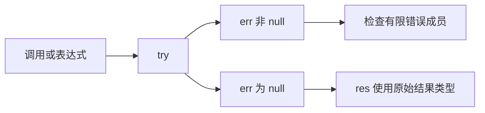

# 类型化错误参考

## Intent：最终目标

在 ZX 中显式处理调用失败，错误成员在编译期可知；需要传播错误时继续使用普通调用。

## Data：语法与使用

```zx
import encoding from "std:encoding"

export type Input = u8[]

export type Output = string

export default function (in: Input): Output {
  const [err, res] = try encoding.decodeUtf8(in)

  if (err != null) {
    return err == error.InvalidUtf8 ? "invalid" : "unexpected"
  }

  return res
}
```

`try` 将操作数的失败变成可检查的值。示例中 `err` 的类型为有限的 `InvalidUtf8` 错误集合加 null；成功时为 null。错误分支返回后，编译器证明调用已经成功，`res` 可以直接作为 string 使用。

普通 `encoding.decodeUtf8(in)` 不捕获错误，仍向调用者传播。`try` 的操作数采用前缀表达式优先级：`try f(in).field` 捕获调用及字段求值；捕获整个复合表达式时写作 `try (表达式)`。

### 结果与窄化

| 操作数返回类型 | 成功结果           | 失败结果        |
| -------------- | ------------------ | --------------- |
| T              | `[null, some(T)]`  | `[error, null]` |
| T?             | `[null, some(T?)]` | `[error, null]` |
| void           | `[null, void]`     | `[error, void]` |

表中的 some 表示 optional 内存在一个值，不是需要调用的 ZX 函数。原始结果为 optional 时，成功返回 null 与调用失败仍有不同表示。

直接解构 `const [err, res] = try ...` 保留两者的来源关联。`err == null` 的分支中，以及错误分支已经 return 的后续语句中，res 的外层 optional 会被去掉。`err != null` 的分支中，err 是确定存在的错误值，可以与 `error.Member` 比较，或用 match/switch 分别处理成员。复合条件只在可以证明时窄化，不以猜测放宽类型。

普通 tuple 不获得这种成功关联；将捕获结果先存入普通 tuple 变量再解构，也不自动恢复直接解构的证明。没有检查成功时，res 仍是 optional，可用既有 `??` 处理。

void 调用的第二槽必须丢弃：

```zx
const [err, _] = try operation(in)
```

直接解构不会为了包装结果额外分配内存。被调用函数自身的分配、编码或 I/O 成本仍然存在。

### 原生接口

原生声明用 `throws` 后的有限成员集合描述失败：

```zx
export declare function decodeUtf8(in: u8[]): string throws { InvalidUtf8 }
```

没有 `throws` 表示不返回错误。`throws {}` 表示返回空错误联合。裸 `throws` 保留兼容，但其错误集合未知，不能用于 typed try。错误名称采用 PascalCase，不能重复。

原生实现的真实错误集合由 Zig 编译核验；漏报成员会导致构建失败。第三方实现需给出准确声明，不能把未知错误任意强转到一个有限集合。

[标准模块声明](../2026-10-05/功能参考索引.md#标准模块)已给出所有可失败函数的有限集合。集合包含调用链和生成操作可能返回的错误，例如 OutOfMemory、IndexOutOfBounds、PreconditionFailed；它是静态可能集合，不表示每次执行都会出现其中每一项。

## Edges：边界与限制

- `error.Member` 必须属于使用位置的有限错误集合；拼错或不存在的成员在编译时被拒绝。
- try 只捕获它所包围的表达式。已经在前面的语句中发生的失败不会被后续 try 捕获。
- 嵌套 try 各自处理自己的边界；普通聚合值的保存遵循既有 tuple 表示与分配规则。
- panic、进程退出、外部终止不会变成 err。
- requires/ensures 契约暂不支持捕获与 optional 解包；RX 属性仍只负责数据组装，错误处理逻辑放在 ZX 中。
- 错误编号不是稳定的跨宿主 ABI。硬件、证明与 Wasm 标量导出仍遵循各自的类型限制。
- `try await` 与 `try parallel` 遵守同样的错误集合与成功关联规则，见 [ZX 异步与并发](ZX异步参考.md)。

## Answer：交付与成功标准

使用者得到静态有限错误成员、受检解构、成功路径窄化与普通错误传播。编译库再次消费时会重新校验捕获集合和非空证明，不只依赖源文件的检查结果。

可运行的 UTF-8 示例在 [utf8_capture.zx](ZX异步并发与类型化错误/验证/utf8_capture.zx)，构建及边界证据见[错误契约实施记录](ZX异步并发与类型化错误/错误契约实施记录.md)。


