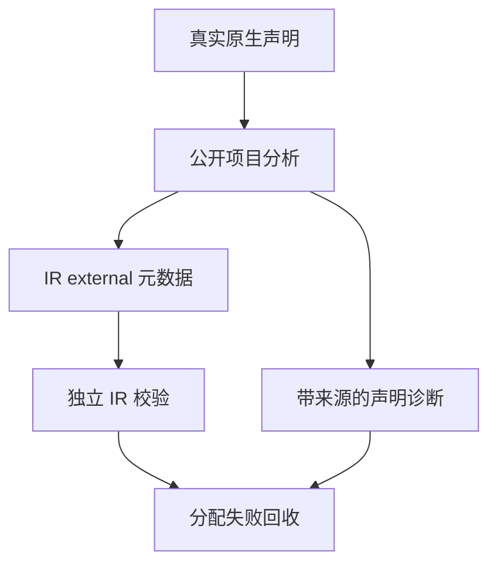
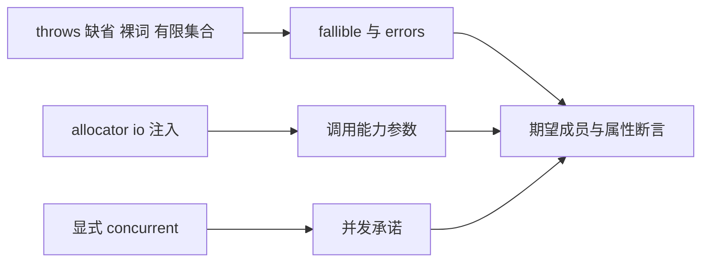

# 类型化错误原生契约测试

## Intent：最终目标

为有限原生 throws 集合与显式 concurrent 标记建立正式细粒度回归，验证声明经公开项目分析与 IR 校验后保留完整语义。

## Data：可用证据

生产提交 4034cc57 引入有限错误集合，039a7ce0 引入原生 concurrent 契约。复用 native/declarations_test.zig 的成熟公开 project.analyze、错误来源与 validateIr 习惯；测试真实声明文本，不手写替代 AST。

## Edges：边界与限制

只新增正式测试与构建接线，不修改生产实现。此部分证明声明、IR 元数据和分配失败清理；不证明 native 实现本身的错误集合准确性，不替代 typed try 捕获、任务执行或真实 IO 并发测试。有限集合按成员语义比较，不依赖类型 ID 或声明顺序。

## Answer：交付格式与成功标准

交付 native_contract 目录的接受、拒绝与共用 fixture，功能 build 文件及总入口接线。18 个独立 Zig 声明中包含两个分配失败回收声明。Debug/ReleaseSafe 各实际执行全部声明、保留源码和证据指纹；完成后独立提交 push。新特性声明不计作新上游 Test262 对齐案例。

## 架构图

## 数据流图

## 结果与自我批判

Debug 与 ReleaseSafe 均退出 0，各 9/9 构建步骤、18/18 Zig 声明实际执行，0 个缓存运行步。固定检出为 0f371fe5，包含生产功能提交 039a7ce0；compiler/core/genz 没有工作树差异。测试覆盖无错误联合、未知集合、有限空集合、成员保留、空白与尾逗号、命名与重复拒绝，以及 IO 不自动赋予 concurrent 的边界。

helper 只承载公开分析、接受与拒绝断言，类型元数据使用既有公开字段。没有使用生产校验器来生成期望集合；声明顺序不作为错误集合身份，未知/null 与有限空集合明确区分。两种模式重复执行不计作 36 个独立声明。

本部分没有发现新生产缺陷，因此不向实现会话发送通过消息。后续仍需捕获形状、成功窄化、库语义重验、真实原生实现错误联合及任务生命周期验证；当前通过不等于三个新特性已全面测试。
