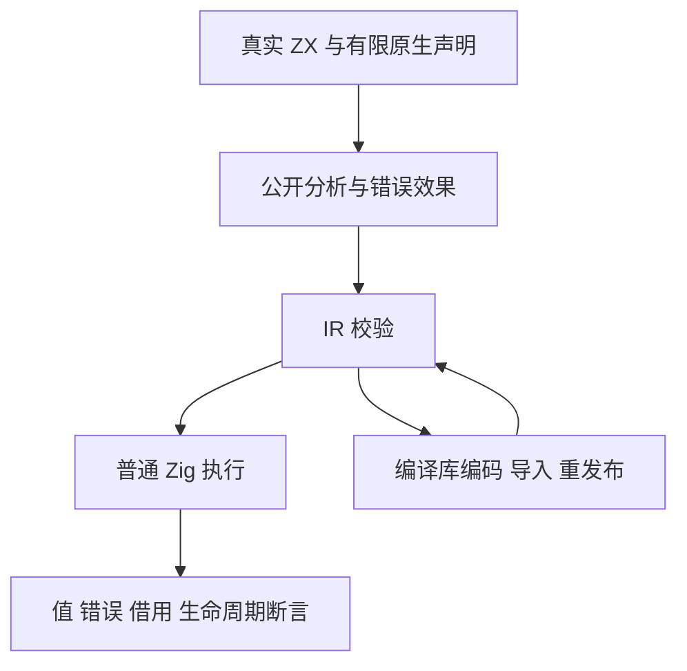
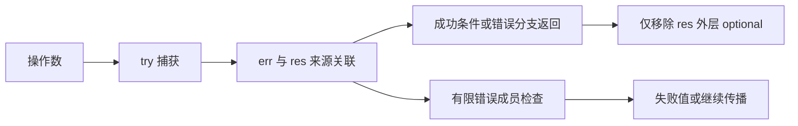

# 类型化错误测试计划

## Intent：最终目标

为正式提交 `4034cc57` 的有限错误契约与 typed try 建立与 Test262 相近粒度的分类回归，独立核对语法、错误效果、解构关联、非空证明、生成执行和编译库边界。

## Data：可用证据

实现会话已提交有限错误契约和 typed try；《类型化错误参考》描述直接 `const [err, res] = try expression` 的成功关联、optional 结果的两层表示、void 第二槽丢弃，以及未知原生 throws 不可捕获。实现记录仅提供少量 UTF-8、索引和环境变量示例，明确未向 tests 加入回归，也未执行全量测试。

## Edges：边界与限制

只编写测试，不修改该会话的生产实现；实际缺陷复现后向该会话反馈。先完成当前 RX 迁移各部分并保留其固定 `0d0f8409` 的证据，再复用检出切到 typed try 正式提交，避免把两种基线混为一谈。async/await 与 ZX parallel 已由 039a7ce0 正式提交；显式 cancel 已由 ae31a16c 正式提交，按各自固定提交验证，不混入共享目录的后续 WIP。RX 属性中的计算限制继续保留。
测试应覆盖保守可能集合，不假定每个成员在每次执行都会发生。不把 Zig 错误编号当成公共 ABI，不通过动态强制转型或固定错误字符串结果使测试通过。代码应走真实解析、公开分析、独立 IR/库校验与普通 Zig 执行；手写 AST 不能代替文本入口。

## Answer：交付格式与成功标准

在 `packages/test/tests/` 中按语法、效果、窄化、执行和库边界分组。每个独立契约使用独立断言，保留空输入、失败和后续成功路径，以及必要的分配失败清理。记录 Debug/ReleaseSafe 的实际声明数、运行次数、源码与生产版本。完成可验证部分后独立提交 push；归档并行 WIP 或模式重复次数不计入 Test262 逐份对齐。

## 架构图

## 数据流图

## 执行顺序与自我批判

先盘点成熟的语言表达式测试入口及库断言，建立静态与执行材料，再运行固定提交验证。特别检查：普通 tuple 不应获得关联；成功 null 不应与失败 null 合并；内部被捕获错误不应泄漏到外层效果；捕获结果仍需保持借用来源。不得仅复制少量实现示例后声称已覆盖 typed try；当前计划尚未实施，不是通过证据。

## 当前实施部分：原生有限错误契约

复用 native/declarations_test.zig 的公开 project.analyze 与 validateIr 习惯，先交付原生声明契约：无 throws、未知裸 throws、有限空集合、单成员/多成员、PascalCase 和重复拒绝，以及 concurrent 显式标记及 io 不自动赋予并发安全。每种独立语义单独声明测试，补充成功及拒绝路径的分配失败回收。
正式目录收口在 `tests/language/expressions/typed_try/native_contract/`，构建入口 `test-typed-try-native-contract` 由功能 build 文件注册。生产固定为 039a7ce0；复用工作树以 0f371fe5 检出全部已提交测试与该生产版本，确认先前 109 份覆盖材料均已完整提交并恢复为干净检出。原 0d0f8409 回归证据保留，不重写其基线。
错误集合按成员语义比较，不能依赖类型 ID 或外部声明数组的偶然排序。该部分只证明声明、IR 元数据和资源清理，不代表捕获、任务执行或整个原生函数实现的实际错误集合已核验；后者需要真实 Zig 编译和运行。
原生声明契约第一部分已完成两模式 18/18 实际执行；具体边界和证据见同日《类型化错误契约测试计划》。其余捕获与执行部分继续实施。
捕获静态分析第二部分已完成 45 个独立声明，两模式覆盖通过，具体实际执行及缓存命中见同日《类型化捕获分析测试计划》。运行时双层 optional 表示、原生错误实现与编译库独立校验继续实施。
捕获运行第三部分已完成 10 组、30 个独立声明，覆盖 scalar/optional/void、空错误集合、前后传播、嵌套、索引与复合表达式，以及 2 个分配行为断言。两模式覆盖通过，ReleaseSafe 30/30 全实际执行，详见同日《类型化捕获运行测试计划》。后续继续编译库校验、原生漏报拒绝与异步生命周期。

## 第四部分：统一库边界

已完成 13 个独立测试声明：往返、消费与再发布 6、IR/编码/摘要有效解码语义拒绝 4、分配失败清理 3。固定生产检出的 Debug 与 ReleaseSafe 均 13/13 实际通过。详见 [类型化捕获库测试计划](类型化捕获库测试计划.md)。未新增 Test262 上游案例，未修改生产实现。

## 第五部分：静态原生错误 ABI

固定生产检出上，Debug 与 ReleaseSafe 均通过 5 个预期编译拒绝实例，并实际执行相等错误集合、子集实现、不可失败实现的 3 个正例。共享执行检查只有 1 个独立 Zig 源码声明，实例数与声明数分别记录。详见 [类型化原生错误ABI测试计划](类型化原生错误ABI测试计划.md)。首轮测试调用签名错误已纠正并保存日志，未修改生产实现，未增加 Test262 条目。

## 第六部分：ZX任务分析

固定ae31a16c生产检出，新增54个独立测试声明（形状12、接受15、拒绝24、分配失败3），Debug/ReleaseSafe各54/54实际通过，运行缓存步均为0。公开project.analyze后独立validateIr，覆盖捕获、一次消费、有限错误与并行结果形状。发现独立void await语句缺口并反馈，生产修复后验证；实际并发与取消另立运行部分。详见 [ZX任务分析测试计划](ZX任务分析测试计划.md)。

## 第七部分：ZX等待运行

18个独立执行声明，每个分别在std.Io.Threaded强制内联与真实线程路径运行。Debug/ReleaseSafe各18/18实际通过、36次生成应用执行；原子计数与线程ID断言核验真实不同线程。覆盖scalar、捕获、direct/nested await、optional双层、void后续执行与有限错误、列表结果；尚不覆盖parallel与取消生命周期。详见 [ZX等待运行测试计划](ZX等待运行测试计划.md)。首轮execute参数顺序夹具错误已修正，未发现生产缺陷。

## 第八部分：ZX取消分析

21个独立声明（形状4、接受5、拒绝9、分配失败3），Debug/ReleaseSafe各21/21实际通过。检查真实cancel节点、void类型、原task错误与调用者错误效果、一次消费/分支汇合及取消后仍只读的捕获。生命周期运行另立门禁；首轮兄弟fixture的Zig模块导入错误已修正为具名共享模块，未发现生产缺陷。详见 [ZX取消分析测试计划](ZX取消分析测试计划.md)。

## 第九部分：ZX任务生命周期

13个独立执行声明，Debug/ReleaseSafe各13/13实际通过，每种模式15次应用执行。真实事件同步及原子观测在宿主收尾前核验显式/直接取消、scope/早退/原调用者错误、内层block退出及取消后的不可取消清理。completed组经标准Io同步完成契约委派真实Threaded async+await，明确与原始Threaded调度路径区分；初轮finished事件不足以证明Future后台完成，已收紧夹具并重验。未发现生产缺陷，parallel并发汇合与启动失败继续实施。详见 [ZX任务生命周期测试计划](ZX任务生命周期测试计划.md)。

## 第十部分：ZX并行运行

13个独立声明，Debug/ReleaseSafe各13/13实际通过，每种模式14次应用执行。事件屏障观测真实2/3分支重叠，started握手验证源码启动顺序，逆序业务完成保持源码首错与按名结果；all_join通过第二Future实际await释放任务，区分正常汇合与取消清理。零并发容量及第二次启动故障分别核验0启动和已启动任务取消等待。测试Io保留原Threaded userdata并委派实际标准操作，不是生产运行库。结果组装OOM、统一库及目标宿主继续实施；未发现生产缺陷。详见 [ZX并行运行测试计划](ZX并行运行测试计划.md)。
