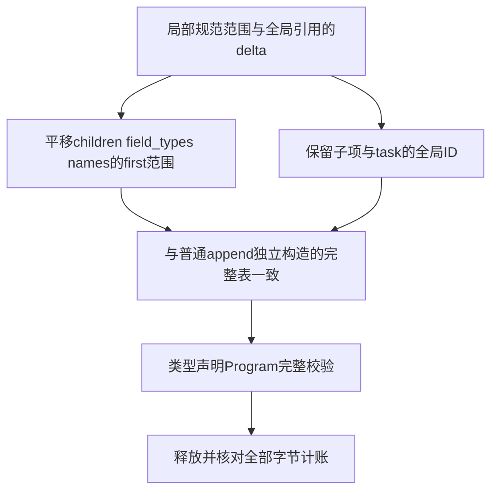

# 类型存储追加原子性回归

## IDEA

Intent：验证 TypeStorage 预备容量后才提交逻辑列的契约，以及 appendDelta 对辅助范围偏移和全局引用的不同处理。

Data：固定 6e1c8e46；finish 所有权和外部类型列已单独验证。append 与 appendDelta 都先逐列 ensureUnusedCapacity，可能部分列扩容后后续列 OOM。当前成熟资源测试主要检查链接全过程释放，未直接验证存储失败时原逻辑内容及可重试性。

Edges：禁止保留并比较扩容前借用地址；每次变更后重新 view。构造列形状独立合法、引用指向合并后既有或前序类型的 delta，它没有 Scalar 前缀，不能冒称独立完整 IR；只有基表与合并后表接受完整类型规则校验。名字字节是静态借用，只验证列数组所有权。不得用非法重排或越界输入当作成功路径。

Answer：单个现有门禁追加一个测试 owner，四条独立声明覆盖 tuple、object、enum 普通追加和全部辅助列的 delta 追加。逐个实际扩容点注入失败，比较全八列逻辑快照，关闭故障后同一存储实际重试，与普通逐项 append 构造的独立结果比较；双模式执行并保存固定来源，完成后单独提交推送。

