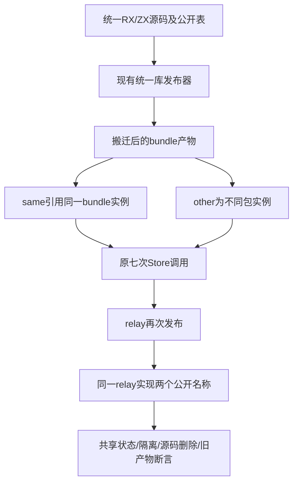

# 统一库发布来源迁移计划

## Intent：最终目标

完成既有统一库发布、搬迁、归档安装、Store初始化与再发布测试的最终RX契约迁移，继续验证同模块身份、不同包实例隔离、公开接口边界及旧产物保护。

## Data：可用证据

12份RX及rx_rejections.ts主检出WIP只做out→name，仍保留旧ctx。当前Call只接受fn/module/in/setter，结果名来自目标最后路径段，重复非void结果不得同名。rx_compiled原七次调用需要不同结果stem，两次relay也需区分。成熟Store公开表已有advance/again同指advance.rx，可复用同源码多公开导出；不复制实现制造不同模块身份。九份正常ZX存在value/type导入未分组或未排序，CLI格式入口会先于发布语义拒绝。

## Edges：边界与限制

只迁移23份测试来源，不改生产、不新增测试声明或目录案例。业务响应字段、expected函数、调用顺序、same:workspace:bundle@*、other实例、Store授权/签名、名义类型来源及归档/源码删除/执行目录空断言保持。统一公开表将四个新名称指向既有snapshot.rx或advance.rx，relay/again指向原main.rx，不制造独立RX/ZX库或运行层。

拒绝用例的module+service保留service，验证unknown_attribute；module+fn更新互斥诊断，module+setter更新现行Schema诊断。私有snapshot.rx访问继续保留源码后缀。共用Return改常量true，排除无关旧结果引用，不改变任何Call拒绝原因或原application字节保护断言。其余五个拒绝目的保持。真实门禁核对后，仅同步现行明确诊断，不放宽为任意失败。

## Answer：交付格式与成功标准

23份同路径草稿、正式来源、固定检出逐字节一致，执行既有test-library-publish聚合门禁，ReleaseSafe、-j2，覆盖11个既有Node驱动和其实际子场景、Zig原生消费。记录完整退出码和实际/缓存层级，不将脚本重复执行算新增覆盖。成功后独立提交push并核验提交后哈希；失败分类为夹具迁移或真实生产缺陷。

### 公开映射

| 原响应字段   | 调用路径                    | 结果引用                   | 实现来源                    |
| ------------ | --------------------------- | -------------------------- | --------------------------- |
| before       | bundle/snapshot             | $ctx.snapshot              | snapshot.rx                 |
| other_before | other/snapshot_other_before | $ctx.snapshot_other_before | 同一snapshot.rx             |
| first        | same/advance                | $ctx.advance               | advance.rx                  |
| second       | bundle/again                | $ctx.again                 | 同一advance.rx              |
| other        | other/advance_other         | $ctx.advance_other         | 同一advance.rx，不同包实例  |
| after        | same/snapshot_after         | $ctx.snapshot_after        | 同一snapshot.rx             |
| other_after  | other/snapshot_other_after  | $ctx.snapshot_other_after  | 同一snapshot.rx，不同包实例 |

最终relay两次调用为relay和relay/again，同指原main.rx；first/second响应字段不变。

## 自我批判

仅改属性名会把重复调用变成ctx重名错误，无法检验原Store共享。复制实现文件虽能消除名字冲突，却改变模块身份。公开别名必须在真实清单落盘并参与发布；不能在生产代码为测试造特殊解析。常量Return只排除无关表达式，八个Call自身必须仍各自触发对应拒绝。正常ZX排序仅移除格式障碍，最终聚合门禁仍需证明语义。

## 批量工具尝试

grit在修改前的fixtures目录执行Call绑定属性预览，退出1，报Could not find variable $attrs in this context，未产生匹配或修改。这不是批量重构成功证据。RX的ZX花括号属性也不属于普通HTML语法；本轮依据已核对的23份明确清单逐项迁移并保存原字节。

## 首轮纠正

第一次启动遗漏ZXC_TEST_SOLVER，entry/runtime/failure/inventory/contract通过--solver默认z3触发FileNotFound，真实solver已确认在既有/tmp路径可执行；属于本会话启动配置疏漏。首轮完整日志保留，退出1，不计通过。重新执行同门禁时设置既有ZXC_TEST_SOLVER。

另两条原拒绝regex已过时：当前module_reference.isPackage只精确匹配已登记的公开specifier，不根据文件是否存在切换分类；CLI references据此将未登记目标作为本地RX路径装载。实际私有bundle/snapshot.rx与未声明absent/read分别拒绝为bundle/snapshot.rx: FileNotFound和absent/read.rx: FileNotFound。原源码目标不改，原产物字节保护不改；regex更新为带首尾锚点、完整路径、精确FileNotFound及换行，避免任意失败冒充公开边界检验。正常公开别名已通过首轮四项直接输入，仍须验证完整再发布。

## 最终执行记录

固定3f977b60，设置既有ZXC_TEST_SOLVER，执行test-library-publish聚合门禁，ReleaseSafe、-j2，退出0，49/49构建步骤。11个原Node驱动完成59个实际声明实例，无Node运行缓存；入口5、runtime2、failure4、closure1、store2、compiled4、inventory12、contract3、rx_boundary8、rx_compiled17、native1。Node父子场景按日志tests口径计数，不另重复相加父项。

rx_compiled17含父场景1、四个直接输入、八个拒绝输入、四个再发布输入。原expected函数未变，same/bundle共享Store、other实例隔离、两轮relay状态递增都通过。Closure保留同一diamond叶子的名义类型，归档安装、源码删除、Zig独立消费及离线恢复通过。能力授权、缺失initializer、有效digest语义伪造和旧产物保护全部通过。

没有顶层Zig run test步骤；原Node驱动内的Zig消费与分配失败检验由既有assert核验，此日志不提供统一内嵌Zig实例总数，不能据此虚填。23份正式来源、草稿、固定检出一致；新增测试声明、目录案例及Test262审阅均0。没有生产源码变更，没有新运行层。首轮失败与grit失败完整保留，最终成功只对应带solver配置、精确拒绝诊断后的日志。
