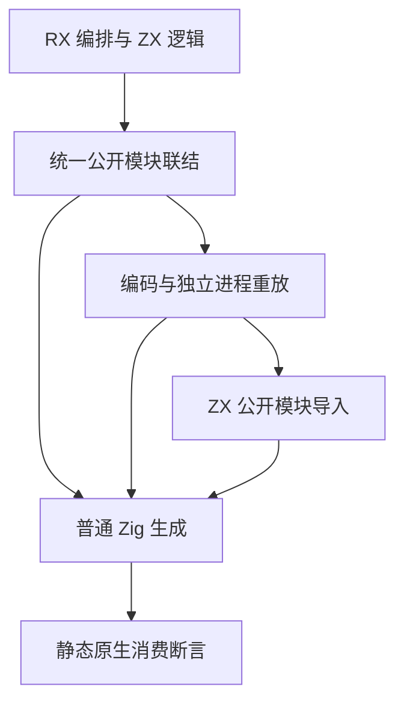
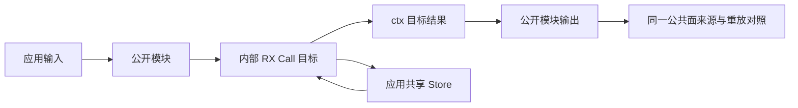

# 统一库运行迁移计划

## Intent：最终目标

迁移统一库内部 RX 编排材料和 Store 推导 helper，保持统一公共模块面、共享身份与静态 Zig 消费，继续验证来源、编码重放、ZX 导入和 Zig bundle 路径。

## Data：可用证据

本部分有四份真实 RX 材料及 `tests/library/store_fixture.zig` 的真实 XML 文本。混合库同时公开 RX 编排和 ZX 逻辑；Store 库多个公开名称指向同一写模块与读模块。既有断言覆盖空列表条件惰性、失败后的继续调用、共享更新、旧视图与不同应用宿主隔离。

## Edges：边界与限制

按《统一库设计》及《Store设计》迁移五份测试材料，不分裂 RX/ZX 库，不修改生产实现、公开导出表、Store 身份或期望断言。不新增运行库和自动落盘行为。本部分没有重复非 void 目标；直接使用真实 fn/module 文件的结果名称。发行搬迁和 CLI 发布属于下一部分，不能由这些内部消费路径推断已全部完成。

## Answer：交付格式与成功标准

交付材料、迁移脚本、Debug/ReleaseSafe 固定检出日志和源码指纹，运行 `test-library-link`、`test-library-initializers` 和 `test-library-runtime`。统计 API 与外部原生声明的实际执行次数；来源、库路由和不同模式不计为独立 Test262 案例。通过后独立提交 push。

## 架构图

## 数据流图

## 执行记录与自我批判

复核成熟 mixed/store 运行驱动，保留其公开名称和模块顺序反转覆盖。迁移只改变 Call 属性与结果引用；文本 helper 保留格式化 Store 路径与类型参数。完成后核对 diff 和固定检出日志，不把公共名称 aliases 与内部结果别名混淆。

## 消费者执行模式核对

首轮 Debug 已通过。读取外部运行链发现 `run_test.ts` 未传 Zig `-O`，所以旧 ReleaseSafe 构建只优化生成工具，实际消费者仍为默认 Debug。为取得两模式真实原生证据，最小修正运行协议：将必填 optimize 参数放在可选 native_host 前面，四份 build 文件全部显式传模式，Node driver 将其传给 Zig test。公共模块及应用接口不变，不增加兼容解析或默认回退；本部分范围因此从五份材料扩为十份正式文件。重新运行两模式，首轮日志保留为模式修正前记录。

## 最终结果与自我批判

两模式均退出 0、101/101 构建步骤成功。ReleaseSafe 的 68/68 API 声明实际执行、无缓存运行步；Debug 首轮同调用材料的 68/68 API 声明实际执行，模式接线修正后 12 个 API 运行步复用缓存、0 次 API 再执行。最终两模式各有 22 个 Node 消费组，108 次外部 Zig 声明全部实际执行，日志明确标记 debug/safe。

五份调用材料与首轮 Debug 指纹一致；四份 build 和一份 Node driver 的模式修正不改变 API 测试、公共名称、Store 物理身份或内存视图。来源、独立进程编码重放、ZX 导入、Zig bundle、原生模块与共享 Store 的输出和生命周期断言保留。未修改已有期望来适应迁移结果。

最初未察觉消费者固定为默认 Debug，仅运行名为 ReleaseSafe 的聚合入口不足以证明消费者的真实模式。现显式接线并验证日志和 Zig 调用，保留修正前证据，不把 Debug 缓存改写为实际执行。当前只验证内部消费路由，发行搬迁和再次发布仍需独立组；新增 typed try 也不在此固定基线内。
