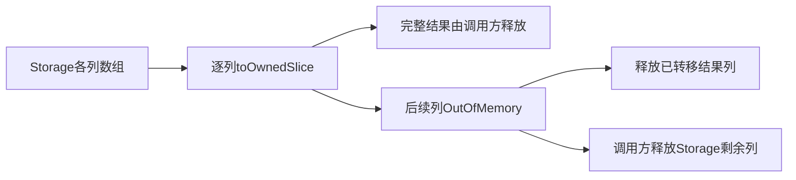
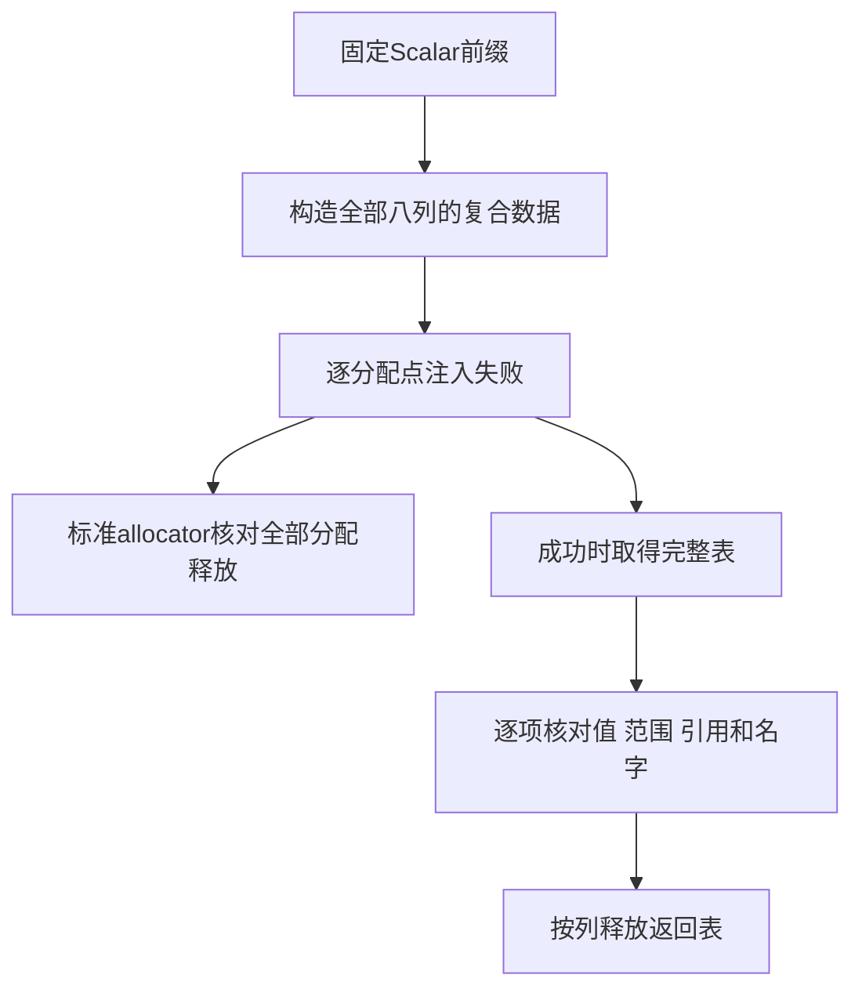

# 类型表结束阶段所有权回归

## IDEA

Intent：确认 TypeStorage.finish 在普通 allocator 上逐列转移所有权时的失败清理，避免 Arena 销毁掩盖已转移列的泄漏，并把该边界接入默认 type-merge 门禁。

Data：固定 fc040024 复现，Debug 与 ReleaseSafe 均实际退出 1。首次失败发生于 fail_index 6/9，累计分配 916 字节、释放 905 字节，已转移 kinds 列泄漏 11 字节；栈指向 storage.zig 的 toOwnedSlice。已按用户授权通知实现聊天，后续生产修复为 ba9dde18。原生产源码、原始日志和 SHA 均已保存。

Edges：本测试使用合法固定 Scalar 前缀与独立、规范的复合类型数据，不要求任意重排类型行。Storage 管理列数组，名字字节仍由调用方持有；失败时只要求已经转移给临时结果的列得到清理，不要求恢复 finish 前的所有逻辑内容或切片地址。追加原子性、损坏外部表及缓存恢复后的实际执行属于后续独立边界，不能凭本项通过宣称覆盖。

Answer：两个正式文件：现有 build.zig 的 type-merge 名单追加 storage；新 storage_test.zig 包含两个独立声明。测试复用成熟 allocation_testing，禁止 resize/remap，使每个实际分配失败位置被遍历，不新增运行器或生产实现。

## 复现与修复

初始复现直接导入 core TypeStorage，追加完整十一项 Scalar 前缀，调用 finish；成功后逐列释放返回表，退出时始终 deinit Storage。这个调用满足公开 allocator 和 owner 契约，既没有截掉清理，也没有使用无效类型值。

finish 原实现逐列 toOwnedSlice；每次成功都会把对应列从 Storage 转移到局部 result。后续分配失败时局部 result 未清理，Storage.deinit 只能释放尚未转移的列。修复添加 errdefer，释放 result 中已经接管的各列；空列 free 是正常空操作，尚未转移的列仍由原 Storage 清理。

固定 ba9dde18 重跑同一最小复现后，Debug 与 ReleaseSafe 均退出 0。正式夹具扩展为两项：原始 Scalar 前缀，以及包含 tuple、optional、object、list、error_set、enumeration、native_reference、task 的完整复合表。第二项使 children、field_types、field_names、names 也非空，覆盖全部八列的分配与转移，检查成功后的标量、子项、字段配对、名字、名义标签及全局引用。

## 实际范围与自我批判

正式的 type-merge、library-codec、cache-codec 三个门禁在固定 ba9dde18 上分别执行 Debug 和 ReleaseSafe：每种模式均退出 0，41/41 构建步骤通过，43/43 构建管理测试通过。原始日志中新增文件对应的 run test 明确执行 2/2；正式文件、隔离执行文件和草稿逐字节一致，具体 SHA 与命令保存在存储正式来源与证据.json。

迁移首轮七个既有门禁在 fc040024 的 Debug/ReleaseSafe 各为 172/172 步骤、172/172 构建管理测试通过。这些结果保留，但它们主要使用 Arena，不能证明本轮直接 allocator 路径。独立原生运行器和目标驱动的计数也不混入上述构建管理数字。

本轮失败应归因于 owner 转移，不是字段排序或名义查找。一个仅在 Arena 上运行的资源测试会得到过强结论；因此正式用例直接使用测试 allocator 和既有禁止 resize/remap 的枚举机制。成功时核对所有列及引用，失败时由标准计账证明没有泄漏，不能只验证返回 OutOfMemory。

两条声明不增加 JSONL 目录或 Test262 审阅数。当前主线随后增加的名义来源自举提交 5a523edd 不属于 ba9dde18 这次固定执行的证明范围，后续应独立验证。
