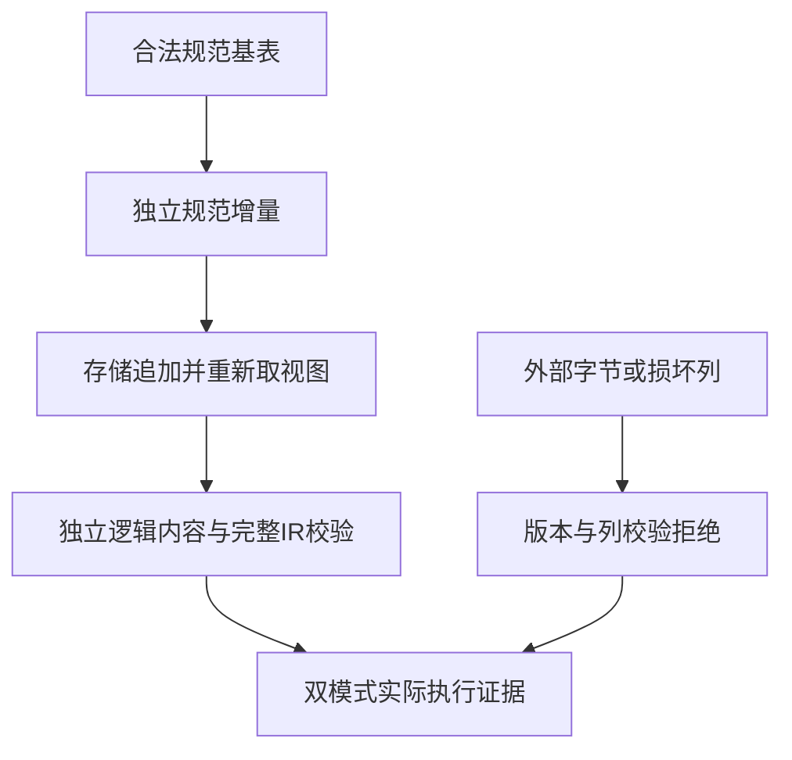

# 统一类型表迁移独立回归计划

## IDEA

Intent：为当前主线 fc040024 的 IR 23 列式类型表迁移取得独立执行证据，验证类型链接、名义身份、外部列校验、库与缓存恢复及生成布局，并补充现有专项尚未覆盖的语义边界。

Data：实现计划记录规范列式存储和消费者迁移已交付，名义、排序、解析和批量增量驻留自举仍未完成。已有专项通过不等于全量回归；此前本聊天的生成布局、应用与原生引用证据绑定旧生产提交，不能当作当前迁移通过。当前 git 提交、正式类型表源码及测试夹具是依据。

Edges：保持固定标量前缀、已验证 canonical delta 和已声明的借用视图生命周期；不能用任意类型重排构造非法输入后称为合法顺序回归。修改 Storage 后必须重新取得 view，OOM 只承诺逻辑内容不变，不承诺旧切片地址不变。测试遵循用户授权先写草稿，不把实施聊天的不新增测试工作范围外推到本测试任务。发现真实生产违约才通知实现聊天。

Answer：复用当前干净 json-output-conformance 隔离检出，固定 fc040024；先实际运行相关已有门禁，再依据只读审阅补最多几个独立语义族。完成 Debug/ReleaseSafe、源码/统一库/缓存路径及分配失败检查，保留原始失败、最终来源和自我批判后单独提交 push。

