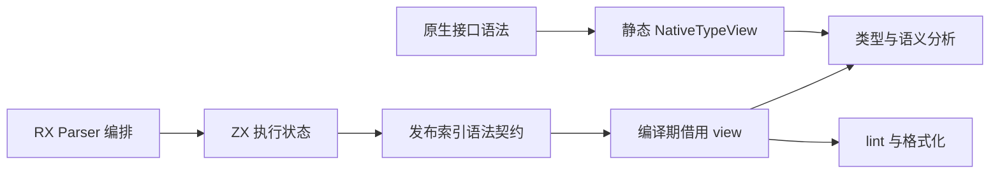
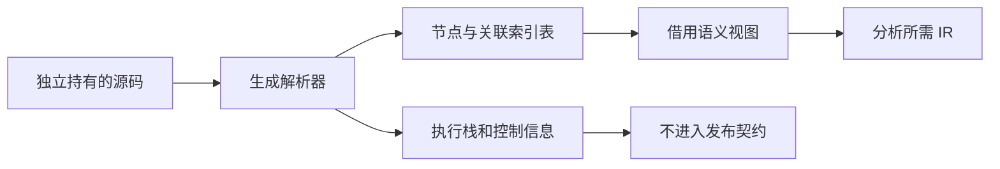
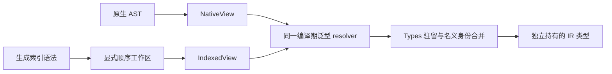

# 统一索引语法与消费链迁移

## Intent：最终目标

让生成 Parser 的索引语法表成为生产分析与 lint 的直接输入，移除 program_adapter 的整树及 Token 二次物化。使用 RX 编排和 ZX 逻辑继续完成编译器自举。公开解析结果仍独立拥有源码、文件名与诊断。

## Data：可用证据

现有生成输出直接暴露 BodyStage / Parsed 执行状态，包括 frames、control、prepared 与词法模板工作区。program_adapter 依赖这些嵌套字段，分配第二份 Type/Expression/Block、字段和 Token 表。generated 对象列表当前为指针切片；genz shared_types 只统一 nominal 类型，不会将它变成连续值数组。

反向 previous 链由当前 adapter 逆向回填恢复源顺序。消费迁移必须处理参数、语句、字段、模板和 match 的顺序，不能改成逐项重走链的 O(n²) 访问。

## Edges：边界与限制

- 选择编译期泛型借用 view：只保存 source、生成表切片和 root ID，访问时按值映射当前节点。core 不反向依赖 generated_parser，不用 vtable，不缓存第二树。
- 原生 .d.zx 目前仍由手写 Parser 产生指针 AST。类型解析器后续以静态 TypeView 参数化，共享同一解析算法；NativeTypeView 与 GeneratedTypeView 只负责读取，不互相物化。
- 公开源码副本是独立 ownership 契约；删除 dupe 会破坏 ParseCache，不能混同为 AST 优化。
- 仅改变 arena 或隐藏 adapter 不能算完成。迁移结束前继续明确保留的复制，不以生成成功代替生产消费闭环。

## Answer：交付格式与成功标准

第一步从 Parser 执行状态中分离可发布的索引语法契约。程序与独立表达式出口只返回节点表、Token/Comment、声明/导入/契约、root 与最终诊断。现有 adapter 改为消费这个契约，解析公开 API 暂不改变。这一步没有消除 AST 复制，验收目标仅是生产解析出口不再发布控制状态。

后续依次迁移类型解析、Analyzer 与全部 helper、lint/format、项目/缓存及 RX 表达式消费者。最终 generated parse 直接保留 owning 语法表并删除全量 adapter；原生接口 producer 随后统一。完整无 import compileWithContext 是首个用户可见闭环，不能只用内部分析调用宣称完成。

## 实施与自我复核

第一步发布契约分离已完成，消费者直接借用迁移尚未完成。发布结果中的表仍是既有生成 ABI 的对象指针切片，不称为连续值数组。临时 arena 的物理存储仍统一释放，裁剪返回形状不会自动回收其中旧分配；不能宣传内存下降。后续 view 的关联顺序协议必须在消费者切换前确定，不允许分配隐蔽的持久第二树。

字段访问迁移已尝试 grit 的 Zig 规则（含实际换行规则文件），当前工具在 language zig 首行拒绝解析，未更改源码；因此改用限定文件与明确字段链的批量替换，并复核 diff。

第一步验证：bootstrap-parser、test-frontend（313 项）及发行构建全部通过。实际 Program 输出只有 blocks/body/comments/consumes_input/contracts/declarations/diagnostic/expressions/function_start/has_store/import_names/imports/members/tokens/types；Expression 输出只有 blocks/comments/diagnostic/expressions/result/tokens/types。节点表内仍保持原来 previous 关联，不改变集合语义顺序。

实际完整自举产物摘要：parser.zig 为 `7d6bbac4501956ce445402dc6547a0294d91b35ac1ffc823c20736b8e6420e6b`，expression.zig 为 `3b333c4891bb43a2e6c858cdcdc0c41ee685e501bd68ae6679df0ced062c8c9b`。主 CLI 与原始 Zig CLI 编译同一当前 program.rx，单入口产物 SHA-256 同为 `db650e576e9d71e6b678156b1963a70890c582ca9115f96d73086de0154565c7`；生成入口不同则类型集合不同，不跨入口比较摘要。

未新增测试、未运行全量测试。原始 Zig 分支继续保留原生解析实现，此次自举出口迁移不复制到该分支。

## 类型消费协议迁移

类型表的 interning、nominal 共享和任务限制不依赖 AST 布局，保留在 Types owner。把声明查找与递归语法读取收束到一个编译期泛型 resolver，现有公开 initialize/named/resolve 先通过 NativeView 调用同一算法。后续 GeneratedView 直接读已发布 types/declarations/members，不重新构造 native Type。

视图只提供 Ref、kind/name/child，以及 declarations/fields/children/members 的计数与迭代。NativeView 的 Ref 是原指针，迭代直接借用原切片；它不分配、不持有缓存节点，也不改变消费顺序。类型结果中的 IR 字段与名称仍按既有所有权分配，不能把必要 IR 构造误称为 AST 复制。

完整既有类型解析已接入 NativeView，前端 313 项及既有原生声明、类型合并专项通过。随后将 modules/external 的自包含类型签名入口接入 IndexedView：生产分支直接运行生成 Parser、检查原有纯类型且无 import 约束，然后读取发布的类型表；seed 仍通过 NativeView。两者共用同一个 resolver，不复制类型解析算法。

此处只迁移现有 External.signature 入口，包含兼容外部签名；std: 与普通 .d.zx 仍使用原生声明入口，不能扩大为全部原生或标准库签名已切换。普通 ZX 程序、公开 parse 与 lint 的整树转换也仍保留。

### 顺序与生命周期

生成类型字段和 tuple 项使用反向关联。为保持源码顺序，signature 入口在自己的 scratch arena 中显式建立 heads、fields、items 三张 usize 顺序索引。每条边只反转关联方向一次，视图迭代不再从头重走链，不复制字段载荷、名称字符串或 Type 节点。该工作区是可见的 O(节点数＋边数) 时间和空间成本，不称为零分配；后续若 producer 直接发布正向关联，可以删除该工作区而保持 resolver 不变。

视图借用调用期间有效的 entry.signature 和生成表；所有最终 IR 字段名、枚举名及成员仍按原有规则由输出 allocator 持有。helper 返回前释放解析及顺序工作区，外部接口后续读取的是独立 IR，不保留 scratch 引用。公开 parse 的独立源码所有权没有改变。

类型视图阶段验证：既有 test-frontend（313 项）、test-native-declarations、test-type-merge、test-nominal-origins、test-object-evaluation-order 及最终发行构建通过。额外复用既有 coalesce.zx/coalesce.jsonl 和原生成/执行工具运行 144 条既有记录，全部通过，覆盖对象签名中的 bool/optional 字段和外部调用错误顺序；未编写新用例。外部 tuple 的前向读取与字段使用相同关联反转算法，本轮没有新增其专项用例，不把已有枚举/对象证据扩大为穷举类型语法。

主 CLI 与原始 Zig CLI 编译相同当前 program.rx，源码摘要仍同为 `db650e576e9d71e6b678156b1963a70890c582ca9115f96d73086de0154565c7`。该比对验证普通类型解析迁移后的此入口一致性；外部索引路径依据上面的真实签名与执行专项验证。

自我复核：新索引分支没有调用 program_adapter，也没有创建 native Type/Expression/Block/Token 数组；它仍分配生成解析工作区、三张顺序索引以及最终 IR 所需数据。未测量总分配或吞吐，因此不宣称净内存下降比例或完整零成本。后续先扩大同一视图协议的生产消费者，再移除残余兼容物化，避免停留在单个入口。
