# 统一索引语法与消费链迁移

## Intent：最终目标

让生成 Parser 的索引语法表成为生产分析与 lint 的直接输入，移除 program_adapter 的整树及 Token 二次物化。使用 RX 编排和 ZX 逻辑继续完成编译器自举。公开解析结果仍独立拥有源码、文件名与诊断。

## Data：可用证据

现有生成输出直接暴露 BodyStage / Parsed 执行状态，包括 frames、control、prepared 与词法模板工作区。program_adapter 依赖这些嵌套字段，分配第二份 Type/Expression/Block、字段和 Token 表。generated 对象列表当前为指针切片；genz shared_types 只统一 nominal 类型，不会将它变成连续值数组。

反向 previous 链由当前 adapter 逆向回填恢复源顺序。消费迁移必须处理参数、语句、字段、模板和 match 的顺序，不能改成逐项重走链的 O(n²) 访问。

## Edges：边界与限制

- 选择编译期泛型借用 view：只保存 source、生成表切片和 root ID，访问时按值映射当前节点。core 不反向依赖 generated_parser，不用 vtable，不缓存第二树。
- 原生 .d.zx 目前仍由手写 Parser 产生指针 AST。类型解析器后续以静态 TypeView 参数化，共享同一解析算法；NativeTypeView 与 GeneratedTypeView 只负责读取，不互相物化。
- 公开源码副本是独立 ownership 契约；删除 dupe 会破坏 ParseCache，不能混同为 AST 优化。
- 仅改变 arena 或隐藏 adapter 不能算完成。迁移结束前继续明确保留的复制，不以生成成功代替生产消费闭环。

## Answer：交付格式与成功标准

第一步从 Parser 执行状态中分离可发布的索引语法契约。程序与独立表达式出口只返回节点表、Token/Comment、声明/导入/契约、root 与最终诊断。现有 adapter 改为消费这个契约，解析公开 API 暂不改变。这一步没有消除 AST 复制，验收目标仅是生产解析出口不再发布控制状态。

后续依次迁移类型解析、Analyzer 与全部 helper、lint/format、项目/缓存及 RX 表达式消费者。最终 generated parse 直接保留 owning 语法表并删除全量 adapter；原生接口 producer 随后统一。完整无 import compileWithContext 是首个用户可见闭环，不能只用内部分析调用宣称完成。

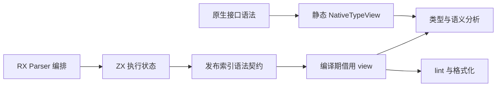

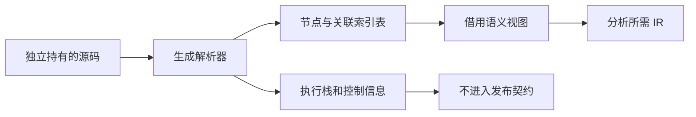

## 实施与自我复核

第一步发布契约分离已完成，消费者直接借用迁移尚未完成。发布结果中的表仍是既有生成 ABI 的对象指针切片，不称为连续值数组。临时 arena 的物理存储仍统一释放，裁剪返回形状不会自动回收其中旧分配；不能宣传内存下降。后续 view 的关联顺序协议必须在消费者切换前确定，不允许分配隐蔽的持久第二树。

字段访问迁移已尝试 grit 的 Zig 规则（含实际换行规则文件），当前工具在 language zig 首行拒绝解析，未更改源码；因此改用限定文件与明确字段链的批量替换，并复核 diff。

第一步验证：bootstrap-parser、test-frontend（313 项）及发行构建全部通过。实际 Program 输出只有 blocks/body/comments/consumes_input/contracts/declarations/diagnostic/expressions/function_start/has_store/import_names/imports/members/tokens/types；Expression 输出只有 blocks/comments/diagnostic/expressions/result/tokens/types。节点表内仍保持原来 previous 关联，不改变集合语义顺序。

实际完整自举产物摘要：parser.zig 为 `7d6bbac4501956ce445402dc6547a0294d91b35ac1ffc823c20736b8e6420e6b`，expression.zig 为 `3b333c4891bb43a2e6c858cdcdc0c41ee685e501bd68ae6679df0ced062c8c9b`。主 CLI 与原始 Zig CLI 编译同一当前 program.rx，单入口产物 SHA-256 同为 `db650e576e9d71e6b678156b1963a70890c582ca9115f96d73086de0154565c7`；生成入口不同则类型集合不同，不跨入口比较摘要。

未新增测试、未运行全量测试。原始 Zig 分支继续保留原生解析实现，此次自举出口迁移不复制到该分支。

## 类型消费协议迁移

类型表的 interning、nominal 共享和任务限制不依赖 AST 布局，保留在 Types owner。把声明查找与递归语法读取收束到一个编译期泛型 resolver，现有公开 initialize/named/resolve 先通过 NativeView 调用同一算法。后续 GeneratedView 直接读已发布 types/declarations/members，不重新构造 native Type。

视图只提供 Ref、kind/name/child，以及 declarations/fields/children/members 的计数与迭代。NativeView 的 Ref 是原指针，迭代直接借用原切片；它不分配、不持有缓存节点，也不改变消费顺序。类型结果中的 IR 字段与名称仍按既有所有权分配，不能把必要 IR 构造误称为 AST 复制。

完整既有类型解析已接入 NativeView，前端 313 项及既有原生声明、类型合并专项通过。随后将 modules/external 的自包含类型签名入口接入 IndexedView：生产分支直接运行生成 Parser、检查原有纯类型且无 import 约束，然后读取发布的类型表；seed 仍通过 NativeView。两者共用同一个 resolver，不复制类型解析算法。

此处只迁移现有 External.signature 入口，包含兼容外部签名；std: 与普通 .d.zx 仍使用原生声明入口，不能扩大为全部原生或标准库签名已切换。普通 ZX 程序、公开 parse 与 lint 的整树转换也仍保留。

### 顺序与生命周期

生成类型字段和 tuple 项使用反向关联。为保持源码顺序，signature 入口在自己的 scratch arena 中显式建立 heads、fields、items 三张 usize 顺序索引。每条边只反转关联方向一次，视图迭代不再从头重走链，不复制字段载荷、名称字符串或 Type 节点。该工作区是可见的 O(节点数＋边数) 时间和空间成本，不称为零分配；后续若 producer 直接发布正向关联，可以删除该工作区而保持 resolver 不变。

视图借用调用期间有效的 entry.signature 和生成表；所有最终 IR 字段名、枚举名及成员仍按原有规则由输出 allocator 持有。helper 返回前释放解析及顺序工作区，外部接口后续读取的是独立 IR，不保留 scratch 引用。公开 parse 的独立源码所有权没有改变。

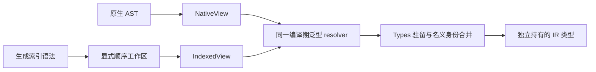

类型视图阶段验证：既有 test-frontend（313 项）、test-native-declarations、test-type-merge、test-nominal-origins、test-object-evaluation-order 及最终发行构建通过。额外复用既有 coalesce.zx/coalesce.jsonl 和原生成/执行工具运行 144 条既有记录，全部通过，覆盖对象签名中的 bool/optional 字段和外部调用错误顺序；未编写新用例。外部 tuple 的前向读取与字段使用相同关联反转算法，本轮没有新增其专项用例，不把已有枚举/对象证据扩大为穷举类型语法。

主 CLI 与原始 Zig CLI 编译相同当前 program.rx，源码摘要仍同为 `db650e576e9d71e6b678156b1963a70890c582ca9115f96d73086de0154565c7`。该比对验证普通类型解析迁移后的此入口一致性；外部索引路径依据上面的真实签名与执行专项验证。

自我复核：新索引分支没有调用 program_adapter，也没有创建 native Type/Expression/Block/Token 数组；它仍分配生成解析工作区、三张顺序索引以及最终 IR 所需数据。未测量总分配或吞吐，因此不宣称净内存下降比例或完整零成本。后续先扩大同一视图协议的生产消费者，再移除残余兼容物化，避免停留在单个入口。

## 顶层校验的借用读取边界

Intent：为普通类型模块的索引消费移除 lint 对 Type AST 的前置依赖。Data：现有顶层命名仅检查导入绑定和声明名，排序及空行仅读取 span、路径、类别及函数边界；函数体和契约仍有独立递归规则。Edges：保留现有公开 lint API，不能伪造带 undefined 类型值的 Program，不能跳过 import 顺序、注释边界或命名诊断；此阶段不修改 ParseCache，不宣称类型模块已去除物化。Answer：同一顶层规则支持编译期借用 Header，原生入口通过 Native Header 实际复用，后续索引入口实现同一读取方法。所有映射只返回当前导入或声明元数据，不分配第二份集合。

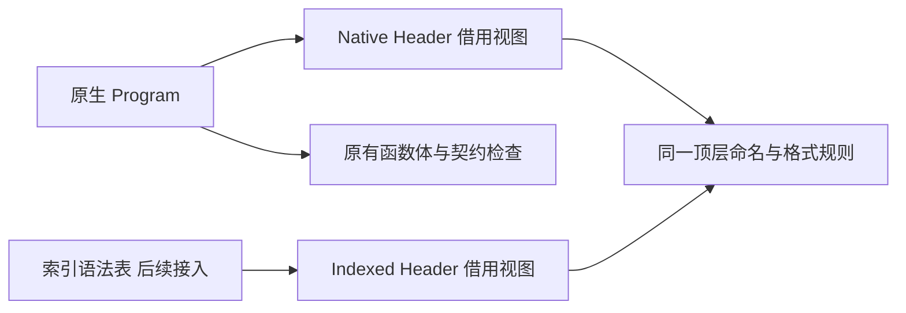

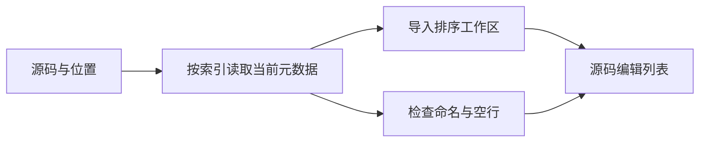

### 顶层校验实施与复核

顶层命名、导入排序、声明空行已共用 Header 的按索引读取方法。Native Header 只借用 Program，单次读取返回导入 kind/path/span 或声明 name/span；不构造替代 Program、不读取 Type、不复制声明或名称数组。导入排序保留原有必要工作区，其中不再携带未使用的 names 切片。函数体与契约命名继续执行原有遍历；有函数体的 spacing 继续进入原有 block 规则。纯类型生产入口调用同一个 checkHeader，公开 check/format/spacing.edits 的签名与行为保留。

既有 test-zx-import-order-library、test-frontend 及最终发行构建均通过；没有新增用例或运行全量测试。初次从仓库根目录调用包内专项时提示 step 不存在，随后在 packages/test 正确入口执行成功，不计作源码失败。

自我复核：这只是 lint 消费接口的解耦；当前 Native Header 背后仍是已经物化的 AST，comments 也仍是原 Span 切片。Indexed Header、索引 comments 直接读取与项目缓存入口尚未接入，所以没有声称减少普通类型模块的解析分配或完成 zero copy。

### 下一阶段的缓存与分析约束

ParseCache 应维持每个路径一个 digest、一个 owning 结果，用互斥 native/indexed 表示，不保留两棵树。内部 getModule 服务项目检查和加载；公开 get 保留原 *const parser.Result，当明确命中 indexed 时成功生成 native 后再替换，OOM 时保留旧项。getModule 命中 native 不反向转换。统计必须反映实际解析与复用，不能隐藏兼容重解析。

模块 producer 必须直接以已发布 output.body 是否为空判定纯类型，不能先构造 native AST，也不能引用发布前的旧 prefix.present 字段。源码和路径仍独立持有。项目加载只在输入边界选择 view，导入、环检查、semantic restore、模块记录与 ownership 保持同一条实现链。Analyzer 的类型入口要复用初始化、Store context 授权、nominal 合并和 exports，不能手写简化 Program 跳过这些步骤。

## 类型模块完整生产接入

Intent：项目内纯类型 `.zx` 从一次生成解析直接进入 lint、导入和类型分析，不再创建原生 Type/Token 数组。Data：现有公开 ParseCache.get 被 RX 与增量回归依赖，项目检查覆盖全部 source，Project.load 持有完整导入和语义缓存行为。Edges：普通函数体保留原生兼容；源码与文件名独立持有，返回 IR 不借用缓存；原生接口声明暂不迁移；不改变缓存格式、导入约束或 Store 授权。Answer：实现互斥 owning 解析结果、共享加载链和类型分析入口，并通过现有缓存、模块与前端专项验证，不新增用例。

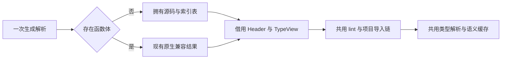

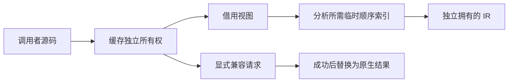

实现草稿统一保存在本功能的 `草稿/类型模块/` 下。索引结果可分别持有源码 arena 和生成语法 arena，这不是双树；普通函数体转换完成后仍释放生成临时 arena。类型字段顺序索引仅在分析期间保留。此设计减少重复语法表示，不宣称生成解析器自身工作区已零分配。

共享 Header 现在同时服务 lint 和模块语义读取，纯元数据契约应归 core.syntax；lint 保留规则和格式编辑，compiler 保留 generated storage 的读取实现。沿用 lint.header 的公开别名可保持此前调用兼容，但语义分析不应依赖 lint 才能读取导入。

### 完整接入结果

生产项目的 getModule 已保留纯类型索引结果，root 的全部源码检查与 Project 的可达模块加载读取同一缓存。导入绑定按当前位置读取，不复制中间 names 数组；最终模块记录和 IR 继续独立持有字符串。普通函数体缓存只保留转换后的原生结果。公开 get 命中索引结果时重解析并替换，实际解析次数计入 parsed；创建新结果失败时不释放旧条目。

索引分析入口复用类型初始化、共享名义身份、Store 授权与导出逻辑，所有权检查和语义缓存仍在共享项目加载链执行。分析用的顺序工作区从解析结果的底层 allocator 创建独立临时 arena，避免挂在输出 arena 下后因 IR 分配穿插而延长存活。共享 Header 契约已归 core.syntax，lint 直接借用生成注释位置，未生成第二份 Comment/Token/Type 表。

### 验证证据与自我复核

- 既有 test-frontend、test-parse-cache、test-semantic-cache、test-module-records、test-type-merge 均通过。
- Header 移入 core 后，test-nominal-origins、test-zx-import-order-library、test-native-declarations 及最终发行构建通过。
- module-records 的既有用例实际覆盖纯类型入口、枚举导出、缓存释放后的 IR/记录读取，以及项目加载分配失败；type-merge 的既有输入包含枚举、optional、list、tuple 和 object。其资源枚举针对合并本身，不能扩大成全部类型解析路径的 OOM 穷举。
- 主 CLI 与保留的原始 Zig CLI 使用 `--no-cache` 编译同一当前 Parser program.rx，生成源码逐字节一致，SHA-256 同为 `db650e576e9d71e6b678156b1963a70890c582ca9115f96d73086de0154565c7`。

没有新增测试或运行全量测试。公开 get 与内部 getModule 混用时的兼容重解析分支经过所有权及失败顺序审查，本轮未新增该组合的专项用例。常规缓存专项主要使用带函数体的模块；索引表示的类型语义、IR 独立所有权和资源释放证据来自模块记录、名义类型与类型合并专项，不混淆覆盖范围。

此阶段完成纯类型项目链的直接消费，不是全部编译器自举完成。公开 parse、普通函数体、独立表达式、RX 表达式消费者及 .d.zx 仍有原生 AST 路径。生成解析器自身仍使用 arena 和工作数组，索引结果保留其语法 arena；没有测量净峰值内存或吞吐，不声称按某个比例加速、完整零分配或全管线零拷贝。后续应扩大同一视图协议到普通程序消费，并逐步移除兼容物化。

## 普通程序消费协议

Intent：让表达式、普通块、loop 状态块、callback 和 contracts 共用同一语义算法，随后直接读取索引表。Data：Analyzer 的持久字段只有 IR、符号、类型表与上下文；expression_binding 按名称路径和 SymbolId 匹配，不依赖 AST 指针身份。Edges：不把整个 Analyzer 泛型化，不建立第二套 expression switch，不创建持久 native 节点数组；公开解析兼容仍保留。Answer：先将现有分析算法的语法输入改为静态借用协议，再接索引读取器与完整 body lint，最后才允许普通程序进入索引缓存。

原生 Expression 指针可直接作为一种 Ref，由 core 的编译期读取 helper 返回当前 value；索引 Ref 持有上下文指针、节点 ID 与当前 span，read 返回当前节点描述，子节点保持 Ref。集合保留 len 并提供按索引读取：原生切片直接取元素，索引集合通过临时 numeric order 表 O(1) 获取对应边，不逐项从 head 重走反向链。类型注解通过已有 TypeView resolver 读取，不临时物化 Type。

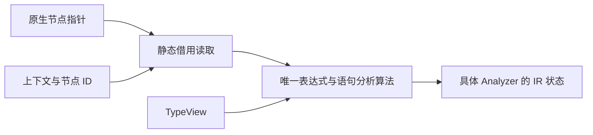

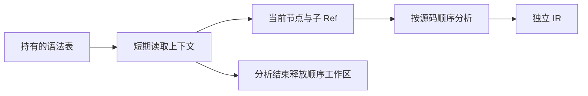

普通程序索引缓存开关必须等函数体命名和 spacing 全部迁移后再打开，否则会漏掉现有 lint。草稿放在 `草稿/普通程序/`，不增加测试用例，验证复用现有语义、作用域、loop、任务及格式专项。

### 普通程序完整接入

单文件 compileWithContext 与项目 getModule 已直接保留普通函数体的生成索引结果。Analyzer 及表达式、语句、callback、loop、contracts、Store 和任务 helper 通过静态借用协议执行同一套分析逻辑；原生调用仍通过同一逻辑。函数体命名、shape 和 spacing 也读取该协议，未绕过 lint。CLI 依赖扫描、原生接口预热及 RX Call 的 Store 元数据检查改用 getModule，避免预热时把索引结果转回兼容 AST。

读取器按当前节点返回标量、借用名称和子 Ref，不构造 native Expression/Block/Type 数组。集合先建立短期数值顺序索引，再按索引常数时间访问，保留源码求值顺序；相关代码按 model、order、expressions、statements、collections 分工。类型及普通语法工作区独立于最终 IR arena，分析结束释放。解析结果仍持有生成器自身的整个 syntax arena，发布字段减少不代表该 arena 内的执行工作数组已回收。

单文件入口复用现有共享类型校验、名义类型 seed、Store 上下文和所有权检查；有 import 时仍要求项目入口。项目导入、环检查、语义缓存、模块记录和 IR 独立所有权沿用已有实现。公开 parse、ParseCache.get、format 和独立表达式的兼容路径继续保留；此阶段尚未删除 program_adapter，不宣称完整零拷贝或编译器完整自举。

### 普通程序验证与自我复核

- 既有 test-parse-cache、test-semantic-cache、test-module-records、test-zx-import-order-library 全部通过，覆盖索引项目加载与资源释放。
- 单文件入口接通后，最终 test-frontend 与 dist 均通过；没有新增用例，也没有运行全量测试。过程中发现并修正 lint 中遗漏的 switch cases 借用读取，以及共享分析入口的 declarations 初值。
- 最终 CLI 与原始 Zig CLI 使用 --no-cache 编译同一当前 program.rx，产物逐字节一致，SHA-256 均为 `db650e576e9d71e6b678156b1963a70890c582ca9115f96d73086de0154565c7`。这证明此真实自举入口的生成一致性，不等于所有语义组合都经过索引专项穷举。

自我复核：没有持久第二棵 AST，没有用 vtable 或解释器实现视图，也没有给生成应用新增运行库。短期顺序索引、独立源码副本和最终 IR 分配仍存在；未测量峰值内存和吞吐，不声称具体性能收益。前端回归部分仍显式调用公开 parse/analyze，因而只能证明兼容路径与共享算法；索引生产证据来自项目专项、最终 compileWithContext 构建以及真实 Parser 编译。后续需继续迁移 format、独立表达式和原生声明消费者，再移除兼容 adapter。

## 格式化生产入口

Intent：让 ZX 格式化直接消费同一索引语法，去除 fmt 的整树转换。Data：检查与格式化已有相同导入排序、空行编辑及合并规则，检查多一步命名诊断。Edges：format 继续只修格式，不新增命名或语义门禁；RX XML 格式化行为不变；错误诊断独立持有。Answer：lint 共用 planView 和 formatView，解析结果选择原生或索引读取，compiler.format 接入 parseModule；复用现有格式专项与发行构建验证。

格式化已接入 parseModule → ModuleResult.format → lint.source.formatView；checkView 与 formatView 共用 planView，保留导入排序、注释位置、空行和编辑合并规则。输出仍由调用方 allocator 独立持有，scratch 在返回前释放。已通过既有 test-zx-import-order-library 与 dist；资源用例覆盖格式化结果和诊断在源码释放后的有效性，以及对应输入逐次分配失败清理。test-zx-import-order-cli 也已通过，覆盖实际 lint/fmt 模式及静态生成程序行为。没有新增用例或运行全量测试。

自我复核：ZX 格式化不再调用 program_adapter，但仍需要生成器 arena、短期数值顺序索引和编辑列表；本次没有测量性能，不声称零分配。公开 parse/get、独立表达式及原生声明仍保留兼容路径，完整迁移尚未结束。

## 独立表达式与 RX 消费

Intent：独立表达式的生产解析、RX 属性校验、Store 路径与项目推断直接读取生成表。Data：Analyzer 已支持借用 Ref；RX 的 constraints 在 graph arena 中持有解析结果，不能返回指向栈上 View 的引用。Edges：保留公开 parseExpression 的原生契约；字符串属性直接构造字面量而不重复解析；不跳过 RX 禁止调用/callback 的约束；不增加生成应用运行库。Answer：owning native/indexed 结果在消费入口分支一次；字符串继续直接构造单节点。各分支局部建立 View 并同步消费，只向外返回 Graph.Id 或独立 IR。constraints 不再返回裸语法指针，解析诊断在释放前复制到输出 arena；RX 推断与分析复用静态读取协议。

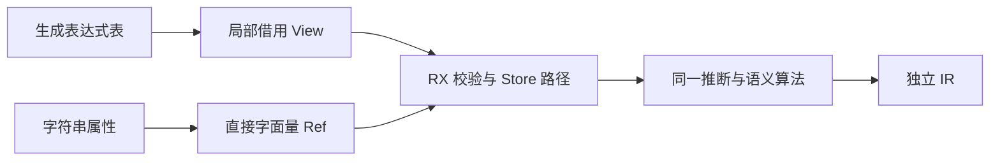

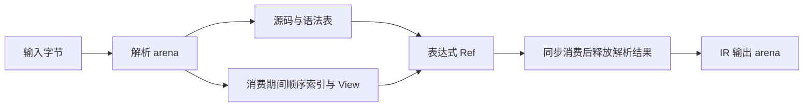

### 表达式生产接入结果

parseExpressionInput 与原公开 parseExpression 共用 parseWithMode。生产模式保留 owning 索引输出，不执行 adapter.expression/lexed；兼容模式仍返回原 AST。索引结果独立持有源码 arena 与生成语法 arena，成功后转移所有权，失败时清理临时 arena。

RX value_rules、Store getter/setter、项目类型推断及表达式 IR 编译均已接通。owning union 只在入口分支，递归消费者共用静态 syntax.borrow。字符串仍通过原 stringExpression 直接构造单节点；没有增加字符串解析，也没有修改普通程序 Ref 布局。独立表达式的 TypeView 在编译期提供空 declarations/members，仍完整读取类型注解节点，不制造伪 Program。

constraints 的 parse→裸节点接口已改成 inferAttribute→Graph.Id。局部 View 和顺序索引在推断期间有效，解析结束即可释放；解析错误 message 先复制到 graph allocator。对象字段名、Graph.field 名称、IR 字符串沿用已有独立所有权。普通属性编译的错误路径也先复制并映射诊断，再释放 owning 解析结果。

模式替换沿用前阶段已验证的工具边界：当前 grit 不接受 Zig 规则，使用限定文件、明确语法成员的替换，并复核 diff。没有新增测试；临时格式化命令碰到的无关 inference 文件均已恢复，仅保留本次借用输入修改。

### 表达式验证与自我复核

- test-frontend、test-rx-value-policy、test-rx-task-output、test-rx-parallel-inference、test-rx-store-paths 及 dist 全部通过。策略专项包含 37 类 CLI 拒绝和 3 项实际执行，Task 输出专项包含 32 项 CLI 检查；既有资源用例覆盖拒绝诊断、Task 聚合等输入的分配失败清理。没有新增测试、没有执行全量测试。
- 最终主 CLI 与原始 Zig CLI 使用 --no-cache 编译同一当前 program.rx，输出逐字节一致，SHA-256 均为 `db650e576e9d71e6b678156b1963a70890c582ca9115f96d73086de0154565c7`。
- 双 arena、诊断复制、局部 Ref 生命周期及语法遍历经过只读复核，未发现可行动问题；复核不是穷举证明。

自我复核：RX 表达式生产链不再经 program_adapter，也不在 Graph 中保存语法 Ref。仍有解析 arena、临时顺序表、必要源码副本和最终 IR 分配；底层 allocator 若也是 arena，deinit 不保证立即降低实际峰值。没有测量净内存或吞吐，不宣称零分配。公开 parseExpression 兼容入口、Store 类型属性及原生 .d.zx 声明仍需后续迁移。第一条 test-frontend 误从仓库根执行，step 不存在；随后在 compiler 包正确入口执行通过，不计作源码编译失败。

## 剩余生产入口收口

Intent：消除 Store 类型属性和 CLI 普通 lint 对公开 AST 兼容接口的内部依赖。Data：Store 类型通过单条临时类型声明解析，只需 Header 形状与共享类型分析；CLI lint 只需独立诊断。Edges：保留 Field.type 单一类型限制、void 拒绝、共享类型上下文和位置映射；不增加语义 lint 门禁；保留公开 parse/get 契约。Answer：Store 使用 parseModule/analyzeModule 与统一 Header，compiler 提供拥有诊断的 checkSource，CLI 调用后释放诊断；继续审计原生声明 producer 的真实差距。

### 原生声明迁移的核对结果

`.d.zx` 目前仍由 modules/declarations.zig 的手写 Parser 生产 Type AST；native.zig 随后执行类型、名义身份、引用能力及 ABI 校验，native_types.zig 还递归读取 AST 并复制对象字段后排序。不能只替换解析入口或参数 TypeId 而留下 ABI shape 转换。

下一阶段需要独立 native.rx 编排、单次词法分析与同一 TypeTree。底层 declarations/initial、step 能在第一条 export declare function 前停下；函数参数与返回类型应按 declarations/header 的重启方式保留 tree、重置 frames/control，不调用 types/parse 重扫每个参数。新输出需要 types/declarations/members/functions/parameters/errors 和诊断，参数与错误名可用 first/count 连续片段。

必须区分无 throws、throws 和 throws {}；保留 allocator→io→process 注入顺序及名字后逗号/右括号的 lookahead，allocator: T 仍为普通参数。declare/throws/concurrent 等保持上下文标识符，不升级成全局保留字。类型先于函数、命名及重复项检查、参数 void、native reference 与并发约束均需保留。

消费端在 seed/production 边界选择 native/indexed view，共用 native 类型与 ABI shape 算法。生成语法和顺序索引放同步 scratch，返回 IR 独立持有字符串；生成诊断在 scratch 释放前复制。构建接线需同时更新 generate_parser entries、parser.Sources/modules 和 compiler.ParserModules，seed 的 parser=null 继续使用旧声明实现，禁止生产失败后回退旧 Parser。以上是已核对的下一阶段方案，尚未实施，不计作原生声明自举完成。

### 入口收口验证

Store 类型属性与 CLI lint 的生产接入已完成。test-rx-value-policy、test-zx-import-order-cli、test-rx-store-paths 及最终 dist 均通过，没有新增用例或运行全量测试。Store 保持单一类型声明、void 拒绝及共享类型上下文；checkSource 只执行原有语法和命名/格式检查，返回诊断克隆，CLI 在输出后释放。

自我复核：源码检索中剩余显式原生 Parser 位于原生声明、公开兼容 parse/get 和 seed 分支；检索只是入口定位证据，不代表全编译器已自举。新的原生声明 producer 尚未实施，兼容 adapter 尚未删除，也没有测量本轮净内存变化。
