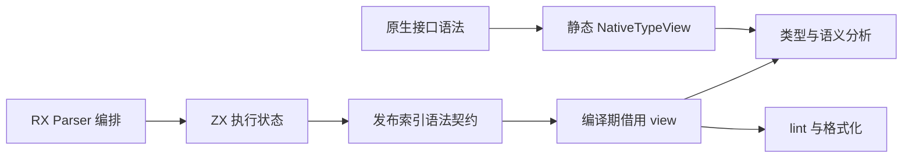
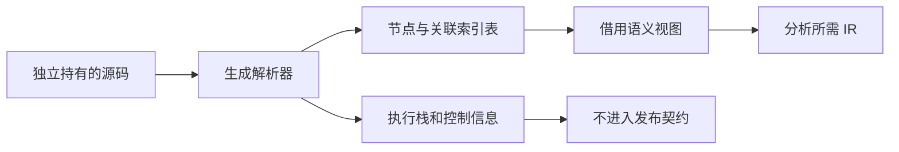

# 统一索引语法与消费链迁移

## Intent：最终目标

让生成 Parser 的索引语法表成为生产分析与 lint 的直接输入，移除 program_adapter 的整树及 Token 二次物化。使用 RX 编排和 ZX 逻辑继续完成编译器自举。公开解析结果仍独立拥有源码、文件名与诊断。

## Data：可用证据

现有生成输出直接暴露 BodyStage / Parsed 执行状态，包括 frames、control、prepared 与词法模板工作区。program_adapter 依赖这些嵌套字段，分配第二份 Type/Expression/Block、字段和 Token 表。generated 对象列表当前为指针切片；genz shared_types 只统一 nominal 类型，不会将它变成连续值数组。

反向 previous 链由当前 adapter 逆向回填恢复源顺序。消费迁移必须处理参数、语句、字段、模板和 match 的顺序，不能改成逐项重走链的 O(n²) 访问。

## Edges：边界与限制

- 选择编译期泛型借用 view：只保存 source、生成表切片和 root ID，访问时按值映射当前节点。core 不反向依赖 generated_parser，不用 vtable，不缓存第二树。
- 原生 .d.zx 目前仍由手写 Parser 产生指针 AST。类型解析器后续以静态 TypeView 参数化，共享同一解析算法；NativeTypeView 与 GeneratedTypeView 只负责读取，不互相物化。
- 公开源码副本是独立 ownership 契约；删除 dupe 会破坏 ParseCache，不能混同为 AST 优化。
- 仅改变 arena 或隐藏 adapter 不能算完成。迁移结束前继续明确保留的复制，不以生成成功代替生产消费闭环。

## Answer：交付格式与成功标准

第一步从 Parser 执行状态中分离可发布的索引语法契约。程序与独立表达式出口只返回节点表、Token/Comment、声明/导入/契约、root 与最终诊断。现有 adapter 改为消费这个契约，解析公开 API 暂不改变。这一步没有消除 AST 复制，验收目标仅是生产解析出口不再发布控制状态。

后续依次迁移类型解析、Analyzer 与全部 helper、lint/format、项目/缓存及 RX 表达式消费者。最终 generated parse 直接保留 owning 语法表并删除全量 adapter；原生接口 producer 随后统一。完整无 import compileWithContext 是首个用户可见闭环，不能只用内部分析调用宣称完成。

## 实施与自我复核

第一步发布契约分离已完成，消费者直接借用迁移尚未完成。发布结果中的表仍是既有生成 ABI 的对象指针切片，不称为连续值数组。临时 arena 的物理存储仍统一释放，裁剪返回形状不会自动回收其中旧分配；不能宣传内存下降。后续 view 的关联顺序协议必须在消费者切换前确定，不允许分配隐蔽的持久第二树。

字段访问迁移已尝试 grit 的 Zig 规则（含实际换行规则文件），当前工具在 language zig 首行拒绝解析，未更改源码；因此改用限定文件与明确字段链的批量替换，并复核 diff。

第一步验证：bootstrap-parser、test-frontend（313 项）及发行构建全部通过。实际 Program 输出只有 blocks/body/comments/consumes_input/contracts/declarations/diagnostic/expressions/function_start/has_store/import_names/imports/members/tokens/types；Expression 输出只有 blocks/comments/diagnostic/expressions/result/tokens/types。节点表内仍保持原来 previous 关联，不改变集合语义顺序。

实际完整自举产物摘要：parser.zig 为 `7d6bbac4501956ce445402dc6547a0294d91b35ac1ffc823c20736b8e6420e6b`，expression.zig 为 `3b333c4891bb43a2e6c858cdcdc0c41ee685e501bd68ae6679df0ced062c8c9b`。主 CLI 与原始 Zig CLI 编译同一当前 program.rx，单入口产物 SHA-256 同为 `db650e576e9d71e6b678156b1963a70890c582ca9115f96d73086de0154565c7`；生成入口不同则类型集合不同，不跨入口比较摘要。

未新增测试、未运行全量测试。原始 Zig 分支继续保留原生解析实现，此次自举出口迁移不复制到该分支。
