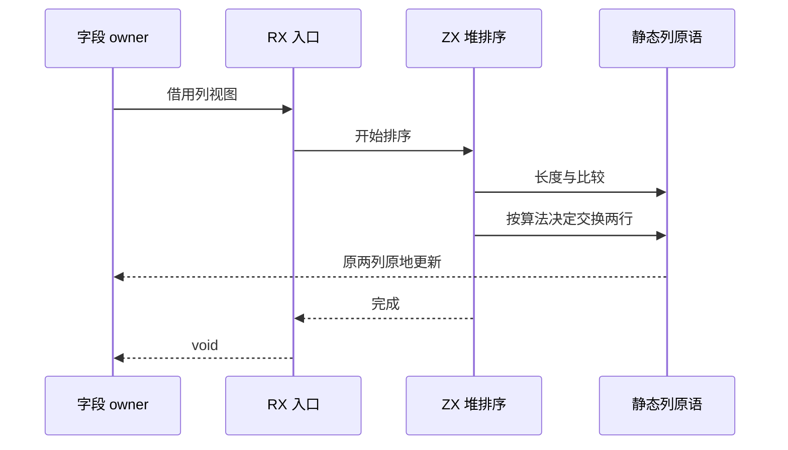
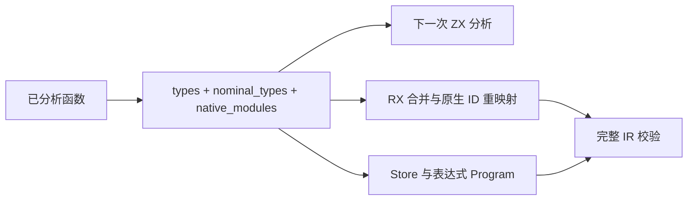

# 字段排序自举

Intent：让字段规范顺序的算法由 RX/ZX 执行，保留现有名字/类型两列原地排序，不引入逐字段扫描或整表复制。

Data：正式 `types/fields.zig` 当前调用 pdqContext，在两列上成对交换；旧 sort_fields.zx 草稿先排序名字，再对每个名字线性回查来源，复杂度 O(n²)，且分配新列。名义查找已完成，排序成为下一个类型规范化语义缺口。

Edges：输入由字段 owner 持有，调用期间不能发布或并发修改；字段名称的字节序和名称/类型配对关系保持不变。选择原地堆排序，O(n log n) 时间、O(1) 数据存储；不承诺比旧 pdq 对所有输入更快。静态原生接口仅借用两列，提供长度、按原有字节序比较名字及成对交换，不实现排序循环、不保存句柄、不新增运行库。ZX 的调用必须保持实际副作用顺序，不能因为原生参数只含标量或 opaque 指针就把调用当作无副作用。零容量分配器验证用于阻止意外对象分配。

Answer：先实现 `ordering/sift.zx` 与 `ordering/sort.zx`，RX 编排调用；字段 owner 通过短生命周期 opaque 视图把可变列交给生成代码。种子构建仍用原有 Zig 排序以生成后续阶段。具体生成行为和专项结果待实际验证，不提前宣称零分配已实现。错误集合排序及整批增量驻留后续继续，不能将字段排序完成等同于全部规范化自举。

草稿已由真实 CLI 生成，但初始产物在循环状态进出处分配对象。原因不是排序需要额外存储，而是 native_value.scalarBoundary 的输入限制排除了 opaque 句柄，导致已有值布局分析不能选中栈上循环状态。现有 isolated/inputLeaf 已证明这类输入以指针值传递，原生函数拿不到调用者聚合头的地址。复用 inputLeaf 作为 scalarBoundary 的输入条件；输出仍限制无引用标量，字符串/列表/聚合输入仍不放宽。opaque 句柄指向的宿主对象及其生命周期完全不改，外部调用次数、顺序和副作用也不改。该修正需由现有原生调用顺序专项及生成代码检查验证。

opaque 输入布局修正后的发行构建通过，现有 `test-native-references-runtime`、`test-native-references-transfers`、`test-value-return` 一组验证退出码 0。重新生成排序后，循环状态已不分配，但原生多参数调用的临时元组仍分配：lower.zig 先进入 state_active 通用转换，遮蔽了已有 expand_tuple 原生参数栈借用分支。将已验证 isolated 的原生 tuple 字面量分支放到 state_active 之前，保持 tuple 成员求值和调用顺序，未放宽其他输入形状。

正式接线已写入 ordering/ 与 fields.sort。构建的原生声明由每个生成入口显式传入，避免给无关入口装入 opaque 接口；第一次整合构建在共享声明下报 IR 校验错误，修正后正在验证。所有字段排序适配调用使用零容量 arena；若仍有临时对象分配，现有实际编译路径将直接失败，不把分配器扩容作为解决方案。

### 共享原生类型上下文修复

只读子代理与当前调用链核对确认：RX prepare 会分析整个输入集合，各调用逐步扩充共享类型表，但 Context 原本只有 types 与 nominal_types。opaque 类型缺失的不是导入接口，而是已经解析的 NativeModule owner 证据。按入口减少 NativeInterface 无法解决全模块准备过程，故撤回这一尝试；所有声明恢复正常注册。

Context 现在携带 native_modules；项目/独立分析在入口复用完整 native IR 规则校验，再按原顺序深拷贝描述。RX prepare 连同类型表回写 owners；module_native 先带入共享 owners，再沿用原来的 callee external.module ID 重映射。编译库调用也从共享 owners 初始化。不能只补当前 calls，因为全局 types 可能包含后续独立模块引入的 opaque 类型。

表达式独立 Program、Parallel Task、Store 字段类型和初值同时保留该元数据。Store 本身无需复制一份独立 owner 表；每个初值 Program 和共享 Context 已有合适的持有位置。项目最后扩展 Store 初值 types 时，也同步 native_modules。所有字符串和导出名跨 owner 深拷贝，TypeId 与原始模块顺序保持；缓存 Context 摘要原本已序列化全部字段，因此新元数据自然进入缓存键。没有弱化 IR 对每个 native_reference 都要求 owner 的约束，也没有通过过滤某个具体模块绕过校验。

共享上下文修复后，全集合 IR 已通过此前失败的位置，生成进入 NativeRequiresBundle 检查：原先生成器把所有独立 RX 入口一起推导，会把无关入口的 native 元数据带到原本无原生依赖的单文件输出。这不是放宽 emit 契约的理由。生成器现在先保留对完整 RX 集合的语法、依赖及无环校验，再按每个入口收集 Import 和所有嵌套 Call.module 的可达闭包，只为该入口推导、生成所需模块。闭包选择是通用图操作，不含排序路径特例，仍包含未使用 Import；共享上下文修复保留，保证正常全集合分析的完整性。

生成器完成可达闭包接线后，field_sort 的实际生成代码已无 allocator.create。编译继续发现 printer 将独立 labelled block 作为 .expression 语句打印为 `label: { ... };`，Zig 此处禁止尾随分号。打印器仅对 .expression + .block 省略分号；discard、调用、赋值等保持原输出。该问题由真实 void 原生调用路径触发，修正是通用语法规则，不是替换具体生成文本。

当前正在验证最终发行构建和六个专项：类型合并、RX 推导、RX 并行推导、库初值、原生引用运行（含容量转移）、值返回。没有新增用例，也没有执行全量测试。

## 验证与自我复核

- 最终发行构建退出码 0。
- 六个专项全部退出码 0：`test-type-merge`、`test-rx-inference`、`test-rx-parallel-inference`、`test-library-initializers`、`test-native-references-runtime`、`test-value-return`；原生引用运行包含来源/编译库两条路径和容量转移。没有执行全量测试，没有新增用例。
- 用最终 CLI 重新生成真实排序 RX 模块成功。生成代码未包含 allocator.create 或 allocator.alloc，入口及适配层仍为零容量分配器；相关实际分析与生成路径执行成功。
- 算法建立最大堆后逐次把最大值交换到尾部，排除已排序尾段再下沉。`root < count / 2` 保证计算左子项不溢出且存在；右子项只有在小于 count 时读取。空/单项不交换。比较沿用 std.mem 的字节顺序，每次交换同时更新名字与类型 ID；不依赖稳定排序，重复对象字段仍由原有语义校验拒绝。
- 复杂度为 O(n log n) 次名字比较和 O(1) 排序额外存储。未声称在所有输入上比旧 pdq 更快；未引入排序副本或自定义动态运行库。
- 静态 native 适配层只提供列访问原语，不含排序循环；共享 owner 深拷贝仍服务独立分析结果的生命周期，不属于排序数据复制。原生调用没有被允许进入纯 Parallel，布局分析与语言副作用规则保持分离。
- 生成器仍先验证完整模块图，之后按入口闭包生成；没有略过未使用 Import、嵌套调用或无环硬约束。
- 自举尚未完成：错误集合规范化、来源校验和类型解析/整批驻留仍需继续迁移。旧 `types/sort_fields.zx` 是先前未接线的 O(n²) 草稿，不是当前生产排序实现。
