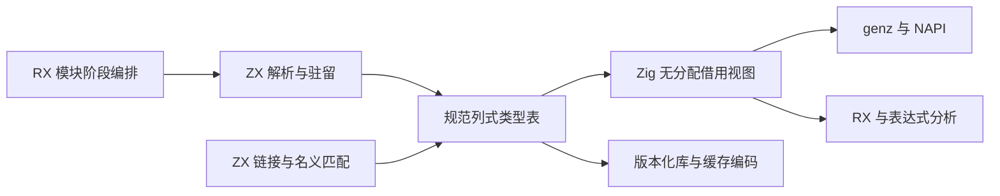
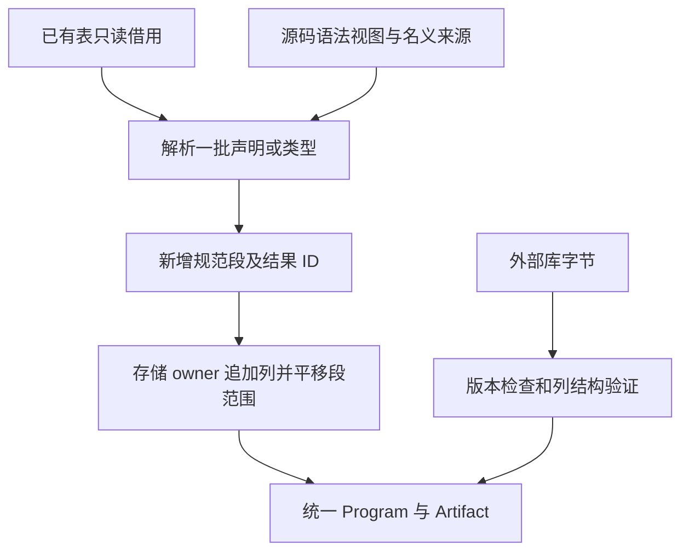
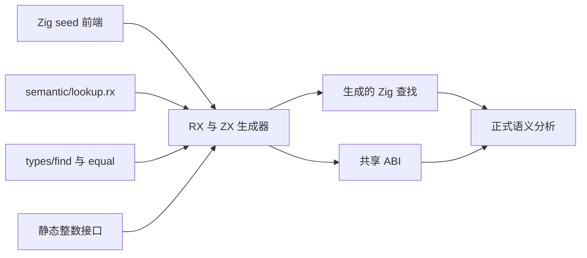
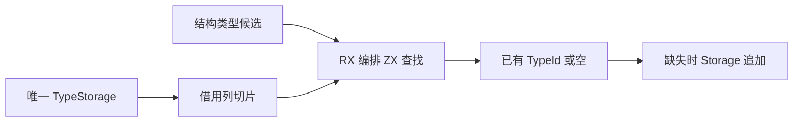
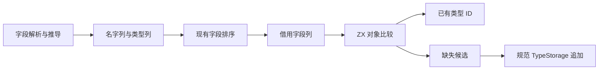

# 统一语义类型表实施计划

## Intent：最终目标

类型解析、驻留、名义身份匹配与模块类型重映射由 ZX 实现，RX 组织模块阶段；core、compiler、linker、genz 和库产物消费同一份规范类型存储。Zig 仅承担存储生命周期、借用视图及系统接口，不把语义判断藏入原生 helper。

本次承接完整自举目标。不可变输入及表达式风格两阶段已经提交；本阶段不重复修改这些语言契约。

## Data：可用证据

以下前三项为迁移前基线；当前生产已切到 IR 23 列式表，验证记录见后文。

阶段交付已完成：规范列式存储、生产消费者及已有测试接口迁移，分析与链接共用 RX/ZX 结构查找。发行构建、相关专项及真实 CLI 生成已通过；RX 七个旧预期经迁移前基线复现后按不可变契约修正，修正后的 RX 专项通过。未执行全量测试。名义来源、排序、解析与批量增量驻留仍未完成 ZX 自举，以下历史记录中的进行中状态按此交付状态理解。

- `core/src/ir.zig` 使用 `[]Type`，object、tuple 等分支还持有独立切片；IR 当前版本 22。
- `compiler/src/zx/analysis/types.zig` 用 `ArrayList(ir.Type)`，驻留依次扫描已有类型。
- `shared_types.zig` 先建立类型，再复制旧前缀，链接整表并回写 ID。
- ZX 生成的对象列表保存对象指针，不能直接作为 Zig 值结构体切片；ZX 枚举也没有与独立 Zig 枚举共享名义类型及显式底层宽度的契约。
- 已有 frontend 的 `Sequence.at()` 展示按需投影视图，不必为保留 `for (fields)` 写法分配兼容数组。
- 类型消费者涉及 RX 推导、IR 校验、缓存与库编码、NAPI 声明、genz；只换解析器返回值会留下第二套 IR。

## Edges：边界与限制

1. 不新增运行库，不动态加载，不把旧 union 数组作为持久镜像。
2. 不强转 `[]u32` 为 `[]TypeId`，不假设 ZX enum 或对象内存布局；单个 ID 按值转换。
3. 表头使用 `kinds: u8[]`、`first: u32[]`、`second: u32[]`、`labels: string[]`；子项使用独立的 `children`、`field_types`、`field_names`、`names` 列。
4. kind 编码属于版本化存储契约。ZX 使用显式 decode/encode；Zig 固定 `enum(u8)`，不借用 ZX enum 数组。
5. 基表与增量遵守同一 schema。类型 ID 是合并后的全局 ID；各段内的子项范围属于各自段，合并时只平移范围，不重算类型身份。
6. 解析请求借用整个基表，返回 canonical delta 和结果 ID；不能每次构造已有表的副本。频繁小请求使用同一分析期 allocator。
7. 内存生命周期改变时才复制应被新 owner 持有的内容。零拷贝指阶段间借用，不代表可以借用已释放的源码或缓存 arena。
8. 外部库先查 envelope 版本，再解码新表；版本升级到 23，不维护旧类型格式自动转换。
9. 外部数据必须先验证列长度、kind、范围、标量前缀、引用、规范排序与名义结构，才能使用假定有效的投影 API。
10. 不新增测试用例，不执行全量测试；复用已有类型、链接、库、RX 与 genz 专项。其他 session 的修改不纳入提交。

## Answer：交付与成功标准

- 中文计划、实施记录及对应源码草稿；架构图与数据流图如下。
- 生产类型存储只有一份 schema；解析、驻留、名义与重映射语义在 ZX 中完成。
- 所有消费者直接借用表，不生产旧 `[]ir.Type` 镜像；类型投影不分配。
- 生成 Zig 中没有全表输入复制，增量追加的成本有实际生成代码证据。
- 旧库版本得到明确版本错误；新格式与缓存正常往返，既有专项通过。
- 大特性完成后按明确文件清单提交并推送，完整自举目标保持不变。





## 实施顺序

1. 固定 schema 和 Zig 借用视图、ZX 表模型；先在草稿中验证编译与布局边界。
2. 实现 ZX 基表与增量读取、规范驻留、解析及名义身份处理；存储 owner 仅处理追加和生命周期。
3. 同时迁移 core Program、Artifact、分析、链接、RX、genz 与 NAPI 消费者，不留长期双表示桥接。
4. 升级库和缓存格式，补齐外部列结构验证及逻辑字段指纹。
5. 构建、复用专项、核对实际生成代码与本次 diff；同步草稿并记录自我审查，提交推送。

## 初始草稿阶段记录

- 已核对现有源码和其他 session 的改动边界。
- 已选择列式 schema；仍处于草稿实施，尚未切换生产 IR。
- 性能判断：增量方案消除按请求复制旧表，但不会自动消除驻留的线性搜索。初期保持已有复杂度，不宣称所有语义操作为常数成本。
- 已写入并编译核对 `core/type_table` 草稿：模型、只读投影、列借用、增量存储和结构检查。投影按值转换单个 ID；不存在 union 数组镜像。
- 存储追加先检查所有列容量限制、再准备容量、最后提交长度。分配失败可以保留旧逻辑内容，但不保证旧借用切片地址不变；调用者必须在每次修改后重新取得 view。
- 追加输入必须是独立的已验证 canonical delta；不能与 owner 的可扩容列重叠。字符串字节由分析期 owner 持有，Storage 只管理列数组。跨 arena 转移仍需实现明确的深复制边界。
- `structure.valid` 目前只验证列长度、kind、范围与 scalar 值；它不是完整类型图/名义/排序校验，不得作为外部库唯一入口。
- ZX `model/kind/kind_code/row` 草稿使用当前匿名默认函数语法和四空格缩进。真实生成已确认列借用，无整表复制。
- 集合长度是 `u64`，类型 ID 和子项列仍为 `u32`。草稿引入显式静态 `zig:integers`，`widen` 只拓宽整数，`narrow` 使用 Zig 标准库的 checked cast，并在超限时返回 `IntegerOverflow`；不包含类型判断、驻留或名义决策。生产自举构建的 native interface 接线尚未实施。
- `row` 作为独立生成入口会为返回 Row 分配一个对象。这不是整表复制，也不能据此宣称读取零分配；真正作为驻留内部函数使用时还需核对生成代码。core 的 Zig 投影视图无分配。
- 编译核对文件仅实例化已有草稿 API 与实际生成代码，不包含测试数据和测试断言。当前 Zig 0.17 的反射接口为 `field_names`/`@FieldType`，已按实际编译诊断修正。

### 已执行的验证

```sh
zig-out/bin/zxc docs/2026-10-06/统一语义类型表/草稿/compiler/semantic/types/row.zx \
    --project docs/2026-10-06/统一语义类型表/草稿/compiler/semantic/pkg.yaml \
    --out docs/2026-10-06/统一语义类型表/生成/row.zig

zig build-obj --dep integers --dep zxc_abi \
    -Mroot=docs/2026-10-06/统一语义类型表/编译核对.zig \
    -Mintegers=docs/2026-10-06/统一语义类型表/草稿/compiler/semantic/native/integers.zig \
    -Mzxc_abi=docs/2026-10-06/统一语义类型表/生成/row.zig.abi.zig \
    -fno-emit-bin
```

上述两步已经通过。尚未运行生产专项，因为生产 IR 尚未修改。后续任务仍是 ZX 规范驻留、解析与名义重映射、生产读写路径和格式版本的一体迁移。

## 自我审查

不能用“统一表”命名掩盖两份长期存储，也不能把全部决策装进 Zig 后只从 ZX 调用。迁移完成的判断依据是生产数据路径与生成代码，而不是草稿文件数量。切换前必须核对 codec、缓存和声明生成，避免主编译成功而旁路仍依赖旧 union。

## 驻留实施中发现的生成器问题

`find.zx` 和 `equal.zx` 的真实生成代码暴露：即使原生函数只输入、输出整数，value-call 分析仍因存在 external 调用关闭整条调用链的值布局，导致行读取和搜索循环持续分配小对象。

修正以 ABI 边界为依据：原生调用的全部输入及输出只能是无引用标量、枚举、错误值及它们的 optional；多参数 tuple 逐项检查。排除 string、list、object、native reference 以及 Store。这样的原生调用不能取得被优化的 ZX 对象地址，因而不会捕获其临时存储。

此证明只允许存储布局优化，不宣称外部函数没有副作用：调用次数、顺序、错误与 IO/process 参数必须保留。既有 `pure` 字段在这些使用点用于布局/借用资格，未执行函数折叠或公共子表达式消除。先以最小改动修正资格分析，不扩展原生聚合参数边界。

具体源码位于 `草稿/genz/native_value.zig` 和 `草稿/genz/value_call/analysis.zig`；验证使用实际驻留生成代码及既有原生／循环专项，不新增测试用例。

继续检查发现第二道限制：深层循环值布局把“只读借用的对象列表”也当作不支持，连 Candidate.fields 这样的既有切片都使整轮回退到堆分配。草稿 `genz/iteration_layout.zig` 允许列表以原 ABI 切片作为叶子被携带；同时明确拒绝深层布局里构造、修改或执行对象元素列表操作，避免把临时对象地址写进逃逸列表。列表内容不展开成值树。

实际生成验证表明循环体分配已消除，但局部按值请求仍在入口和出口重建嵌套对象。`iteration.zig` 因此在已经请求按值返回、调用链符合布局资格、且 state-plan 允许该类型时，复用既有带 origin 的状态布局。保持对别名身份的既有判定，只扩展进入已有路径的条件，避免重复维护第三种布局。

## 规范驻留草稿进展

- `find/equal` 从基表与增量读取结构类型，复用原有 ID；名义 enum/native 不按名字自动合并，后续由来源身份解析决定复用。
- `append` 输出新 delta 与全局 ID，引用的 child ID 不重映射。对象字段拆为名字和 ID 列；错误名字排序，枚举保持声明顺序。
- `intern` 组合排序、查找、追加。输入 Candidate 是已完成语义校验的内部请求；任务容器约束、重复字段、名义身份等尚待解析层完成，不能对任意用户数据直接调用。
- `sort_fields` 暂用排序后的名字回查字段，要求输入名字唯一；复杂度 O(n²)，不作为最终性能结论。后续应使用零拷贝字符访问实现 ZX 比较与高效排序，或补齐通用比较能力，不能把类型排序整体移回 Zig。
- 驻留草稿已用实际 CLI 完成生成，并由 `驻留编译核对.zig` 实例化 generated execute 后通过 Zig 编译。尚未接入生产 Types。
- 生成器资格修正已写入四个正式 genz 文件；最终构建与既有专项复跑均已通过，准备提交生成器前置修正。

### 生成器修正的当前验证证据

- 最终 `zig build dist -Doptimize=safe -j2` 已通过，使用已有本地 Zig archive。
- 使用最终 CLI 重新生成 find 与 intern；驻留生成代码实例化后的 Zig 编译通过。
- find 的类型搜索循环和 equal 的字段比较循环不再直接执行 allocator.create。equal 的 Candidate 在进入循环时记录原始地址，迭代只更新 index/equal，保留 Candidate.origin；退出时复用该地址。
- 生成源码中仍保留旧 ABI 函数和边界分配分支，不能以整个文件里 create 的数量判断热路径，也不能据此宣称整个编译过程零分配。尚未实施完整 TypeTable 请求批处理及分配曲线测量。
- 第一轮既有 `test-value-return`、`test-iterate-buffer`、`test-typed-try-runtime` 均通过；最后一次循环入口修正后，同样三个专项复跑也已全部通过。

### 前置修正收尾

四个 genz 文件的正式源码与草稿一致，已有三个专项最终命令退出码为 0，未新增用例、未执行全量测试。row 与 intern 的实际生成代码实例化编译均通过；所有 ZX 草稿已采用四空格官方格式。

本次提交可以交付生成器前置性能修正及可复核的类型表草稿，不代表 TypeTable 生产迁移完成。下一步仍需落实解析、名义身份和统一存储消费者；当前驻留接口按单个 Candidate 返回 delta，在完整模块批处理接线前也不能宣称消除了 delta 的重复追加成本。

## 生产一体迁移开始

迁移在独立的 `codex/semantic-type-table` 工作区进行，起点为 e78d3130，避免中途影响主工作区的另一个回归 session。Grit 的 `language zig` 模式解析失败，机械替换将使用受控脚本并逐项核对编译器诊断。

core 的长期类型存储切换为 TypeTable；Type 是临时无分配读取视图，TypeValue 只用于构造单个新类型，不能保存成另一张长期类型表。TypeStorage 接收单个已决策值或规范 delta，只处理存储，不执行驻留、名义比较或解析。原有 Zig 语义函数将在编译切换过程中暂时修改为新存储 API，阶段完成前必须由 ZX 替代，不能把这种过渡状态当自举完成。

生产 IR 版本拟切为 23。当前切换尚未通过完整编译，外部 codec 必须补先检查版本的入口后才能交付。

### 生产迁移中的具体边界

- 已切换 Program/Artifact 与分析、缓存、NAPI 等类型表接口；当前仍在修复构建错误，不可发布该中间状态。
- 类型字段和 tuple 子项从直接切片遍历改为 `.at(index)`；迁移脚本只在编译器确认具体新视图类型且源码行仍与诊断完全相同时应用，旧诊断不套用到已变化行。
- NativeModule.types 是公开导出绑定列表，不是语义类型表。已排除这类同名字段，不能仅按 `.types` 文本批量改写。
- Storage 的可表示容量超限使用与 ArrayList 容量溢出一致的 OutOfMemory 路径，避免另行扩展整个编译器错误协议；外部格式容量或引用不合法仍在验证阶段拒绝。
- 新列结构验证先检查长度、kind、范围、保留字段以及子项列的连续覆盖；通过后才允许类型投影和现有拓扑/任务/字段语义检查。
- 库与语义缓存已增加仅解析版本 envelope 的前置步骤。旧库的版本错误不依赖新 TypeTable 形状能否解码；该改动仍待整体构建和已有 codec 专项验证。

## 消费者迁移与视图生命周期复核

- Intent：保持单一列式类型表，并让分析、链接、缓存和代码生成直接使用读取视图。
- Data：第 5 至第 8 轮 dist 构建均失败；诊断驱动迁移已继续覆盖原生参数、对象字段、元组子项与模块链接。第 9 轮仍有读取接口错误，尚未取得构建通过证据。
- Edges：单个 TypeValue 仅用于构造，不能成为第二份长期类型表。原生参数签名借用 TypeIds；缓存恢复检查它的长度一致性。正式自举语义仍待接入，当前 Zig 驻留逻辑只是迁移中间态。
- Answer：完成所有消费者迁移、通过构建和已有相关专项后再交付，不提交当前未通过状态。

自我复核发现：旧类型表中的字段/子项有独立数组，新的列视图会因 TypeStorage 追加而失效。类型分析中不能跨递归表达式分析保存这样的视图。已将元组字面量、对象预期字段、索引表达式改为使用稳定类型 ID 在追加后重新取得视图；其余跨追加路径仍需逐一审核。不能仅以编译通过证明本次迁移正确。

第 11 轮 dist 已结束：31/34 步完成，在 CLI 实例化库加载路径时发现一处空类型表仍写作指针字面量。已修正为列式表初值并启动第 12 轮构建，尚待结果。草稿目录已同步本轮源码。未新增测试，未执行全量测试，未提交或推送迁移中间态。

第 12 轮仍为 31/34 步完成，CLI 实例化进一步暴露 Zig 模块签名、Node 资源签名、硬件后端、形式化验证和 JSON 输出的旧表读取。已继续适配这些生产消费者，第 13 轮构建进行中。整个迁移尚未获得构建成功证据。

## 生产列式表构建通过

第 14 轮发行构建已成功。使用本轮编译器重新生成 `intern.zx`，再通过 `驻留编译核对.zig` 实例化生成代码，Zig build-obj 成功。该结果证明生产读写路径已能完成发行构建和这条真实 ZX 生成路径，不代表 ZX 语义自举已完成。

已有库编码、缓存编码、名义来源专项开始运行。第一轮已执行 20/20 测试通过，3 个编译步骤因测试旧表接口失败；第二轮已执行 11/11 测试通过，另 1 个旧索引仍需迁移。已保留原断言完成接口迁移，第三轮三个专项全部通过（进程退出码 0）。已有 value-return、iterate-buffer、typed-try-runtime 三个运行时专项也已全部通过（进程退出码 0）。未新增用例，未执行全量测试。

只读生命周期审核未发现已修路径之外的确定问题：RX unify 递归只改推断节点，ZX positional 参数视图来自独立导入表，链接源表与目标 Storage 独立，普通 expression append 不修改类型列。该结论限于审核到的实际调用链，不替代后续专项与错误反馈。

## ZX 名义身份协议

Intent：将来源身份与同名成员冲突判断迁入 ZX，保持现有 `Origins.same` 的语义。

Data：来源有 source(path)、native(specifier)、external(module, member) 三种。相同名字不能跨来源合并；相同来源和名字的枚举成员或类型种类不同必须报告冲突。

Edges：输入为已验证名义候选及稀疏身份列。身份 kind 固定为 0/source、1/native、2/external；owner 分别保存 path、specifier、module，member 仅 external 使用，其他必须为空。每段 ids/kinds/owners/members 等长，ID 指向已验证规范类型表。原生引用只能有 native 来源。验证归入口/批量解析阶段，搜索不负责修复无效身份。base/delta 分段借用，搜索不拼接身份数组，也不复制类型表。ID 在 Missing 时无意义。

Answer：`types/nominal/find.zx` 返回 Missing、Found 或 Conflict 及匹配 ID；共用 equal 判断类型形状，结构驻留 find 仍明确排除枚举和原生引用，不能因为 equal 支持名义形状而丢掉来源身份。模型及实现先在中文草稿目录验证，随后接入批量解析/链接生产路径；当前未将其冒称为已替代 Zig 语义。

名义查找草稿已通过实际 CLI 生成与 `名义编译核对.zig` 的 Zig 实例化编译；共用 equal 修改后也已重新生成并编译 intern。生成的身份搜索 while 体内没有 allocator.create，字段/成员比较循环也没有逐项分配；标准 ABI 入口和循环退出仍有固定数量对象头分配，因此仅确认没有随扫描长度增长的分配，不能宣称整个请求零分配。名义模型的 base/delta 身份列均借用，未生成整表拼接。

自我审查：本步骤仍是可编译的语义实现草稿，生产 link.Types 尚未调用它。下一步应以批量解析/链接入口接线为交付目标，同时提供身份列验证与 owner 追加，不能停在薄薄的 ZX 调用层或将语义回搬 Zig。

## ZX 查找进入自举构建（进行中）

- Intent：让生产类型驻留逐步调用 RX 编排的 ZX 查找，保留 seed 编译器所需的原实现。
- Data：已有生成器仅输出无原生依赖的单文件；ZX 类型查找需要显式整数转换接口及共享 ABI。
- Edges：仅静态原生模块；本步不声称完成批量驻留和解析迁移，不新增测试或执行全量测试。
- Answer：生成器增加语义查找与 ABI 输出，正式构建静态接线；通过发行构建后记录结果。

构建接线与数据流：





首批调用点是 Types.wrap 与 Types.task；有效性限制保留在现有解析入口。Zig 适配器只组装切片头与标量候选，seed 模式保留旧查找，以打破构建循环。正式模式调用生成代码，生成结果的实际入口调用按值 find 与 row；三类候选在 equal 的标量分支返回，不进入聚合分配分支。沿用现有 integer 适配方式，以零容量固定缓冲区支撑 arena，不允许堆分配；没有复制类型列。这仍不是完整语义迁移的最终交付。tuple、object、errorSet、名义查找以及批量解析尚未切换。

首次构建暴露 RX prepare 会准备全部源码，因此只为语义入口提供接口不够。已将静态整数接口注册到生成器的统一项目环境；普通输出仍使用单文件 emit，语义输出使用正式 emitBundle 及显式 ABI 模块。第二次发行构建通过；改为零容量分配器后第三次发行构建也通过。首批三类查找接线的现有 value-return、iterate-buffer、typed-try-runtime 三个专项全部通过，进程退出码为 0；聚合扩展需单独收取后续结果。

## 聚合查找接入（进行中）

- Intent：继续把 tuple 与 errorSet 查找从生产 Zig 语义实现迁入 ZX。
- Data：TypeId 明确定义为 enum(u32)，tuple 候选可借用相同布局的 u32 切片；错误集合本来就是字符串切片。原有 ZX equal 已覆盖两类比较。
- Edges：候选改为五类带类型的 union，不能携带不匹配的 kind/载荷；对象字段不能把 Zig 的 Field[] 强转成 ZX 的对象指针数组，尚未迁移。排序与来源验证仍归现有入口，不能冒称全部语义已迁移。
- Answer：Types.tuple 与 errorSet 统一调用 lookup；旧查找集中在只供 seed 的 seed_lookup 中。保留零容量分配器与所有原校验。首次构建的名称遮蔽已修正，第二次发行构建通过；新 CLI 重新生成 intern.zx 及随后 Zig 实例化编译均成功。扩展后的 value-return 与 typed-try-runtime 两个专项已全部通过，进程退出码 0。

## 对象字段列统一（进行中）

- Intent：让对象查找同样由 ZX 执行，并消除 AoS 与对象引用数组之间的转换。
- Data：五处分析入口构造 TypeField 数组，链接重映射与 Artifact 裁剪也构造同类数组；Storage 最终仍拆成名字与类型两列。两种临时布局并无必要。
- Edges：只统一类型字段，表达式 ObjectField、源码 AST 字段和公开协议保持原契约。字段排序与有效性校验暂留原层，不把它们藏进 core 存储；跨 arena 的名字所有权仍需复制，不能因零复制要求留下悬挂引用。Grit 的 Zig 解析能力此前已验证不支持，本轮使用逐处受控替换。
- Answer：TypeValue.object 使用列视图，编译器构造器直接写两列，ZX Candidate.fields 使用同样的两列；Storage 追加仅进行必要的规范表存储，查找全程借用。通过发行构建和既有相关专项后记录验证。

对象列草稿已进入正式源码：字段 builder 只持有两列，排序同时交换名字与类型；字段构造、链接重映射和 Artifact 裁剪不再生成 ir.TypeField 数组。源码 AST 的 zx.ast.TypeField 保留，因为它承载源码语义，与规范类型表职责不同。

共享 ZX 模型改为 Fields{names, types}，equal 直接读取两列；append 草稿也直接使用两列，去掉原先两次 map。修改后的 intern 与 nominal 草稿均已用真实 CLI 生成，并通过对应的 Zig 实例化编译。对象迁移后的发行构建已通过；新 CLI 再次生成 intern.zx，随后 Zig 实例化编译通过。库编码、缓存编码、名义来源、value-return、typed-try-runtime 五个既有专项均已通过，进程退出码 0。



## 链接阶段复用结构查找（进行中）

- Intent：让分析与链接共用同一套 ZX 结构类型驻留判断。
- Data：对象列统一后，适配层的 Value 子集与 core TypeValue 已具有相同布局；重复的 union 定义和链接扫描不再必要。
- Edges：补充 scalar 投影；枚举和原生引用仍由 ZX find 明确排除，不能绕过名义来源比较。来源冲突及前缀一致性检查继续保留，尚未迁移到 ZX。
- Answer：适配层直接使用 TypeValue，链接 structural 调用同一 lookup。种子保留对应结构比较；生产路径沿用零容量分配器。构建与相关专项结果另行记录。

链接复用后的发行构建已通过，新 CLI 实际生成 intern.zx 及 Zig 实例化编译也通过。对象阶段启动的五个专项已全部通过。链接新增路径另由本轮发行构建与真实 CLI 生成确认，不能把这些局部验证扩大为全量回归结论。

自我复核：本次删除了生产结构类型的重复扫描，但有效性限制、字段排序、类型重映射与名义来源仍有 Zig 实现；同一张表和同一个查找入口是自举前提，不等于整个语义阶段已完成自举。后续名义查找需让来源数据可直接供 ZX 读取，不能每次扫描先复制一遍来源记录。

## 已有测试接口收束（进行中）

- Intent：让已有回归继续验证原来的行为，消除生产类型表迁移留下的旧数组读写。
- Data：已定位只读索引、字段/元组遍历，以及少量非法库和原生引用变异辅助函数；nominal_types、NativeModule.types 和生成源码字符串不属于类型表。
- Edges：不新增用例，不删断言；变异辅助函数必须保持原来非法语义，不能仅制造另一个更早触发的结构错误。只运行对应专项，不执行全量测试。
- Answer：只读改为视图访问；写入只复制和修改需要变化的列，变长错误集合保持所有后续名字范围有效。通过相应专项后记录结果。

已迁移 24 个已有测试文件，包含只读访问与变异辅助函数；未新增用例。变长错误集合变异会同步调整后续错误集与枚举的名字范围，保留原本 missing/extra/renamed/guard 的语义。原生引用变异只复制标签列，任务结果变异只复制 first 列，自引用容器变异仍保留该容器种类并修改其子 ID。

八个相关专项的第一次有效运行在中断后丢失进程句柄，空日志不足以证明成功。重新执行发现 typed-try 库共享 fixture 仍使用旧元组索引，已修正；本轮运行尚未结束，结果待收取。额外检查也修复了原生引用库和 task shape 的同类索引。

八专项本轮已结束：65/72 个构建步骤成功，262/269 个已运行测试通过。两个编译步骤失败均来自已修复的 typed-try 库共享元组索引；另有七个 RX 所有权预期失败，涉及借用返回值、重复使用、输入与发布别名后的 pop 调用。失败文件及 pop fixture 本轮未修改，fixture 当前为普通 Input 上的不可变 pop，但这还不足以排除本次迁移影响，暂不修改失败断言。

已建立迁移前 e78d3130 的临时 managed 工作区，单独运行 test-rx-inference 取得对照；该检查仍在运行。当前工作区另运行 test-typed-try-library、test-native-references-library、test-zx-tasks-analysis，覆盖共享 fixture 修复与新增发现的旧视图访问。基线结束后应归档临时工作区，不把其源码副本作为交付文件。

补充的 test-typed-try-library、test-native-references-library、test-zx-tasks-analysis 三个专项已全部通过，进程退出码 0。迁移前 RX 基线专项仍在运行，七个 RX 失败断言保持原样。

迁移前 e78d3130 的 RX 专项已结束：131/138 测试通过，七个失败与当前分支完全一致；原始日志保存在验证/迁移前RX推导.log。按不可变 pop 的现行契约修正这些既有预期，并替换为精确输出检查：pop 为 [u64[], u64?]，对象字段名、数量及每项类型必须匹配，同时验证 IR。未新增测试用例；RX 属性内方法调用的 unsupported 拒绝用例不变。修正后的 RX 专项正在运行。

修正既有不可变语义预期后，test-rx-inference 专项已通过（退出码 0）。基线工作区归档被应用以“受固定任务或工作区保护”拒绝，已保留，未强制删除。至此本轮发现的接口编译错误与七个基线旧预期均已处理；不将专项结果扩大为全量通过。

最终清理了本次迁移引入的临时索引变量名；清理后的发行构建通过。row/find 生成证据已更新到当前字段列 schema，投影与借用编译核对通过。
