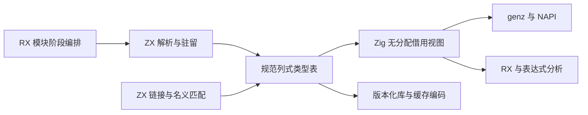
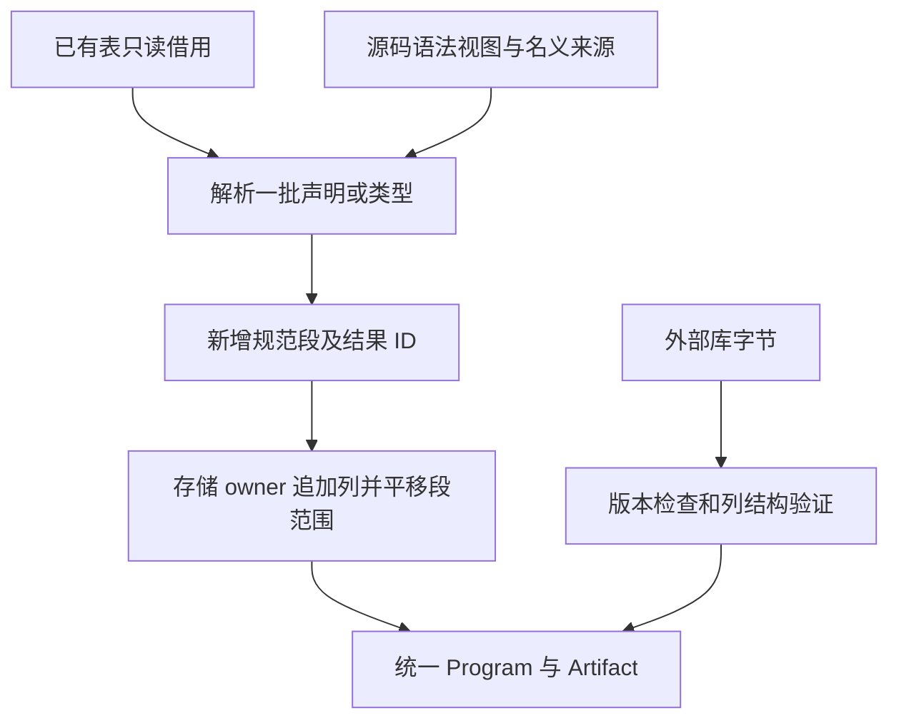

# 统一语义类型表实施计划

## Intent：最终目标

类型解析、驻留、名义身份匹配与模块类型重映射由 ZX 实现，RX 组织模块阶段；core、compiler、linker、genz 和库产物消费同一份规范类型存储。Zig 仅承担存储生命周期、借用视图及系统接口，不把语义判断藏入原生 helper。

本次承接完整自举目标。不可变输入及表达式风格两阶段已经提交；本阶段不重复修改这些语言契约。

## Data：可用证据

- `core/src/ir.zig` 使用 `[]Type`，object、tuple 等分支还持有独立切片；IR 当前版本 22。
- `compiler/src/zx/analysis/types.zig` 用 `ArrayList(ir.Type)`，驻留依次扫描已有类型。
- `shared_types.zig` 先建立类型，再复制旧前缀，链接整表并回写 ID。
- ZX 生成的对象列表保存对象指针，不能直接作为 Zig 值结构体切片；ZX 枚举也没有与独立 Zig 枚举共享名义类型及显式底层宽度的契约。
- 已有 frontend 的 `Sequence.at()` 展示按需投影视图，不必为保留 `for (fields)` 写法分配兼容数组。
- 类型消费者涉及 RX 推导、IR 校验、缓存与库编码、NAPI 声明、genz；只换解析器返回值会留下第二套 IR。

## Edges：边界与限制

1. 不新增运行库，不动态加载，不把旧 union 数组作为持久镜像。
2. 不强转 `[]u32` 为 `[]TypeId`，不假设 ZX enum 或对象内存布局；单个 ID 按值转换。
3. 表头使用 `kinds: u8[]`、`first: u32[]`、`second: u32[]`、`labels: string[]`；子项使用独立的 `children`、`field_types`、`field_names`、`names` 列。
4. kind 编码属于版本化存储契约。ZX 使用显式 decode/encode；Zig 固定 `enum(u8)`，不借用 ZX enum 数组。
5. 基表与增量遵守同一 schema。类型 ID 是合并后的全局 ID；各段内的子项范围属于各自段，合并时只平移范围，不重算类型身份。
6. 解析请求借用整个基表，返回 canonical delta 和结果 ID；不能每次构造已有表的副本。频繁小请求使用同一分析期 allocator。
7. 内存生命周期改变时才复制应被新 owner 持有的内容。零拷贝指阶段间借用，不代表可以借用已释放的源码或缓存 arena。
8. 外部库先查 envelope 版本，再解码新表；版本升级到 23，不维护旧类型格式自动转换。
9. 外部数据必须先验证列长度、kind、范围、标量前缀、引用、规范排序与名义结构，才能使用假定有效的投影 API。
10. 不新增测试用例，不执行全量测试；复用已有类型、链接、库、RX 与 genz 专项。其他 session 的修改不纳入提交。

## Answer：交付与成功标准

- 中文计划、实施记录及对应源码草稿；架构图与数据流图如下。
- 生产类型存储只有一份 schema；解析、驻留、名义与重映射语义在 ZX 中完成。
- 所有消费者直接借用表，不生产旧 `[]ir.Type` 镜像；类型投影不分配。
- 生成 Zig 中没有全表输入复制，增量追加的成本有实际生成代码证据。
- 旧库版本得到明确版本错误；新格式与缓存正常往返，既有专项通过。
- 大特性完成后按明确文件清单提交并推送，完整自举目标保持不变。





## 实施顺序

1. 固定 schema 和 Zig 借用视图、ZX 表模型；先在草稿中验证编译与布局边界。
2. 实现 ZX 基表与增量读取、规范驻留、解析及名义身份处理；存储 owner 仅处理追加和生命周期。
3. 同时迁移 core Program、Artifact、分析、链接、RX、genz 与 NAPI 消费者，不留长期双表示桥接。
4. 升级库和缓存格式，补齐外部列结构验证及逻辑字段指纹。
5. 构建、复用专项、核对实际生成代码与本次 diff；同步草稿并记录自我审查，提交推送。

## 当前实施记录

- 已核对现有源码和其他 session 的改动边界。
- 已选择列式 schema；仍处于草稿实施，尚未切换生产 IR。
- 性能判断：增量方案消除按请求复制旧表，但不会自动消除驻留的线性搜索。初期保持已有复杂度，不宣称所有语义操作为常数成本。
- 已写入并编译核对 `core/type_table` 草稿：模型、只读投影、列借用、增量存储和结构检查。投影按值转换单个 ID；不存在 union 数组镜像。
- 存储追加先检查所有列容量限制、再准备容量、最后提交长度。分配失败可以保留旧逻辑内容，但不保证旧借用切片地址不变；调用者必须在每次修改后重新取得 view。
- 追加输入必须是独立的已验证 canonical delta；不能与 owner 的可扩容列重叠。字符串字节由分析期 owner 持有，Storage 只管理列数组。跨 arena 转移仍需实现明确的深复制边界。
- `structure.valid` 目前只验证列长度、kind、范围与 scalar 值；它不是完整类型图/名义/排序校验，不得作为外部库唯一入口。
- ZX `model/kind/kind_code/row` 草稿使用当前匿名默认函数语法和四空格缩进。真实生成已确认列借用，无整表复制。
- 集合长度是 `u64`，类型 ID 和子项列仍为 `u32`。草稿引入显式静态 `zig:integers`，`widen` 只拓宽整数，`narrow` 使用 Zig 标准库的 checked cast，并在超限时返回 `IntegerOverflow`；不包含类型判断、驻留或名义决策。生产自举构建的 native interface 接线尚未实施。
- `row` 作为独立生成入口会为返回 Row 分配一个对象。这不是整表复制，也不能据此宣称读取零分配；真正作为驻留内部函数使用时还需核对生成代码。core 的 Zig 投影视图无分配。
- 编译核对文件仅实例化已有草稿 API 与实际生成代码，不包含测试数据和测试断言。当前 Zig 0.17 的反射接口为 `field_names`/`@FieldType`，已按实际编译诊断修正。

### 已执行的验证

```sh
zig-out/bin/zxc docs/2026-10-06/统一语义类型表/草稿/compiler/semantic/types/row.zx \
    --project docs/2026-10-06/统一语义类型表/草稿/compiler/semantic/pkg.yaml \
    --out docs/2026-10-06/统一语义类型表/生成/row.zig

zig build-obj --dep integers --dep zxc_abi \
    -Mroot=docs/2026-10-06/统一语义类型表/编译核对.zig \
    -Mintegers=docs/2026-10-06/统一语义类型表/草稿/compiler/semantic/native/integers.zig \
    -Mzxc_abi=docs/2026-10-06/统一语义类型表/生成/row.zig.abi.zig \
    -fno-emit-bin
```

上述两步已经通过。尚未运行生产专项，因为生产 IR 尚未修改。后续任务仍是 ZX 规范驻留、解析与名义重映射、生产读写路径和格式版本的一体迁移。

## 自我审查

不能用“统一表”命名掩盖两份长期存储，也不能把全部决策装进 Zig 后只从 ZX 调用。迁移完成的判断依据是生产数据路径与生成代码，而不是草稿文件数量。切换前必须核对 codec、缓存和声明生成，避免主编译成功而旁路仍依赖旧 union。

## 驻留实施中发现的生成器问题

`find.zx` 和 `equal.zx` 的真实生成代码暴露：即使原生函数只输入、输出整数，value-call 分析仍因存在 external 调用关闭整条调用链的值布局，导致行读取和搜索循环持续分配小对象。

修正以 ABI 边界为依据：原生调用的全部输入及输出只能是无引用标量、枚举、错误值及它们的 optional；多参数 tuple 逐项检查。排除 string、list、object、native reference 以及 Store。这样的原生调用不能取得被优化的 ZX 对象地址，因而不会捕获其临时存储。

此证明只允许存储布局优化，不宣称外部函数没有副作用：调用次数、顺序、错误与 IO/process 参数必须保留。既有 `pure` 字段在这些使用点用于布局/借用资格，未执行函数折叠或公共子表达式消除。先以最小改动修正资格分析，不扩展原生聚合参数边界。

具体源码位于 `草稿/genz/native_value.zig` 和 `草稿/genz/value_call/analysis.zig`；验证使用实际驻留生成代码及既有原生／循环专项，不新增测试用例。

继续检查发现第二道限制：深层循环值布局把“只读借用的对象列表”也当作不支持，连 Candidate.fields 这样的既有切片都使整轮回退到堆分配。草稿 `genz/iteration_layout.zig` 允许列表以原 ABI 切片作为叶子被携带；同时明确拒绝深层布局里构造、修改或执行对象元素列表操作，避免把临时对象地址写进逃逸列表。列表内容不展开成值树。

实际生成验证表明循环体分配已消除，但局部按值请求仍在入口和出口重建嵌套对象。`iteration.zig` 因此在已经请求按值返回、调用链符合布局资格、且 state-plan 允许该类型时，复用既有带 origin 的状态布局。保持对别名身份的既有判定，只扩展进入已有路径的条件，避免重复维护第三种布局。

## 规范驻留草稿进展

- `find/equal` 从基表与增量读取结构类型，复用原有 ID；名义 enum/native 不按名字自动合并，后续由来源身份解析决定复用。
- `append` 输出新 delta 与全局 ID，引用的 child ID 不重映射。对象字段拆为名字和 ID 列；错误名字排序，枚举保持声明顺序。
- `intern` 组合排序、查找、追加。输入 Candidate 是已完成语义校验的内部请求；任务容器约束、重复字段、名义身份等尚待解析层完成，不能对任意用户数据直接调用。
- `sort_fields` 暂用排序后的名字回查字段，要求输入名字唯一；复杂度 O(n²)，不作为最终性能结论。后续应使用零拷贝字符访问实现 ZX 比较与高效排序，或补齐通用比较能力，不能把类型排序整体移回 Zig。
- 驻留草稿已用实际 CLI 完成生成，并由 `驻留编译核对.zig` 实例化 generated execute 后通过 Zig 编译。尚未接入生产 Types。
- 生成器资格修正已写入四个正式 genz 文件；最终构建与既有专项复跑均已通过，准备提交生成器前置修正。

### 生成器修正的当前验证证据

- 最终 `zig build dist -Doptimize=safe -j2` 已通过，使用已有本地 Zig archive。
- 使用最终 CLI 重新生成 find 与 intern；驻留生成代码实例化后的 Zig 编译通过。
- find 的类型搜索循环和 equal 的字段比较循环不再直接执行 allocator.create。equal 的 Candidate 在进入循环时记录原始地址，迭代只更新 index/equal，保留 Candidate.origin；退出时复用该地址。
- 生成源码中仍保留旧 ABI 函数和边界分配分支，不能以整个文件里 create 的数量判断热路径，也不能据此宣称整个编译过程零分配。尚未实施完整 TypeTable 请求批处理及分配曲线测量。
- 第一轮既有 `test-value-return`、`test-iterate-buffer`、`test-typed-try-runtime` 均通过；最后一次循环入口修正后，同样三个专项复跑也已全部通过。

### 前置修正收尾

四个 genz 文件的正式源码与草稿一致，已有三个专项最终命令退出码为 0，未新增用例、未执行全量测试。row 与 intern 的实际生成代码实例化编译均通过；所有 ZX 草稿已采用四空格官方格式。

本次提交可以交付生成器前置性能修正及可复核的类型表草稿，不代表 TypeTable 生产迁移完成。下一步仍需落实解析、名义身份和统一存储消费者；当前驻留接口按单个 Candidate 返回 delta，在完整模块批处理接线前也不能宣称消除了 delta 的重复追加成本。
