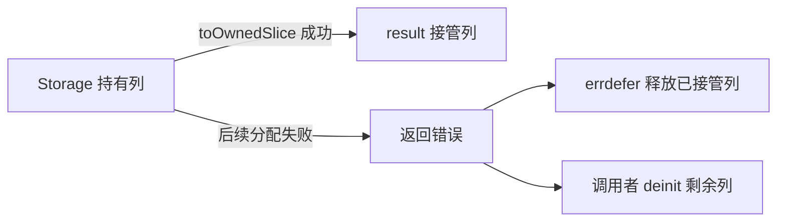
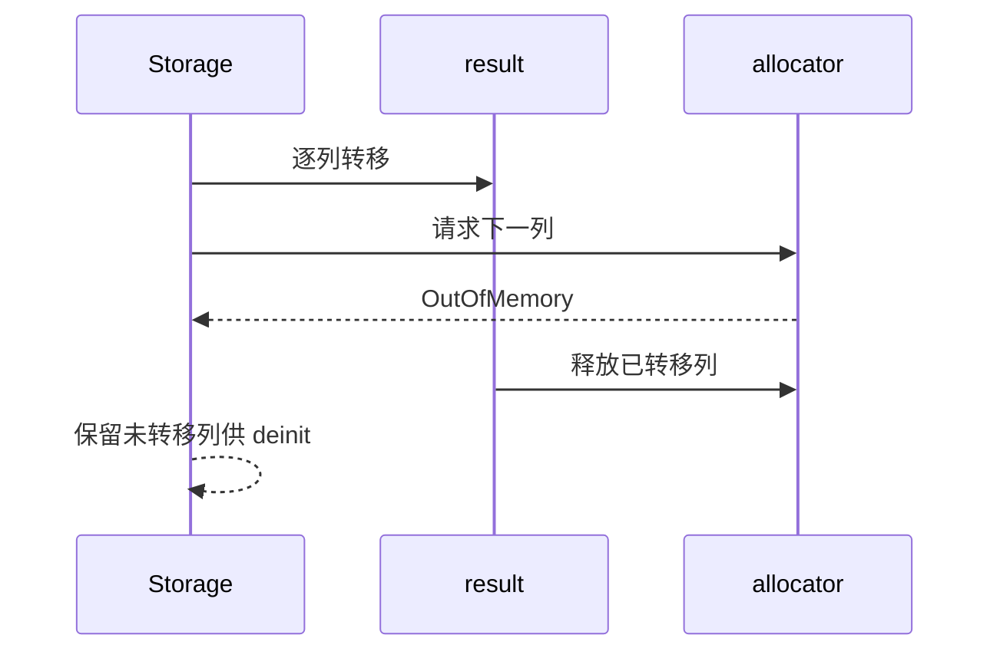

# 类型表所有权转移失败清理

Intent：finish 后续列分配失败时释放此前已转移的列，避免非 arena 调用者泄漏。

Data：独立回归会话在 fc040024 上使用普通 allocator 和逐次失败注入复现：kinds 列已 detach，后续 toOwnedSlice 返回 OutOfMemory；Storage.deinit 无法再释放 kinds。

Edges：失败后不恢复原 Storage 的逻辑内容或切片地址；调用者仍负责 deinit 尚未转移的 Storage 列。字符串内容保持原有借用语义，不逐字符串释放。

Answer：finish 的 result 以空切片初始化，errdefer 释放 result 的全部列。成功转移到 result 的列由该清理拥有，尚未转移的列仍是空切片，Storage 保持其余列所有权。使用对方既有复现验证，不新增用例。

验证：使用独立会话提供的 storage_finish.zig 执行 Debug 逐次分配失败注入，退出码 0，1/1 通过，无泄漏报告。原始输出保存在 验证/所有权转移清理.log。

自我复核：本次只改变错误清理，不改变成功结果、列存储、借用字符串或调用者 deinit 责任；没有要求失败时恢复已拆出的列。
