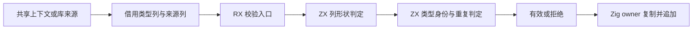
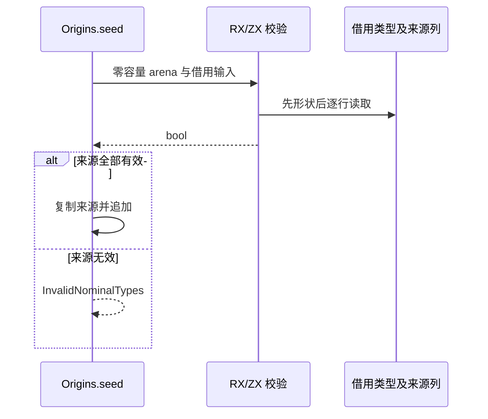

# 名义来源校验自举

Intent：将 Origins.seed 的来源有效性判定迁移到 RX/ZX，使列形状、来源身份与规范类型名称对应、重复绑定拒绝由语言自身执行。

Data：当前 seed 先检查所有来源列等长、kind/member 形状，逐行验证 TypeId、名义类型、native 来源与名称一致，再拒绝重复 TypeId 或重复来源加名称，最后才复制来源并追加。已经存在可零复制借用的 TypeTable 与 Origins.Table，名义 lookup 已由 RX/ZX 实现。

Edges：保持先完整校验后写入的顺序；无效数据不能留下部分来源。来源字符串复制仍属跨 owner 生命周期管理，暂留 Zig。TypeTable 的结构有效性属于调用方既有契约，不借迁移扩大校验域。来源列即使长度不一致也能借用，必须先判形状再访问；不得提前调用会投影非法 kind 的 Table.at。空来源合法，不要求来源覆盖所有名义类型，不新增 owner/member 非空要求。重复检查维持现有 O(n²) 比较，不用新增索引分配换取本阶段局部优化。

Answer：RX 入口调用独立的来源校验 ZX，复用名义绑定类型和规范类型视图，拆分形状判断与逐行/重复检查；Zig 仅适配借用输入及保留种子判定，正式入口使用零容量 arena。以实际发行、现有名义来源、库与缓存专项和真实 CLI 生成结果为验证；不新增用例、不运行全量。

正式接线已完成。来源列只借用，不先投影为 Item；ZX 首先比较五列长度，再逐行检查来源 kind/member、TypeId、类型标签和重复。旧判定提取为种子函数。正式生成模块独立静态接线，输入 type/origin 列与 names 都沿既有 ABI 借用方式。只读复核确认四个 seed 入口的错误映射、未覆盖来源的合法性以及后续 compiled native owner 检查均保持不变。当前发行与四专项正在运行。

## 验证与自我复核

- 最终发行 `zig build dist` 退出码 0。
- `test-nominal-origins`、`test-native-references-library`、`test-library-codec`、`test-semantic-cache` 四专项退出码 0。覆盖实际共享来源、编译库校验与拒绝、名义 ID 越界、库往返及缓存相关路径。没有新增测试或执行全量。
- 最终 CLI 再次生成真实 RX 入口成功，保存 `生成/origins.zig` 及 ABI；生成源码无 allocator.alloc/create，正式验证调用坚持零容量 arena。
- 自省：现有测试未直接穷举 seed 的所有坏列形状；该边界已对照原始判定与生成代码复核，但不能把上述专项声称为完整形式化证明。形状失败在循环前返回，ID 越界在类型标签访问前返回，重复扫描只读此前已校验项；任何 false 都先于 seed 的复制与追加。
- 与旧实现相同，输入来源表去重不检查目标 items 中的历史项；owner/member 非空、名义类型全覆盖和 native owner 匹配不是此入口的新增条件。后续 compiled validation 仍保留自身更严格检查。
- 类型表结构由调用方保证，ZX kind 解码复用已有映射；不将无效 TypeTable 误当作本轮新增可接收输入。查询和校验零分配不代表后续来源复制无分配。
- 来源生产、类型解析、类型重映射和整批增量驻留仍未完成自举。
