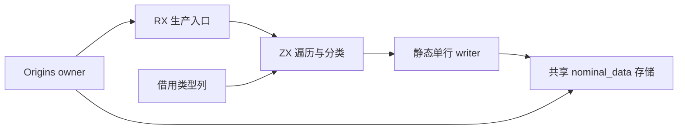
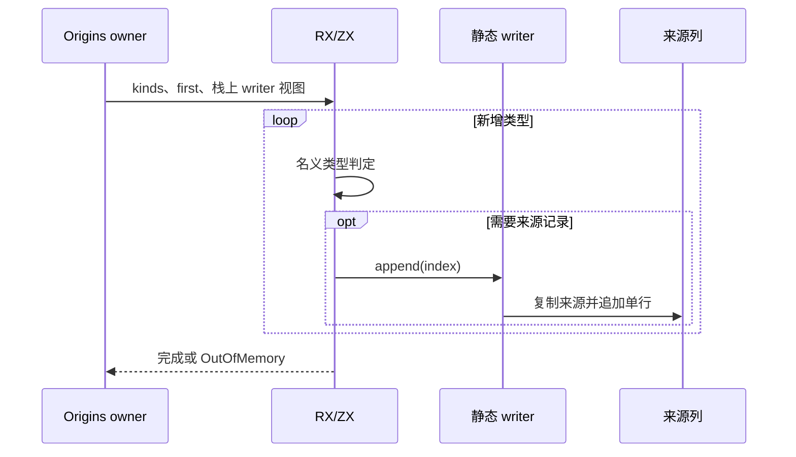

# 名义来源生产自举

Intent：将 Origins.append 的新增类型遍历与名义类型选择迁移到 RX/ZX，保持来源存储的所有权、顺序与失败行为。

Data：当前 append 从 first 扫描类型表，为 enumeration/native_reference 复制 Origin 并追加来源列；来源验证已自举。类型列可借用，来源五列由 Storage 持有，append 保持单行列长原子性。排序阶段已验证 opaque 输入的零分配循环与静态原生调用。

Edges：first 与 TypeId 容量仍遵守现有调用方契约。按原始 ID 顺序追加，非名义类型不追加；失败保持原先已成功追加的前缀，不新增事务语义。ZX 承担循环与分类，静态 writer 只执行单行复制和写入，不隐藏筛选算法。来源字符串跨 owner 复制与存储增长仍使用目标 allocator，不能把编排零分配描述为持久存储零分配。不得使用动态句柄表、函数指针回调或新的运行库。

Answer：新增 RX 生产入口、ZX 循环、显式静态 opaque writer。把已有 model/table/storage 以单个 nominal_data 静态模块共享，避免 writer 导入 frontend 形成反向依赖；不复制列定义。生成编排以零容量 arena 执行，原存储 allocator 只经栈上 View 借用。完成发行及相关已有专项，记录真实生成证据，按 feature 提交推送。

正式实现从完整 kinds 的 first 绝对下标开始扫描，避免切片后的局部索引误当 TypeId。writer 仅保存 labels 列及目标存储，不重新分类类型。只读复核确认共享模块唯一、没有 frontend 反向依赖，复制与逐行 OOM 行为不变。草稿 produce.yaml 仅声明生成代码所需的静态原生接口；完整静态链接由 compiler/build 接线，不能把该生成清单当作独立应用构建配置。

## 验证与自我复核

- 最终 `zig build dist` 退出码 0。
- 现有 `test-nominal-origins`、`test-native-references-library`、`test-module-artifacts`、`test-semantic-cache`、`test-library-link` 五专项全部退出码 0。覆盖来源、原生引用库、裁剪产物、缓存和链接路径，没有新增测试，没有执行全量。
- 用最终发行 CLI 重新生成真实 produce.rx 成功，保存 `生成/produce.zig` 与 ABI。生成循环无 allocator.alloc/create，正式入口以零容量 arena 执行。
- 单行 writer 只有 ID 转换、来源复制和 Storage.append，不读取 kind、不遍历类型、不决定哪些项写入。已有单行 Storage.append 仍先确保五列容量，再一起增长列长；没有新增动态句柄、解释或回调层。
- Origin 逐行复制，name 借用目标类型标签，存储 allocator 与执行 arena 分离；因此“编排无额外分配”不等于“来源存储无分配”。OOM 仍保留已成功追加的前缀，没有暗改事务契约。
- 共享 nominal_data 抽出的是原有结构与复制原语，没有复制第二套状态或造成 frontend 反向依赖。seed 引导分支保留旧算法，正式分支由 RX/ZX 控制。
- 类型表有效性和 TypeId 容量仍是调用方既有契约；first 范围保持断言。producer 不添加 seed 的来源有效性限制、不去重。类型解析、重映射和整批增量驻留仍未完成自举。
