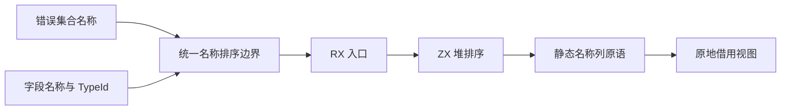
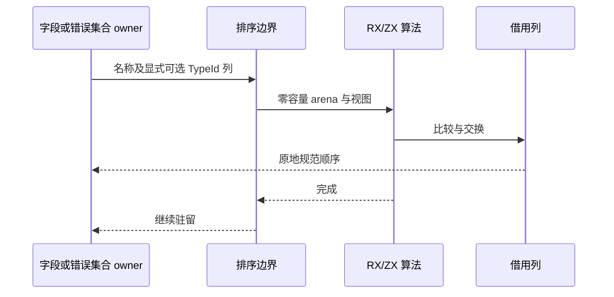

# 错误集合排序自举

Intent：将错误集合的名称排序接入已有 RX/ZX 堆排序，共享名称排序算法，并保留字段类型列配对、错误集合校验及类型驻留契约。

Data：`types.errorSet` 仍直接调用 Zig 排序，字段排序已通过 RX/ZX 与零容量分配器执行。两者排序键均为名称字节序，区别只有字段携带 TypeId 列。种子阶段仍需 Zig 算法引导生成。

Edges：借用视图显式携带可选 TypeId 列；有列时长度必须与名称一致，无列时只交换名称。此可选列表示两种真实输入形状，不是异常兜底。错误名称复制、重复拒绝、错误传播和驻留保持原契约。排序本身不分配，不新增动态库、句柄注册或运行层。不得声称其他类型规范化已完成。仅执行现有相关专项，不新增测试或运行全量。

Answer：共用 ordering.zig 调用边界与 ordering/view.zig 原语，现有 RX/ZX 算法保持不变。内部生成模块改为 name_sort/named_columns 以表达真实职责。完成发行构建、类型合并及有限错误专项后记录结果、复核差异并提交推送。

工具检查：当前 grit 支持语言不包含 Zig/ZX；此次有限标识符迁移使用明确文件白名单和精确替换，随后检查 diff。不尝试用其他语言解析器改写 Zig。

首次发行及专项编译发现共享视图文件被 frontend 与原生模块分别导入，违反 Zig 的文件单模块所有权要求。编译时条件导入不能绕过文件归属检查。构建现在为视图创建单一模块实例，并显式给 frontend 和原生模块复用；种子阶段创建自身独立实例。没有重复结构布局或依赖强转规避类型边界。正在重新验证。

## 验证与自我复核

- 最终 `zig build dist` 退出码 0。
- 现有 `test-type-merge` 和 `test-typed-try` 全部退出码 0；typed-try 包含有限原生错误声明、分析、库、原生 ABI 和运行专项，覆盖多错误、嵌套去重及库往返。不新增用例，不执行全量。
- 用本轮产出的 CLI 重新生成草稿 RX 入口成功，保存 `生成/name_sort.zig` 与 ABI。生成源码不含 allocator.alloc/create；字段与错误集合实际排序调用均使用零容量 arena。
- 名称按既有字节序比较，字段 TypeId 只随名称成对交换。错误集合传 null 明确表示不存在附加列；字段列长度由边界断言，不能把空数组伪装为无列。
- RX/ZX 排序算法本身未复制或修改，只扩展借用视图并统一调用边界。种子构建仍用 Zig pdq，正式构建用生成算法；两种阶段共享同一比较和交换原语。
- 原有错误名称复制和类型驻留保持不变；排序 O(1) 额外数据存储不代表错误类型创建无需分配。来源校验、类型解析与整批增量驻留仍待迁移。
