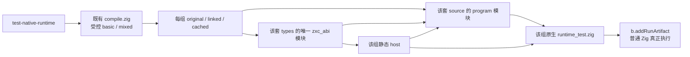
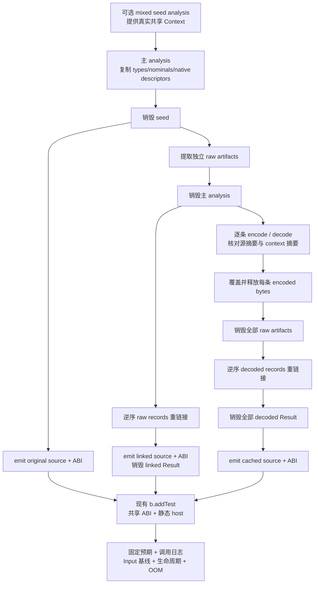

# 缓存恢复混合类型执行回归：只读分析草稿

本稿使用 IDEA 框架。只读证据固定于 `3a0539f3afa140f13fd13618a81fab3a57a34c95`，该提交已包含 `79cc01c8`、`6e1c8e46`、`670c271c`、字段排序自举 `f00fddb5` 和错误集名字排序自举 `2fe99d67`。本次仅交付分析文档，未修改正式源码、未运行生成或测试门禁。下列代码是待主代理实施、生成和验证的夹具草案，不能据此声称当前主线已经通过新增执行观察。

## Intent：最终目标

补齐统一类型表迁移的一项实际缺口：普通 ZX 的对象、元组、列表、可选值与枚举、错误集共同经过 artifact 提取、缓存 codec 编解码、独立重链接后，生成普通 Zig，并由现有 Zig 测试真正执行。

保留现有 basic 原文夹具，增加独立 mixed 夹具。两者都走 `original / linked / cached` 三条路径，并分别对固定预期执行。新增 cached 路径必须在重链接前释放原始 analysis、encoded bytes 和 extracted artifacts；重链接成功后再释放 decoded records，然后才能生成 cached 的 source 与 ABI。

复用 `test-native-runtime` 的静态链接、共享 ABI 与 `b.addTest`，不新增 Node 执行器、通用运行器、动态加载层或 zxc 运行库。

## Data：可用证据

以下是源码检查结果，不是本次实际门禁结果。

| 成熟入口                                                              | 已有观察                                                                                                                   | 本次可以复用的边界                                                               |
| --------------------------------------------------------------------- | -------------------------------------------------------------------------------------------------------------------------- | -------------------------------------------------------------------------------- |
| `packages/test/build/native_runtime.zig:4`                            | `test-native-runtime` 为 original、linked 分别生成 source 和 ABI；同一套 ABI 模块同时注册到 program 与 host；运行 Zig 测试 | 最直接的生成、静态原生链接、真实执行入口                                         |
| `packages/test/tests/incremental/native_runtime/compile.zig:12`       | analysis 内生成 original；提取独立 artifacts；analysis 释放后逆序重链接；artifacts 释放后生成 linked                       | 已经有两段 owner 分离，新增 codec 段即可                                         |
| `packages/test/tests/incremental/native_runtime/runtime_test.zig:5`   | 两个成功 enum 值、helper 首错截止、entry 第二次错误与已完成调用记录                                                        | basic 的四份独立预期应原文保留                                                   |
| `packages/test/build/link_runtime.zig:4`                              | plain、slots 的 original 与 independently linked 单文件 Zig 真正执行                                                       | 适合无原生的标量或 Store；混合原生 ABI 应复用 native_runtime，避免扩写另一套接线 |
| `packages/test/tests/incremental/cache_codec/roundtrip_test.zig:35`   | 所有 decoded artifacts 在原始 analysis 与编码 bytes 释放后重链接；校验 IR 和 nominal 数量                                  | 已覆盖恢复 owner；最后仅 `generated.len != 0`，没有执行混合结构的独立 oracle     |
| `packages/test/tests/incremental/module_generation/gates_test.zig:32` | 生成缓存命中结果在 cache 和 analysis 销毁后仍持有生成文本；与 fresh bundle 比较                                            | 生成缓存所有权已存在，文本相同不能代替新增执行 oracle                            |
| `packages/test/tests/library/runtime/replay.zig:11`                   | library codec decode 后覆盖、释放编码 bytes，再发射静态模块文件                                                            | 可复用“破坏 bytes 后继续使用”的技巧；无需复制其 Node 外层运行链                  |
| `packages/test/tests/support/type_column_fixture.zig:3`               | 普通对象、tuple、enum list、optional、索引 typed try 可共同产生统一列                                                      | 是混合语法与 error_set 行的成熟依据，无需手工构造非法或任意重排的类型表          |

生成执行链已经挂入 `packages/test/build.zig:91-92` 的总测试依赖。本次修改 `build/native_runtime.zig` 即可接入现有聚合门禁，不需要新增根构建步骤。

### 新共享 context 与缓存摘要

`packages/compiler/src/zx/analysis/analyze.zig:23` 的 Context 已包含 `types / nominal_types / native_modules / stores`。单文件分析在 `:88` 复制原生模块；项目分析在 `packages/compiler/src/zx/modules/project.zig:490` 复制 `context.native_modules`。`packages/compiler/src/zx/modules/native_context.zig:19-38` 深复制 descriptor 的 specifier、identity、import_name、namespace 字符串和导出绑定名字。

这不是只复制最外层 descriptor 切片。mixed 可以在编译工具内部通过独立 seed 分析提供 context，在主 analysis 返回后、生成 original 前销毁 seed，观察主 analysis 及其提取记录是否继续拥有上述数据。basic 保持空 context，保留原有简单观察。

`packages/compiler/src/zx/modules/semantic_cache.zig:38-47` 对完整 Context 做 JSON 编码再 SHA-256，因此新增 native_modules 已进入 context 摘要。`project.zig:174` 仅对入口使用调用方 context，非入口使用空 context。codec 的 `decode` 参数只有 compiler_digest；恢复的 context_digest 在返回值里，它不会自行判断是否与当前环境匹配。实现时：

1. 入口记录 encode 时使用 seed 提供的真实 Context 摘要；非入口使用 `SemanticCache.contextDigest(allocator, .{})`，不要把随机常量叫作实际环境摘要。
2. 解码后对 context_digest、source_digest、路径逐项确认。compiler_digest 可使用明确标注为本夹具标识的固定 32 字节值；它不是实际发布编译器指纹。
3. seed 中同形的 context 拷贝应得到相同摘要；只变更一个 descriptor 的 `import_name` 或 identity 应得到不同摘要。这个观察仅证明摘要输入包含原生描述符，不能声称已经验证语义缓存命中或失效计数。
4. 本项 cached 路径调用 codec + linker，不调用 `analyzeIncremental` 的恢复路径；报告必须保留这种区别。

`packages/compiler/src/zx/modules/semantic_cache/restore.zig:60-76` 仍按原生 identity、import_name、namespace 和 remapped 导出类型确认恢复；`semantic_cache/native.zig:59-65` 的原生接口 fingerprint 还覆盖接口源码、路径、模块名及 namespace。它们不是这项 codec 执行测试的替代证据，也不是此次方案要重新实现的机制。

### 按可达闭包生成的范围

`packages/compiler/src/backends/zig/modules.zig:45` 和 `references.zig:4-22` 执行入口函数可达闭包筛选；`functionFiles` 在 `modules.zig:90` 开始只发射 needed 函数。这个逻辑属于 `emitModules` / `emitLibrary`。现有 native_runtime 使用 `emitBundle`，见 `packages/compiler/src/backends/zig.zig:45` 与 `packages/genz/src/zx/render.zig:26`。

所以本稿能补齐缓存恢复后的共享 ABI 和普通 Zig 执行，但不能声称同时覆盖分模块生成的可达闭包筛选。现有 module_generation 与 library runtime 继续承担各自门禁；不为这一项顺手增加第二套分模块执行器。

## Edges：边界与限制

### 最小文件边界

只需改两份现有接线文件，新增 mixed 的五份资源，共七份正式文件。全部由主代理后续实施，本稿没有创建这些源码。

| 文件                                                                    | 具体责任                                                                                                                                   |
| ----------------------------------------------------------------------- | ------------------------------------------------------------------------------------------------------------------------------------------ |
| `packages/test/build/native_runtime.zig`                                | 对受控 `basic / mixed` 各运行同一个现有 compile 工具；每次注册 `original / linked / cached` 的 source+ABI；按夹具选择 host 和 runtime_test |
| `packages/test/tests/incremental/native_runtime/compile.zig`            | 只接受 basic、mixed；按选择加载 main、接口和可选 types；生成三套产物；实现明确 owner 释放及 codec 元数据核对                               |
| `packages/test/tests/incremental/native_runtime/mixed/main.zx`          | 普通聚合输入输出、两次原生调用、列表索引 typed try                                                                                         |
| `packages/test/tests/incremental/native_runtime/mixed/types.zx`         | 纯类型模块；Request、Response 与 enum 引用                                                                                                 |
| `packages/test/tests/incremental/native_runtime/mixed/choice.d.zx`      | Mode 与有两个名字的有限 throws 声明                                                                                                        |
| `packages/test/tests/incremental/native_runtime/mixed/choice.zig`       | 共用生成 ABI 的宿主实现；完整调用日志和 fail_at                                                                                            |
| `packages/test/tests/incremental/native_runtime/mixed/runtime_test.zig` | 固定结果 oracle、错误截止、输入基线、两次结果同时存活、运行时 OOM                                                                          |

existing basic 的 `main.zx / choice.d.zx / choice.zig / runtime_test.zig` 不改。两组夹具共用现有 `helper.zx` 的源码：编译工具统一将选中 main 和 helper 注册为 `/project/main.zx`、`/project/helper.zx`，mixed types 注册为 `/project/types.zx`。因此 main 使用普通 `"./helper"` 导入；不要把磁盘上 `mixed/` 的目录层级意外带入本夹具的逻辑模块路径。

build 只为编译工具增加一个受控选择参数，并把产物循环扩为三个。basic 和 mixed 分别创建 run step；每套 program、host 共用该套的唯一 zxc_abi 模块，不跨 original/linked/cached 混用 ABI 模块实例。



若 compile.zig 的 owner 阶段实现明显膨胀，可以将专门的 records 编解码职责拆成同目录一个小文件，但不预先新增通用 runner 或把测试目录变成框架。主代理可根据实际实现决定是否需要这个第八文件。

### 普通 ZX 夹具草案

下面采用已有表达式和声明组织：纯 types、普通函数、普通 import、tuple 字面索引与 typed try。没有 captured outer bindings、map index 参数或未经支持的箭头语句块。

`mixed/types.zx`：

```zx
import type { Mode } from "zig:choice"

export type Request = {
  values: Mode[],
  saved: u64?,
  record: { value: u64, enabled: bool },
  pair: [u64, bool],
  mode: Mode,
  index: u64
}

export type Response = {
  values: Mode[],
  saved: u64?,
  record: { value: u64, enabled: bool },
  pair: [u64, bool],
  mode: Mode,
  picked: Mode?,
  missing: bool
}
```

`mixed/main.zx`：

```zx
import helper from "./helper"
import native from "zig:choice"
import type { Request, Response } from "./types"

export type Input = Request

export type Output = Response

export default function (in: Input): Output {
  const mode = native.flip(helper(in.mode))
  const [err, picked] = try in.values[in.index]

  return {
    values: in.values,
    saved: in.saved,
    record: {
      value: in.record.value + in.pair[0],
      enabled: in.pair[1]
    },
    pair: in.pair,
    mode: mode,
    picked: picked,
    missing: err != null
  }
}
```

`mixed/choice.d.zx`：

```zx
export enum Mode { First, Second }

export declare function flip(input: Mode): Mode throws { ZetaFailure, NativeFailure }
```

mixed host 保留当前宿主的两格 trace，不额外发明协议。`flip` 先记录输入并增加 calls，再根据 fail_at 返回确切错误：第 1 次是 NativeFailure，第 2 次是 ZetaFailure；其他情况 First→Second、Second→First。签名使用 `error{NativeFailure, ZetaFailure}!Mode`。所有成功和失败都检查 calls 及已发生 trace；测试不能仅检查返回错误。

有限 throws 的两个名字验证原生错误契约和排序。列表 typed try 会产生用于捕获 IndexOutOfBounds 的 error_set 类型行，与 Mode 的 enum names range 同处统一 names 列。不要未经实际检查就声称有限 throws 的两个名字一定也单独形成了类型表中的 error_set 行。

### 类型布局的必要前置观察

在 compile 工具的 mixed 分支，对 source、linked、cached 的 IR 使用成熟 `compiler.validateIr`。按 kind 扫描类型表并通过 `types.at` 读取实际对象、tuple、list、optional、enumeration、error_set。确认上述类别都存在，并检查具体成员及字段类型；单纯检查 count 或 kind 集合不能证明 ranges 正确。

Mode 的成员必须为 First、Second；捕获索引错误的 error_set 必须含 IndexOutOfBounds；tuple 必须是 u64、bool；对象字段应按名字排序且字段值类型与 source 契约一致。至少确认一个 enum range 与一个 error_set range 在 names 列相邻且读取互不串位。用真实产生的 range start/length 检查，不硬编码某个 TypeId 或 row 编号。

当前 scalar 前缀是固定公共契约，不能随意打乱。逆序排列的是完整 module records，不是类型表行。seed context 可以通过合法先声明的 Noise 对象改变后续非 scalar 类型编号；如果希望补第二种合法类型插入顺序，换 seed 声明次序并重新分析，仍保持子类型在父类型之前。不手工改 TypeId 冒充合法源码顺序变化。

### 所有权阶段：必须真正跨过释放边界



不能让 `defer analysis.deinit()` 仍停留在覆盖整个 main 的作用域。raw artifacts 也必须在 cached 重链接之前结束生命周期；否则测试只能证明 bytes 拷贝，无法证明不依赖 extracted arena。cached Result 返回外层之前结束 decoded records 的作用域，再生成 Zig，才能证明 linker 结果独立拥有列与字符串。

每条 decode 采用下面的局部节奏；没有必要把它抽象成一个通用缓存系统：

```zig
const bytes = try codec.encode(allocator, artifact.value, context_digest, compiler_digest);

defer allocator.free(bytes);

const decoded = try codec.decode(allocator, bytes, compiler_digest);

errdefer {
    var abandoned = decoded.result;

    abandoned.deinit();
}

if (!std.mem.eql(u8, &decoded.context_digest, &context_digest)) return error.InvalidContextDigest;
if (!std.mem.eql(u8, &decoded.result.value.source_digest, &artifact.value.source_digest)) return error.InvalidSourceDigest;

@memset(bytes, 0);
```

上段之后将 decoded.result 转移到 records。它是局部所有权示意，不是可直接贴进循环的完整实现；转移之后必须撤销局部 errdefer 的所有权。可以用返回 helper 或明确局部作用域做到这一点。records 的 count 必须在成功转移后立即增加；失败时只 deinit 已初始化项。slice 由 init.arena 或单独 allocator 管理不等于其各项 Result 已自动释放。

宿主生成执行与编译工具分进程。编译工具只持有 analysis/artifact/codec/link owners；运行测试只持有 Input 的宿主数据和结果 Arena。这项测试需要两套生命周期都明确，不能用一次文本比较代替实际输入输出存活验证。

### 七项少量、独立运行时观察

mixed runtime_test 可用以下七个命名 test，分别由 original、linked、cached 同样执行。用手写固定数值和 enum 预期，禁止用 original 输出或编译器类型查询计算 cached 的期望。

| 观察             | 输入与独立 oracle                                                                                                                                                       | 调用与生命周期要求                                                                                                                                               |
| ---------------- | ----------------------------------------------------------------------------------------------------------------------------------------------------------------------- | ---------------------------------------------------------------------------------------------------------------------------------------------------------------- |
| 普通有效聚合     | mode First；record.value=31；pair=[11,true]；values=[First,Second]；index=1；saved=0。结果 record=[42,true]、mode First、picked Second、saved 存在且为 0、missing=false | calls=2、trace=[First,Second]；完整 tuple/list 内容；Input 全量基线                                                                                              |
| 空列表与可选空值 | mode Second；record.value=0；pair=[max(u64),false]；values=[]；index=0；saved=null。结果 value=max(u64)、mode Second、picked=null、saved=null、missing=true             | calls=2、trace=[Second,First]；空 list 的长度和基线；所有 Input 字段保持原值                                                                                     |
| 非空越界捕获     | values=[Second]；index=1；saved 为非零值。picked=null、missing=true，其他结果继续符合固定公式                                                                           | 仍然恰好两次 flip；不会把越界变成 program.execute 返回错误                                                                                                       |
| helper 首错      | fail_at=1；任意已知有效 Input                                                                                                                                           | 精确 NativeFailure、calls=1、trace[0] 为原输入；Input 不变                                                                                                       |
| entry 次错       | fail_at=2；mode Second                                                                                                                                                  | 精确 ZetaFailure、calls=2、trace=[Second,First]；Input 不变                                                                                                      |
| 两个结果同时存活 | 同一结果 Arena 执行两份不同、宿主 owner 仍活着的 Input；第二份返回不同 record value                                                                                     | 二次调用后重新完整检查第一份结果；新构造的两个 record 不得被地址复用而串值；list 的 ptr/len 与两份各自 Input 保留；每次调用分别 reset 并检查 trace               |
| 全分配失败清理   | 静态或 std.testing.allocator 创建输入，受控 failing allocator 仅供 execute 的结果 Arena                                                                                 | 用现有 `std.testing.checkAllAllocationFailures` 或仓库 support 检查全部失败点；OOM 后 Input 基线保留；宿主 calls ≤2，trace 必须是预期前缀；成功轮检查完整 oracle |

记录 Input 基线时同时保存 list.ptr、list.len、完整列表元素和对象/tuple 字段值。只有 expectEqualDeep 而没有槽位/切片基线，仍可能漏掉输入被重建的情况。

值生命周期观察依赖 Input owner 存活。`values: in.values` 是直接借用切片，应保留 ptr/len 与元素；此主夹具列表元素是 enum 标量，不产生元素对象地址。普通对象和 tuple 不额外要求与 Input wrapper 地址相同；新构造 record 的合理契约是完整值与同时存活独立性。

运行时 OOM 的精确成功调用数依赖生成器合法的分配位置。检查“日志是完整成功序列的前缀、停止后没有继续调用”，不硬编码某个 allocator 的第 N 次失败必定发生在第几次 flip。该输入的列表索引是捕获边界，`try` 自身也可能引入分配，因此全部 OOM 预期应在实际首次生成后核对，不把编译布局推断冒充已观测结果。

### 普通原生引用的可选风险边界

现有 `packages/test/tests/native/references/runtime/host.d.zx:1-13` 与 `host.zig:1-69` 已有成熟 opaque Node、Node?、Node[] 及宿主 identity 日志。若主代理认为这次 nominal/native_reference 列恢复风险需要一起关门，可在 mixed 的五份文件内最小追加 `Node` 输入与 `first(Node):Node?`，宿主使用稳定 `HostNode`，检查 null/present、具体底层 Node 身份及确切额外调用日志。

这一追加会扩大成功日志和失败截止矩阵，不属于完成主要缺口的必要条件。不要把 optional<u64> 成功冒充 native_reference optional 成功，也不要给普通聚合 wrapper 引入 opaque Node 才拥有的身份契约。若不追加，交付明确写出该边界仍由既有 native references 门禁负责，新增 cached mixed 尚未独立覆盖它。

## Answer：交付格式与成功标准

主代理先把上述七份文件的实现草稿放入本功能的 `草稿/`，审阅后再按既有授权落正式源码。提交说明由主代理采用英文 Conventional Commits；本稿及实施记录保持中文。

最小执行门禁是 `packages/test` 现有 `test-native-runtime`，分别以 Debug、ReleaseSafe 执行。因为 basic 保留 4 个 test、mixed 提议 7 个 test，每组跑三份生成产物，预期独立执行声明最多是 `4×3 + 7×3 = 33`；这个数字是方案计数，不是已通过的结果，实际实现若合并或调整声明必须重新点数。

适合的邻接门禁是既有 `test-cache-codec`、`test-type-merge`、`test-module-generation`。不需要为这项修复先重跑 N-API/Wasm/Gateway 或引入新的 library TS runner。若主代理增加 native reference optional，再纳入现有 native references 聚合门禁；如果实际修改了 emitModules/emitLibrary 生产逻辑，则按对应模块范围补测，不能只凭本稿的 emitBundle 门禁放行。

成功标准同时包括：

1. basic 既有简单 enum 与裸 throws 原文观察仍在；original、linked、cached 都执行。
2. mixed 的两次原生调用和聚合结果有固定独立 oracle，覆盖 present-zero、null、空列表、非空越界、最大 u64、首错和次错。
3. 在 cached 重链接之前，seed、analysis、raw artifacts、encoded bytes 均已真实销毁；重链接之后 decoded owners 也在 Zig 生成之前真实销毁。
4. 共享 ABI、typed try 的 error_set / enum names ranges、对象字段、tuple/list/optional 都经过完整 IR 验证与实际 Zig 编译执行。
5. 调用日志、Input 基线、两个同时存活的输出、全部运行时分配失败的清理与截止记录没有被弱化。
6. 实施记录固定到真正含全部改动的 commit，保存 gate 命令、返回码和实际声明数量；此前仅源码审阅、旧提交通过或生成非空都不得写成新增门禁通过。

### 自我批判

本稿是可落地的最小方案，但没有生成夹具。typed try 导致的实际 optional 形状、名字池相邻位置、结果对象所需分配，以及 seed context 复用原生 enum 的具体恢复路径，都需要主代理首次生成与执行后确认。语法借鉴的是当前成熟源码，不因此跳过诊断处理：工具必须在 analysis 非 IR 时输出第一条真实诊断并停止，不能忽略失败再写空产物。

最重要的限制是：codec + 独立 linker 的成功不等于 analyzeIncremental 的缓存命中成功；emitBundle 的成功也不等于 emitModules 的入口可达闭包成功。方案把这两点明确留在既有专门门禁，避免为了穷尽未来边界把这项实际执行回归扩成新框架。
