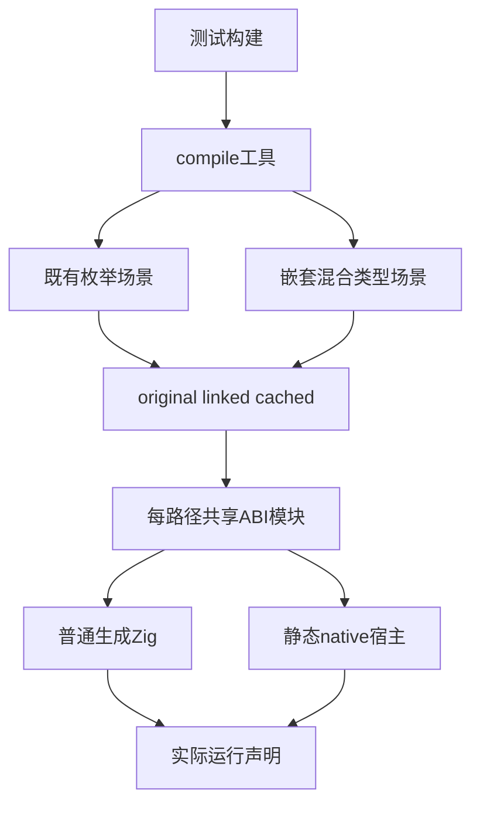
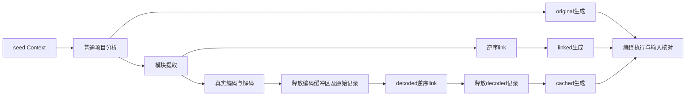

# 缓存恢复混合类型执行回归

## IDEA

- Intent：确认统一类型表中的嵌套对象、元组、枚举列表、可选值和错误信息，在原始分析、模块重链接、持久格式解码后均生成可实际执行的静态 Zig。
- Data：已有 native_runtime 四项测试及普通 ZX helper；真实项目分析、上下文摘要、模块提取、codec、linker、emitBundle；新增草稿和固定版本真实门禁。
- Edges：不改编译器实现，不重建 Test262 目录。codec编解码不等于磁盘缓存命中；emitBundle不等于emitModules；原生有限错误集不等于任意错误。新提交的名义来源和引用重映射不继承旧冻结版本测试结论。
- Answer：保留四个成熟测试，新增七个独立声明；两个场景各经original、linked、cached三个路由运行。完成Debug、ReleaseSafe及必要相邻门禁、生成物核验、自我批判后独立英文提交并push。

## 最小实现范围

`packages/test/build/native_runtime.zig` 接入basic与mixed两个静态测试场景。原有main、helper、native宿主和四个运行声明保持不变，新增mixed目录承载新增场景。compile工具负责三条生成路径，cached helper仅负责真实codec恢复。

mixed场景的Input/Output来自独立types.zx模块，包含枚举列表、可选u64、嵌套record、u64/bool元组、枚举及索引。字段使用非排序源码声明，观察真实类型排序与全局引用重映射。普通helper先调用native.flip，入口再次调用；宿主声明两个有限错误并记录调用顺序。

运行声明分别观察普通值、空列表与null/u64上界、非空列表越界、第一次及第二次native错误、同一arena内连续结果、逐分配失败。每次都以独立输入基准核对完整输入值；不按分配序号硬编码native调用次数，只检查实际调用是合法前缀。

## 生命周期边界

1. 使用seed分析得到真实Context，摘要覆盖类型、名义类型和native_modules。相同Context摘要相同；改变native import_name摘要必须变化。
2. main分析完成后先释放seed，再检查和生成original，观察Context拥有性。
3. 提取全部模块，同时对每个模块执行真实codec.encode/decode；入口带实际Context摘要，其余带空Context摘要。
4. 解码后抹零编码缓冲区再释放。随后释放原始分析，逆序模块输入linker；检查并生成linked。
5. 释放原始提取记录与linked结果后，链接decoded记录。再释放所有decoded记录，检查并生成cached。
6. 三条生成路径的Zig源码与ABI使用相同程序/宿主类型模块静态编译；真正执行全部声明。

固定codec compiler_identity是测试信封身份，不冒充实际编译器版本摘要。检查使用实际生成的TypeId和列范围，不写固定类型编号。全列排序、相邻names范围、payload范围和全局引用还需现有独立codec、storage、type_merge门禁共同支撑。

## 架构图

## 数据流图

## 执行顺序

草稿先格式化并复制到干净 `3a0539f3` 固定检出，真实Debug测试成功后执行ReleaseSafe和必要相邻门禁。失败首先判定场景、检查器与宿主是否满足正式契约，再决定是否通知实现会话；不得把自写检查器的布局假设直接归因于编译器。

门禁日志、退出码、生成源码及ABI哈希绑定固定检出和草稿字节。正式安装测试前检查main中对应路径未被其他任务修改。只提交本部分文件，保存历史失败与修正原因。若新main生产变化需单独复验，再记录实际验证过的版本。
