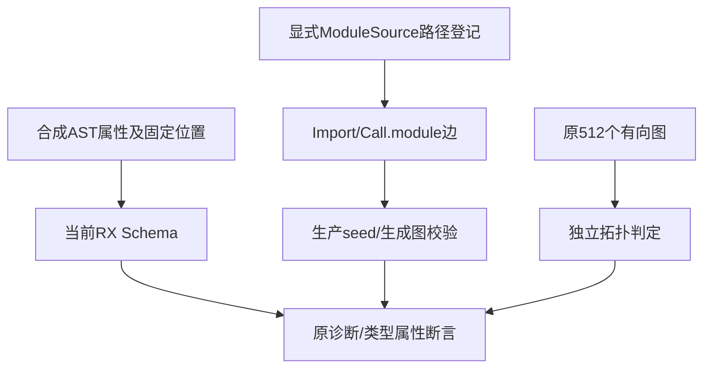

# 编译器RX图夹具契约同步计划

## Intent：最终目标

恢复compiler包既有RX Schema和模块依赖图门禁，使普通标签组合、路径身份、位置诊断及环判定继续到达原验证边界。

## Data：可用证据

根第二轮固定ca727e2c发现helper使用Zig0.17已弃用std.meta.fields，以及flow读取已移除Call.out，当前无法编译。只读盘点七个RX测试来源后，必要范围四个：helpers、flow、modules、dependency_graph。当前Call目标fn/module，依赖边收集只识别Import.from/Call.module；旧service会先在Schema失败，不能作为有环图判定通过。成熟dsl/src/attributes.zig使用@typeInfo(...).@"struct".field_names，helper只需字段名，不增加兼容层。

## Edges：边界与限制

只同步四份既有测试，不改生产、不新增声明/驱动/目录案例。helper合法Call去out；flow同步固定ctx文字并将已删除out读取换为真实setter属性断言。modules和图枚举的Call.service改module，两处out删除，第二调用读取$ctx.users；严格诊断属性名service改module，source_index、h.location与h.value_location原值不变。测试标题仅同步真实目标名。

保留Module.name、Pipeline、sql、Import.as、Store非法属性等故意拒绝来源；Route.service不改。规范化重复路径、同basename不同目录、三模块环、合法菱形、重复图边、分支环及未用Import环保持。合成AST就是Schema/模块图测试的显式入口，不引入ZX实现或假模块别名；不能把Schema通过当真实文本/推导/应用执行通过。

helper未覆盖Task.out分类，但此目录没有Task.out输入；按最小范围不顺带增加未被本组使用的辅助分支。Module.out静态类型名保持。

## Answer：交付格式与成功标准

四份同路径草稿与正式来源一致；固定包含新RX静态规则f72fe861的检出运行compiler包现有test-rx，Debug和ReleaseSafe，记录真实声明/缓存与退出码。512个三节点图仍用独立Kahn判定对照，原位置和无环断言保持。成功后精确提交push并核验源码/证据；根第二轮仍按ca727e2c继续采集，不中途改动该快照。

## 自我批判

旧service在Schema阶段被拒绝，可能让部分有环案例看似成功，实际未经过图判定。必须同步合法边并保留独立拓扑结果，不把所有输入都改成预期诊断。重复left边验证图语义，不应通过复制模块名消除重复。合成位置可验证诊断传播，不能冒充真实XML字节位置；本文门禁边界明确只到Schema和模块集合。

## 最终执行记录

固定f72fe861，Debug与ReleaseSafe的既有test-rx均退出0，各24/24构建步骤、39/39 Zig声明实例实际通过，无运行缓存。原512个三节点图保留独立Kahn判定对照，不另计512个新源码声明。原路径变体、图重复边、来源索引、固定属性值位置、分支环、未用Import环及分配失败清理断言均通过。

四份正式来源、草稿、隔离检出逐字节相同；新增测试声明、目录案例和Test262审阅0。schema/图通过不能替代真实XML解析、项目类型推导或应用执行。根第二轮仍固定ca727e2c，包含旧夹具，原失败保留；不能把本部分修复混入其快照。
