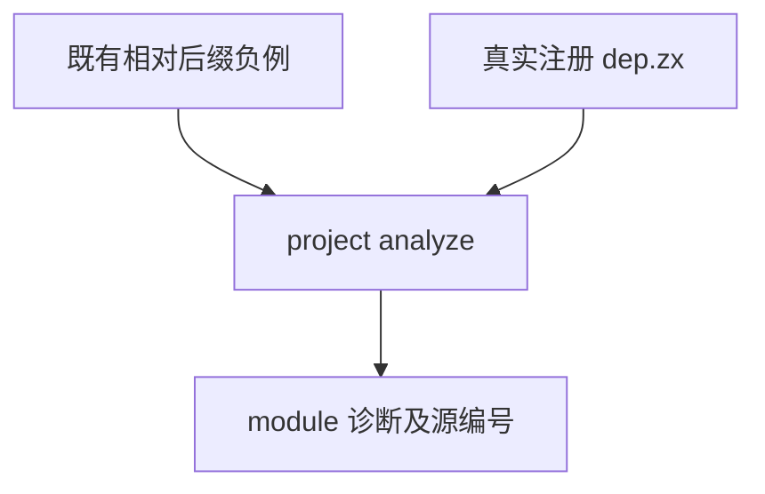
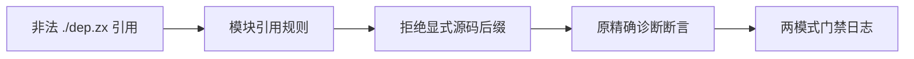

# 编译器相对后缀负例同步计划

## Intent：最终目标

让既有 relative extension 负例继续验证当前 ZX 引用约束，保持精确 module 诊断与 source_index 断言。

## Data：可用证据

既有测试名为 relative extension required，输入 ./dep 且 dep.zx 注册存在；该输入现在属于合法引用。普通相对引用不再写源码后缀，应以 ./dep.zx 验证拒绝。相邻 missing/export/type/call 等负例依旧验证各自错误。

## Edges：边界与限制

仅改同一个已有负例的名称与相对引用，保留 reject helper、.module 和 source_index=0、实际 dep.zx 注册、bare dep.zx 包名负例。不新增、删除案例或修改生产实现。

## Answer：交付格式与成功标准

IDEA 计划、原材料、草稿、指纹；固定检出执行 compiler 的 test-frontend Debug 和 ReleaseSafe，记录退出码、实际/缓存；通过后独立提交 push。两图为入口结构和数据流。

## 自我批判

旧测试不是缺失文件测试；不能删除 dep.zx 来制造拒绝。保留已注册文件才证明失败来自引用格式。只改契约方向，仍需运行整个既有 frontend 门禁，不能预判所有相邻负例通过。

## 最终执行记录

固定 b7e831d5 加一个既有负例方向同步，Debug 与 ReleaseSafe 的 compiler test-frontend 均退出 0，各 23/23 构建步骤、309/309 Zig 原声明实例实际通过，运行缓存 0。相对引用显式后缀拒绝保持 .module 与 source_index=0；missing/export/type/call 等其余原负例全部保持并通过。

源码、完整草稿与固定检出一致。dep.zx 仍真实注册，bare dep.zx 未声明包负例保留；没有新增或删除测试。目录案例与 Test262 审阅均 0；本门禁不代替根回归。
