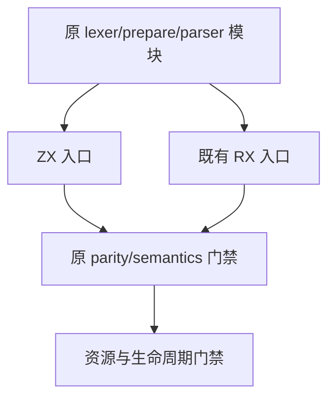

# 自举ZX入口导入分组同步计划

## Intent：最终目标

恢复既有 type parser 与 expression preparation 的 ZX 自举入口，使 ZX/RX 两条真实生成路线继续验证语义、parity、短 token、资源和生命周期。

## Data：可用证据

根第二轮 type_parser/source.zx 在 CLI 生成阶段被 spacing 拒绝。两份 source 的类型导入在普通导入之前，同组路径也未按字典序排序。lint/imports/order.zig 要求普通导入优先，edits.zig 要求类型组间一个空行。build/type_parser.zig 和 build/expression_preparation.zig 将这些 source.zx 交给真实 CLI，保留 --no-cache。

## Edges：边界与限制

只调整两份正常 ZX 入口 import 前缀，保留实际编译器相对路径、Phase 身份、全部函数体及 parser 状态。RX route、模块依赖登记、语义期待、token 边界、分配失败与生命周期断言均保持。不触碰生产自举源码，不新增运行层或测试。

## Answer：交付格式与成功标准

IDEA 计划、完整草稿/原材料/指纹；固定检出执行 test-type-parser 与 test-expression-preparation Debug 和 ReleaseSafe，记录真实实例与缓存。通过后独立提交 push。两图为入口结构和数据流。

## 自我批判

正常自举入口的排序不等于允许修改用来验证不同 import 顺序身份一致性的语义材料。保留 Phase 枚举来源与所有源模块名称，不能复制实现以消除路径或资源检查。

## 最终执行记录

固定 3202ee26 加两个最终 ZX 入口前缀，Debug 与 ReleaseSafe 均退出 0，各 59/59 构建步骤、34/34 Zig 原声明实例实际通过、10 个测试运行步骤无缓存。expression preparation 两条路线各语义 5/资源 4，共 18；type parser 两条路线各 parity 3/short tokens 3/resources 2，共 16。

真实 ZX/RX 生成路线均保留 --no-cache，全部原状态、hints、短 token、源位置、拥有关系/生命周期与分配失败遍历断言不改。只有 ZX 前缀排序与组间空行变化；原 RX 输入与生产 parser/prepare 模块不改。最终来源、草稿、固定检出一致，新增声明、目录案例与 Test262 审阅均 0。
