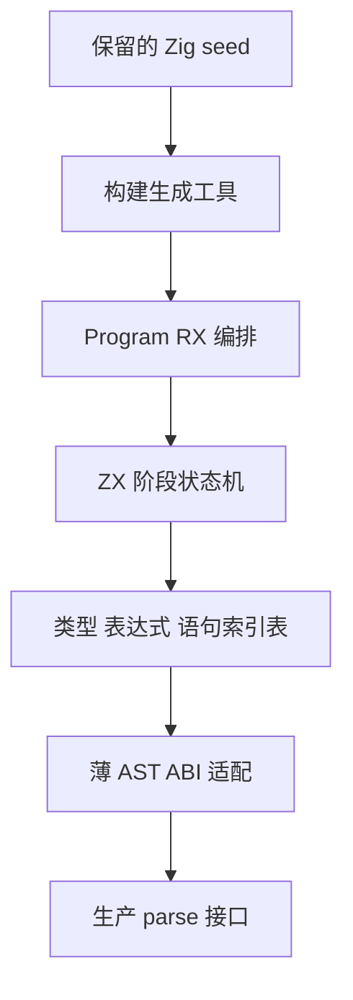

# 自举前能力与实现核查

## Intent：最终目标

完成 RX＋ZX 模块化编译器自举，并保持原始 Zig 实现在 zxc_zig 与 zig 分支中可重建。当前核查更新真实调用链和未完成项，不用已有功能替换原始目标，也不把子解析器源码存在、genz 原语化或目录分离称为自举完成。

## Data：源码与运行证据

本次源码基线为 `ae31a16c`。此前原语化提交为 `16457aad`，示例格式提交为 `c16bec5a`。两个只读分析分别核对自举调用链及交付能力，主执行核对实际文件、分支和构建。

### 自举实际接入边界

| 范围                   | 当前事实                                                                                                     | 直接入口                                                       |
| ---------------------- | ------------------------------------------------------------------------------------------------------------ | -------------------------------------------------------------- |
| Lexer                  | 生产使用 ZX scanner 的生成实现；构建仍由 seed 编译器完成，未以 lexical.rx 作为构建入口                       | compiler/build/lexer.zig；compiler/src/zx/frontend/lex.zig     |
| Program parser         | 生产仍调用 Zig Parser.program；type、statement、expression 同样委派 Zig 实现                                 | compiler/src/zx/frontend/parse.zig；parser.zig；parser_top.zig |
| RX＋ZX parser 子模块   | imports、declarations、types、expressions、header、body 已有正式源码和独立迁移材料，未接入生产 parser 生成链 | compiler/src/zx/frontend/parser/*.rx；compiler/build.zig       |
| 类型、模块、所有权、IR | 仍为 Zig 实现                                                                                                | compiler/src/zx/frontend.zig 的正式导出链                      |
| RX XML 与语义          | 仍为 Zig 解析、校验、类型联结与降级                                                                          | compiler/src/rx/text.zig；analysis/project.zig                 |
| genz                   | 全部生产 Zig 适配改为原语节点生成，但生成器自身仍为 Zig                                                      | genz/src/root.zig；compiler/src/backends/zig.zig               |
| CLI                    | 仍为 Zig 主程序与命令分派                                                                                    | cli/src/main.zig                                               |

准确状态是“lexer 已进入生产自举，parser 子模块已实现但尚未统一接入”；不能继续沿用旧计划中的“自举未开始”，也不能声称已完成编译器自身重建。

### 前置能力与长期交付缺口

| 范围         | 当前证据与边界                                                                                               | 后续要求                                                                         |
| ------------ | ------------------------------------------------------------------------------------------------------------ | -------------------------------------------------------------------------------- |
| std 标准库   | modules.json 有 14 个 specifier；网络主要为 http.request；未覆盖 net/dns/dgram/tls/http2/stream/TTY 等功能族 | 按接口和实现重建 Node 能力对应表，逐项补齐批准范围；不恢复已排除数据库           |
| 形式化验证   | Z3 检查 bool、enum、定宽整数和静态聚合；Store、外部调用等明确不支持                                          | 分清源码契约验证与编译变换证明，补独立复验及明确类型扩展，不能把有限回归称为证明 |
| 约束合成     | CLI 与 compiler 无完整 CEGIS/SyGuS 路径                                                                      | 独立设计显式请求、候选语法、反例回路和结果协议；不能把 verify 改名代替           |
| FPGA         | CLI 输出 RTL 与 manifest；未接通器件约束与时序闭合                                                           | 保留目标器件、约束、综合、时序及等价核验的交付要求                               |
| 跨平台构建   | Bun＋gha-ts 的矩阵及 artifact 路径已存在；无 tag/Release 发布 job                                            | 构建 artifact 与正式版本发布分别记账，远端成功需单独查证                         |
| 缓存与 watch | SemanticCache 与重编译后进程重启已接通                                                                       | 不重新实现现有功能；动态插件已取消，不恢复同进程动态加载                         |
| Wasm/Node    | 纯应用及 Store 专项已验证；Gateway 自带 runner、系统 IO/Task 仍有宿主限制                                    | 文档准确列出兼容矩阵，保持静态原生边界，不增设专用运行库                         |
| 使用文档     | website reference/limits 仍有 RX 无解析/联结、由宿主解释表达式等过期描述                                     | 最终逐 feature 对照真实实现修订使用及 reference 文档，内部执行记录不能替代       |

这些缺口仍属于总体交付，未因选择下一实现切片而删除。此核查不是全部能力的运行验收，也不授权把不支持项笼统视为 bug。

### 原始 Zig 保存状态

指定目录 `/Users/xiewendao/Documents/MatrixAges/zxc_zig` 已存在，并检出 zig 分支。本次从 `f7275ed1` 快进到 `ae31a16c`，origin/zig 同步完成；没有强制推送。保留该目录原有未跟踪的 Finder `.DS_Store`，没有覆盖用户文件。正式源码没有未提交修改。

该目录独立执行 `zig build dist -p /tmp/zxc-zig-baseline-current -j2` 已退出成功，产物位于 `/tmp/zxc-zig-baseline-current/bin/zxc`，没有执行全量测试。该保存点包含目前已提交实现，不称为最终 Zig 封存点；后续切换前仍须同步新增功能。

## Edges：边界与限制

- 不新增测试、不执行全量测试；反馈会话的任务分析专项已经复用通过，不纳入本会话测试源码修改。
- 旧 Zig AST 是递归 union，ZX 目前拒绝递归类型。继续使用已有索引表与显式栈，不为了直译旧代码添加递归类型或放松无环机制。
- RX 保留编排；状态推进、循环和语法决策属于 ZX。禁止由 RX 调旧 Zig Parser 伪装自举。
- 生产接线需明确 seed 与 generated 边界，不能让生成工具依赖其自身最终 parser 形成构建环。
- 切换 Program 不会自动迁移 RX 属性用的 parse_expression，也不会自动迁移语义、模块、所有权、IR 和 genz。
- 网站及测试材料存在其他会话修改；本次只登记失配，不整体暂存或覆盖那些文件。

## Answer：下一实施切片与验收

下一切片为完整 Program：只准备一次源码，复用 imports/declarations 的 step 协议以及 header/body 的共享表达式、类型、语句表，完成 imports → declarations → optional default function → EOF 的统一解析。

拟新增 `parser/program.rx`：

```rx
<Module>
  <Call module="prepare" in={$in} />

  <Call fn="program/parse" in={$ctx.prepare} />

  <Return value={$ctx.parse} />
</Module>
```

ZX 的 `program/` 按状态模型、阶段推进与结果收口拆分。不得直接依次调用当前各子模块 parse 包装器：imports/declarations 的独立入口会遍历完整 token 流，header/body 的独立入口会重建表。Program 应传递游标和表所有权，使一次阶段推进只消费相应 token。

接入顺序：

1. 完成统一 Program 输出、词法/语法诊断及纯类型文件契约，复用已有子模块，不调用原生 Parser。
2. 使用薄 Zig 适配把平坦表还原为公开 zx.ast；适配仅负责索引、span、字符串和内存生命周期，不承担语法分支。
3. 构建工具用 seed 生成 Program，正式 parse 导入生成模块；seed 路径保留原 Zig Parser，避免依赖环。
4. 复用现有源码作完整 Program AST 和诊断核对；子模块差分不能代替整个 Program。
5. 独立切换 parse_expression/RX 属性入口，再逐步迁移后续语义层。
6. 最终仍需 stage 1 → stage 2 → stage 3 自身重建和真实行为核验，不能把上述单片接入作为总体成功。




自我复核：源码证据足以证明尚未接线，不能证明全 Program 语义已经等价。当前未发现实现这一切片必须新增的语言特性；若后续出现实际表达能力问题，应从具体源码与失败诊断判断，不提前设计过度抽象。

## Program 生产接线进展

本表保留 ae31a16c 核查时的历史状态。后续已完成统一 Program RX＋ZX、索引表 AST 适配和生产构建接线，发行构建通过；210 份现有实现源码与 201 份边界材料的完整 AST/诊断一致，新生产 CLI 再生成 Program 与 seed 产物相同。详见 [统一 Program 实施记录](Program游标衔接/实施记录.md)。parse_expression 随后也已完成生产接线，见 [表达式入口迁移](表达式入口迁移/实施记录.md)。后续语义层仍未迁移，整体自举未完成。

## RX 文本入口接线进展

RX XML 文本已完成 RX＋ZX 生产接线，见 [实施记录](RX文本解析自举/实施记录.md)。原 Zig 分支仅补入标准声明导入排序修复，当前保存点为 0ce24cec，其 safe 默认构建通过。语法层推进不代表后续语义层、后端或完整自举完成。
