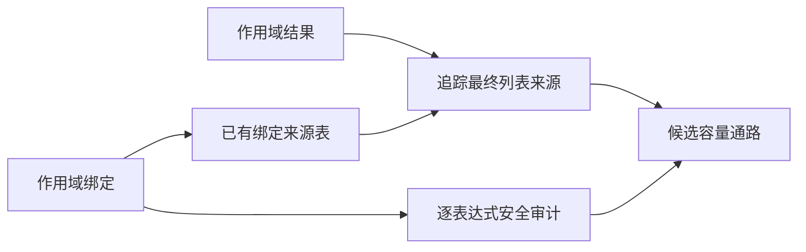
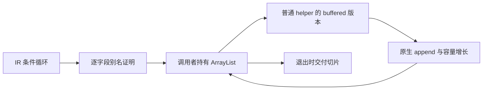
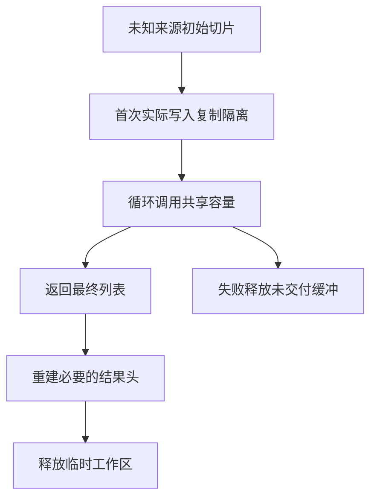

# 自举性能修复

## 选择性内部布局实施与验证

通用源码已推送：master `7642679a`，原始 Zig 基线 `39f4532a`。最终 bootstrap-parser、发行构建与 Zig 基线 CLI 构建均通过。两套 CLI 编译相同 parse.rx 的生成源码 SHA-256 均为 `9093d5dffa0bee3a58028121460f7d8c3c9995401b77f2cab4e26a92b1dfba8b`，仅证明该入口的一致性。

当前实现保留普通 types / layouts，另生成共享的内部类型表，仅在 callValue / callBuffered、符合条件的循环和对象归约作用域内切换表示。外部捕获与内部局部通过符号来源区分；已有 buffer 元素类型不变，写回复用原逻辑。编译指纹同时包含类型布局摘要、被调函数输入输出布局及共享类型单元摘要。

安全筛选覆盖列表元素、原生接口、Store、任务结果和非空身份比较的可达聚合后代。进一步逐个扫描全部聚合类型，包括 helper 参数包装类型：同一聚合类型若有两条路径可以被保存，则该类型及后代保持指针表示。这是类型图证明，不根据 Parser、XML 或测试名称选择。

第一版仅复制内部对象头，在出口重新装箱。真实 XML 完整状态摘要一致且 arena 下降，但既有 value-return/references 专项揭示：未修改子对象的指针身份被破坏。因此不能以内容一致或容量下降作为通过依据。

修正后的内部值保留普通 ABI 来源指针。来源存在时出口复用原对象；新对象、spread 重建、集合 tuple 和容量写回清除相应来源，只有离开内部调用链才实体化新头。重复类型路径的保守筛选避免新值被复制到多处后分别装箱，破坏原有别名。tuple 的内部来源项位于语义字段之后，IR 索引不变。optional 借用镜像的存储位于调用者作用域，分支只执行赋值；无 OutOfMemory 契约的旧 ABI 透传路径保留普通调用，避免优化增加未声明错误。

这仍是编译期生成普通 Zig 值、指针和条件分支，没有专用运行库。来源记录有对象头大小和边界判断成本，是保留引用身份所需的信息，不能称为所有对象零成本；最终版已重新生成 XML 并完成同一测量入口的宽、深两组对照，八项完整结果摘要一致。宽输入 arena 容量分别从 3,765,504 / 6,593,804 / 11,189,510 / 21,171,816 字节降至 1,603,128 / 2,864,730 / 7,425,516 / 14,019,870 字节。深输入分别从 687,554 / 687,478 / 437,914 / 516,844 字节降至 437,886 / 437,738 / 245,068 / 198,592 字节。深度 257 和 1024 仍保留超过 256 层的诊断。记录见测量目录的内部布局与内部布局帧栈六份 JSON；arena 容量不是申请次数或精确请求字节，wall time 含启动、IO 和摘要计算，不据此宣称吞吐倍数。

验证状态：引用身份修正后，既有 test-value-return、test-object-append、test-rx-text、test-module-generation 四项已通过，test-iterate-calls 与 test-typed-try-runtime 也已通过。最后补齐 optional 状态与通用 transform 参数标记后，六项合并复核仍在运行，尚不能将这一轮记为全部通过。未新增测试、未运行全量测试。

## 嵌套状态头的设计依据与边界

实际产物显示，XML 主循环的根 State 已按值保存，但 position 推进后仍分配 Control，属性及节点发布仍重建 Tree。Parser 的 consume 与 emit 有相同模式。根因在 genz/types 的对象字段使用普通指针类型，以及 aggregate.objectValue 只消除最外层构造；优化必须跨 helper 调用链保持内部布局，单改循环变量不足以解决。

候选方案是依据类型图选择内部值布局：列表元素及其聚合后代继续保持指针，其余可证明不逃逸的状态头按值嵌入。普通 ABI 仍只在边界转换。XML 的 frame 会进入 frames 和 nodes，Node 的 Location、Span 等后代不能借用临时栈镜像；因此不能直接放宽现有 deep-layout 的限制。原生、Store、任务及未证明的调用同样需要保留逃逸门禁。

下一阶段成功标准是实际 buffered 热路径不再逐步分配 Control、Tree，同时列表保存的元素仍具有稳定生命周期。本轮已落实以下保守类型图筛选及内部调用转换；仍未新增动态分配计数，也未完成一般用途的完整逃逸分析。列表可达 Location / Node 等聚合仍使用普通指针，不能宣称全部分配消除。

### 内部布局实施约束

Intent：升级现有 callValue / callBuffered 内部入口，让输入、函数体及输出使用一致的选择性值布局。普通 call / execute、原生 InputValue / OutputValue、列表元素 ABI 保持既有契约。

Data：iteration_value 已有递归类型构造、转换、对象求值缓存及 optional 分支处理。但 invocation 当前先借用旧 ABI、调用 helper，再转换返回值，不能消除 helper 内部构造。现有 types/layouts 同时供普通 ABI 与原生绑定使用，不可整体替换。

Edges：列表可达类型的指针保留只是首批条件，不能证明所有旧 ABI 桥接安全。未升级的 callee 若可能将输入子对象保存在返回结果中，桥接时必须实体化；仅有 owned 不能证明不逃逸。contracts、缓存表达式和 stack_symbols 必须使用同一表示决策。

Answer：按以下职责接入并核对实际生成，不新增第三套深值调用入口：

| 职责           | 实施位置与约束                                                                                                                           |
| -------------- | ---------------------------------------------------------------------------------------------------------------------------------------- |
| 选择性布局分析 | 按类型依赖和调用边界给出选中类型、函数资格及稳定摘要；禁止根据 XML / Parser 名称选择                                                     |
| 内部类型发布   | 复用 iteration_value/types 的递归构造；共享 type_bundle / abi_view 发布稳定命名的内部类型，避免分模块各自声明同形但不同身份的 Zig struct |
| 转换与求值     | conversion / aggregate / scope 只转换选中聚合；保留原求值顺序、单次求值与列表切片；区分旧根 layout、指针 ABI 和内部值                    |
| 函数签名与语句 | lower / statements / value_call / contracts 使用一致内部输入输出；普通入口调用内部函数后须正确转换，不能只 construct 根头                |
| helper 调用    | 内部到内部直接传布局；普通到内部及返回普通 ABI 才转换；borrow 只用于已证明不保留临时地址的边界                                           |
| 缓冲写回       | lane 与元素 buffer 不改；writeback 按内部表示决定构造值或装箱，消除相同父路径的重复头分配                                                |
| 增量身份       | fingerprint 同时纳入内部类型布局、函数及被调函数的布局摘要；全局类型图变化可改变 ABI，单次提升缓存版本号不足以保证后续增量正确           |

验证需覆盖单文件与分模块生成、源码与库消费、旧版本观察、旧 ABI callee 保留子对象、分配失败以及增量布局变化。优先复用已有验证入口，遵守不新增测试、不运行全量测试的约束；缺少直接证据时保持未验证，不能以局部编译通过替代生命周期和缓存正确性。

## helper 作用域来源追踪（已撤回试改）

Intent：让普通局部绑定作用域保持列表字段来源，不因语法包装失去跨函数容量复用资格。

Data：Trace.init 已登记 scope.bindings，may.contains 已沿 scope.result 检查可能引用；Trace.trace 缺少对应分支，audit.check 则无条件拒绝所有 scope。作用域生成按绑定顺序求值后返回结果，所有绑定表达式仍位于函数 IR 表内并经过原审计。

Edges：仅补齐作用域结果追踪，不跳过内部表达式审计，不放开 list_update、嵌套迭代、任务、捕获或旧版本读取。绑定中的独立追加、缓存追加和未转交调用继续按原规则拒绝。

Answer：尝试修改来源追踪与作用域门禁，比较真实自举产物，并运行既有对象追加和模块生成专项。实际收益以生成差异为证，不预设所有模块都会改善。

自我复核：bootstrap-parser 构建已通过。与帧栈修复后的产物逐字节比较，十个自举模块均无变化，包括 Parser、独立表达式、XML、依赖图和属性规则。因此这项补齐没有消除当前自举热点中的额外分配，不作为性能目标已完成的证据，也不重复运行相同产物的资源测量。仍需优先解决实际嵌套对象分配。

继续追踪前端发现，scope 只由 analysis/iteration/block 产生，其他路径仅映射或复制既有 scope；当前 audit 又独立拒绝 iteration。因此单独移除 scope 门禁没有打通源码中的新优化路径。试改的三个源码文件及缓存版本提升已从两个分支撤回，未推送。试改期间的对象追加、模块生成专项、发行构建与原始 Zig CLI 构建均通过，但这些通过不改变撤回结论。

## Intent：最终目标

优先消除实际自举热点中的反复整表复制，让独占状态经过普通 ZX helper 调用时保持可预期的集合成本。保持普通 Zig 输出、静态链接、零专用运行库，不为 Parser 或 XML 增加特例。

## Data：可用证据

- 用户指定的诊断聊天已确认复制和分配存在，但没有测得具体性能倍数。
- 当前生成 XML 的 document 主循环每轮调用普通 step，未传递已经生成的 buffered helper 所需容量槽。publish 的 nodes、children 和 value parts 持续增长，普通追加会重新分配并复制旧列表。
- Parser 的部分 body 循环有相同调用结构。
- Lexer 主扫描已经调用 buffered helper，不属于同一个待修热点。
- iteration 当前把状态的局部布局和列表缓冲的资格绑在一起；owned helper 被布局分析拒绝，跨函数容量没有接通。
- buffer_call 已有逐字段输入到输出的别名分析、ArrayList 隐藏参数及安全回退，可复用这一机制。
- RX XML 的临时解析表与最终 AST 共用结果 arena，临时数据随结果长期保留。

## Edges：边界与限制

- owned 表达独占消费，不证明切片分配来源。不能据此释放或 realloc 宿主、静态及未知来源的切片。
- 保留首次复制隔离未知来源输入，后续由调用者持有容量并跨循环复用。追加摊销常数成本不等于永不扩容或复制。
- 缓冲的可复用证明与聚合对象的栈化证明分开，不删除 consumes_input 的布局安全门禁。
- 旧版本仍可观察、存在别名或逃逸、lane 分析拒绝的路径继续采用原生成方式。
- 保留公开解析结果的所有权契约。源码副本和迁移适配的移除必须以生命周期证明为前提。
- 不新增测试用例、不运行全量测试；重用已有专项，并核查实际生成结果及既有源码的资源趋势。

## Answer：交付格式与成功标准

交付 genz 的通用循环缓冲接线和必要的前端生命周期修复。成功标准是实际热点调用使用容量槽、已覆盖路径不再逐轮复制累计表、原行为及错误资源清理保持正确；不把单项优化宣称为完整自举或所有集合操作的性能证明。

## 实施顺序

1. 独立接通整个 owned 状态传给 helper 并返回相同状态形状的循环，复用现有 lane 安全摘要。
2. 核查真实 XML、Parser 产物是否切换 buffered 调用，记录仍被拒绝的字段及原因。
3. 分离 XML 临时与长期结果生命周期，避免解析表长期驻留。
4. 运行相关已有专项与构建，检查分配失败清理和共享输入语义。
5. 根据实际热点证据继续补齐更新、缩短或复杂调用路径，而不是无条件放开安全门禁。

## 自我复核

此修复不能以“生成了 ArrayList”作为唯一验收：必须确认实际调用链传入非空容量槽，且退出写回不会遗留悬空切片。也不能把 arena 当成泄漏清理的替代证据；toOwnedSlice 后的后续失败必须能释放已经转移的缓冲。

## 当前实现与安全依据

循环调用的识别只接受整个当前状态作为 owned helper 的输入，并要求输入、输出为同一个对象类型。循环体可以有仅转发该调用结果的单绑定作用域，不忽略其他语句或副作用。while 条件必须通过现有纯表达式检查。

每条列表字段继续使用原 buffer_call 的唯一输入到输出映射及别名检查。通过的字段在循环外创建普通 std.ArrayList，沿已有 buffered helper 参数传递；离开循环时 toOwnedSlice 并写回结果。已经转移的切片使用外层 errdefer 保护，后续字段写回或最终结果头分配失败时仍能释放。

只读查询须同时满足纯函数、不消费输入、返回不含引用的标量或 optional 标量；且出现在当前字段被转移或追加之前。返回字符串、对象、列表、原生引用的查询不在此许可内。写入后读取、Store 调用和既有别名拒绝规则仍保持。

状态头的局部值传递有独立证明：调用纯度排除原生、Store 和任务逃逸；输入输出类型相同；IR 类型依赖严格指向更早的类型，因此输出的子字段不可能递归包含输入根类型。返回整个根对象时按值复制根头即可，子对象保持原有指针表示。这只消除根头逐轮装箱，不把所有嵌套对象改成栈对象。

## XML 结果生命周期

生产 XML 入口现将生成解析器放在临时 arena 中；最终 AST、解码后的文本和长期源码副本放在结果 arena 中。adapter 的节点定位表也使用临时 arena。正常返回、诊断和分配失败都会释放临时工作区；诊断字符串显式复制到结果生命周期。

当前仍有一项迁移成本：生成的 RX 入口把输入视为借用，prepare 需要复制源码以满足后续 owned 调用。曾尝试将 prepare 改为 owned 转发，实际推导拒绝了借用入口，已撤销该尝试，没有绕过所有权检查。因此成功解析期间暂时存在解析用副本和最终结果用副本，返回后只保留后者。消除此额外瞬时复制需补齐入口所有权表达或移除旧 AST 适配，不能用悬空借用换取表面零拷贝。

## 资源测量

使用既有 Gateway 夹具的完整子内容生成 8、16、32、64 倍解析工作负载；不是新增语义测试用例。测量驱动、来源摘要和结果在测量目录。四个规模的完整生成解析状态 JSON 摘要均与修复前一致。

| 倍率 | 字节数 | 修复前 arena 容量 | 修复后 arena 容量 |
| ---- | -----: | ----------------: | ----------------: |
| 8    |  9,777 |         5,696,376 |         3,718,180 |
| 16   | 19,449 |        15,011,824 |         6,505,364 |
| 32   | 38,793 |        38,397,616 |        11,222,190 |
| 64   | 77,481 |       108,641,758 |        31,632,592 |

64 倍工作负载的生成阶段 arena 容量下降约 70.9%。此指标是生成阶段返回时的 arena 容量，包含 allocator 的预留空间，不是进程峰值内存；也不包含随后旧 AST 转换的资源。记录的 wall time 包含进程启动、读文件和结果摘要，不作为精确解析加速倍数。

第一版仅接入循环容量时，属性表因只读查询仍被拒绝，64 倍容量并未下降。这一测量推动了只读查询的安全分析扩展；不能仅凭看到 ArrayList 就断言性能问题已解决。

## 修复后的专项自查

| 核查项                       | 当前结论                                                                                      | 后续边界                                                                  |
| ---------------------------- | --------------------------------------------------------------------------------------------- | ------------------------------------------------------------------------- |
| 专用运行库、解释器、动态加载 | 本次 XML、Program、独立表达式生成产物仅导入 std；新增生成路径使用普通结构体、函数及 ArrayList | 搜索未命中不是全仓库形式化证明，结论结合了生成入口与实际调用链            |
| 持续增长的 XML 语义表        | 五个表的实际 step 调用均传入容量槽；完整状态摘要一致                                          | 不能将普通 fallback 分支中的 memcpy 算作这条活跃路径仍在复制              |
| 循环根状态装箱               | 符合相同对象类型、纯 owned helper 条件的循环已使用局部值                                      | 嵌套对象构造和更复杂循环体未获得相同证明，不能统称零分配                  |
| 集合更新的一般回退           | 未通过逐字段证明时，push/concat/list_update 仍可能复制                                        | 跨 helper 的 pop 已按下节接入；索引更新、旧版本观察和复杂作用域仍保守处理 |
| 索引表转旧 AST               | 仍是迁移适配                                                                                  | 后续消费者直接读取索引表示后移除                                          |
| XML 临时数据长期驻留         | 已分离临时 arena，返回后仅保留结果数据                                                        | 当前迁移入口仍有上述瞬时源码副本                                          |
| 公开解析结果持有源码         | 保留结果独立于调用方缓冲的契约                                                                | 借用入口或所有权转移接口需要显式表达，不能只删 dupe                       |
| 转义、路径构造               | 内容改变时仍需要产生新字节                                                                    | 不将必要的新值构造视为违规零拷贝；未穷举所有标准库路径                    |

本轮错误输入回归发现 XML 诊断构造的 arena 返回顺序问题：不能先把 arena 状态写入返回结构，再分配诊断消息。已改为先分配消息再返回，原 XML 文本专项随后通过。继续按同一模式检查源码，发现 native_artifact 的路径复制也位于 arena 返回结构内部；已提前分配，并通过语义缓存专项。

自我批判：这轮已消除所确认 XML 热路径的持续整表追加复制，并减少根状态装箱、长期驻留，但没有完成所有集合操作的零成本证明。后续帧栈 pop 已按下节修复；更复杂作用域和跨函数索引更新仍有保守回退。完整性能目标继续保持，不以本轮资源下降替代最终验收。

## 跨调用缓冲阶段已完成的验证

- compiler 的 bootstrap-parser 与 test-rx 通过。
- packages/test 的 test-object-append、test-value-return 通过。
- packages/test 的 test-rx-text 在修复诊断返回顺序后通过，覆盖实际文本、错误输入、深度边界和分配失败。
- packages/test 的 test-semantic-cache 通过。
- packages/test 的 test-module-generation 通过；缓存输入域已更新，旧生成结果不会沿用。
- 最终源码的发行构建通过，使用已核验的本地官方 Zig 归档。
- 原始 Zig 分支同步通用生成器及缓存修复后，CLI 构建通过；该分支保留原生 XML Parser，不引入自举 adapter。两套 CLI 编译主仓库相同的 rx/syntax/parse.rx，生成源码 SHA-256 均为 `51a6201f130d14548662a38928183816494550b6b6681885b752ce9b298fe173`。这是该入口的一致性证据，不是完整编译器 stage1/2/3 验收。

未新增测试用例、未运行全量测试、未进行浏览器 UI 检查。测量工作负载、资源数据与语义状态摘要是性能证据，不替代既有语言回归。

## 帧栈缩短与再次追加

本阶段处理跨 helper 的 pop：保留弹出值与剩余列表的区分，剩余列表只改变逻辑长度；后续追加前必须同步 ArrayList 的长度，循环或归约结束时也按最终长度交付。不能仅放开 pop 标签，否则会把已经弹出的元素重新带入结果。弹出元素不等于容器本身，只有类型和来源均能证明不包含当前列表时才排除别名。

现已接入 pop 的剩余列表来源追踪，包括通过局部 tuple 绑定访问结果的情况。弹出元素只有在当前目标列表与所追踪字段类型相同、依赖类型无递归的条件下才排除容器别名；其他可能引用保持保守处理。optional 解包只在不携带当前字段时放行，旧版本读取门禁没有移除。

普通追加 helper 在复用已启动缓冲前同步 source.len；归约结束也复用容量交付逻辑，按最终长度写回并保留后续失败清理。XML 生成主循环目前向包括 frames 在内的六条字段传递容量槽。

使用原有 XML resources_test 的 255、256、257、1024 层工作负载测量，不新增语义测试。四项完整状态摘要均一致；后两项保持原来的深度诊断。256 层的生成 arena 容量从 1,050,074 字节下降到 687,478 字节。XML 有固定深度上限，因此不能用这个测量宣称无限深度输入的增长趋势；通用 helper 的容量行为依据生成算法判断。

测量可用 run.py 的 --frames 参数复现，详细数据在帧栈修复前、帧栈修复后和帧栈对照 JSON。bootstrap-parser、test-object-append、test-rx-text、test-module-generation 已通过；发行构建已通过。通用源码已提交为 29e10ae8，并同步到原始 Zig 分支 2fcc50de；该分支 CLI 构建已通过，两个源码提交均已推送。
