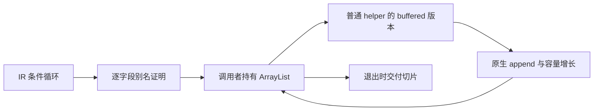
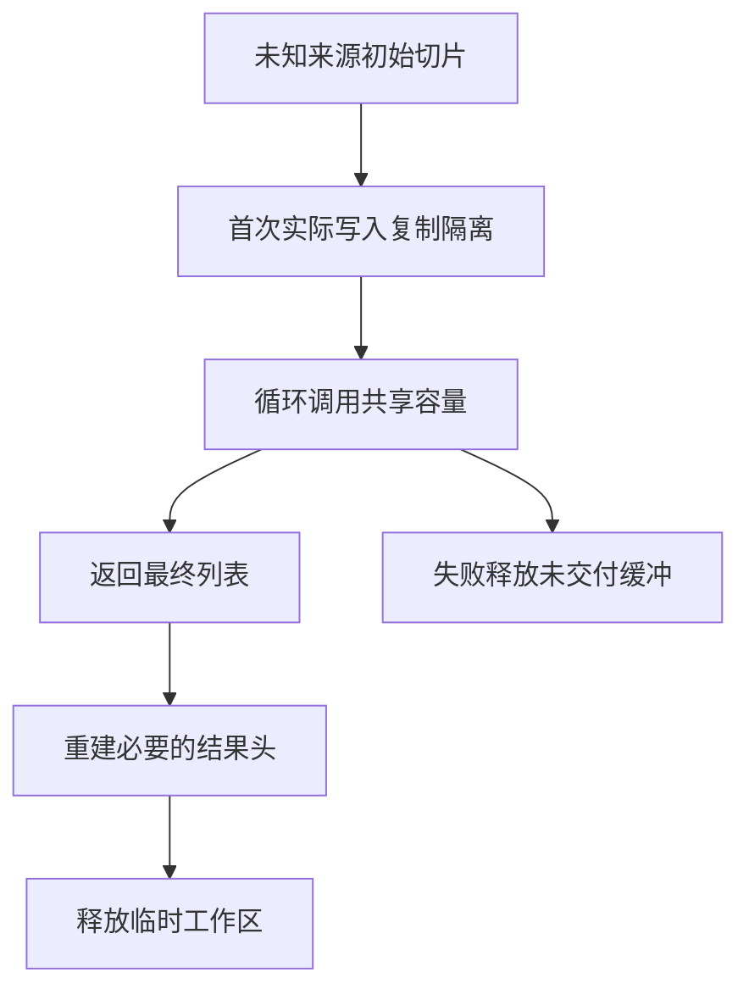

# 自举性能修复

## Intent：最终目标

优先消除实际自举热点中的反复整表复制，让独占状态经过普通 ZX helper 调用时保持可预期的集合成本。保持普通 Zig 输出、静态链接、零专用运行库，不为 Parser 或 XML 增加特例。

## Data：可用证据

- 用户指定的诊断聊天已确认复制和分配存在，但没有测得具体性能倍数。
- 当前生成 XML 的 document 主循环每轮调用普通 step，未传递已经生成的 buffered helper 所需容量槽。publish 的 nodes、children 和 value parts 持续增长，普通追加会重新分配并复制旧列表。
- Parser 的部分 body 循环有相同调用结构。
- Lexer 主扫描已经调用 buffered helper，不属于同一个待修热点。
- iteration 当前把状态的局部布局和列表缓冲的资格绑在一起；owned helper 被布局分析拒绝，跨函数容量没有接通。
- buffer_call 已有逐字段输入到输出的别名分析、ArrayList 隐藏参数及安全回退，可复用这一机制。
- RX XML 的临时解析表与最终 AST 共用结果 arena，临时数据随结果长期保留。

## Edges：边界与限制

- owned 表达独占消费，不证明切片分配来源。不能据此释放或 realloc 宿主、静态及未知来源的切片。
- 保留首次复制隔离未知来源输入，后续由调用者持有容量并跨循环复用。追加摊销常数成本不等于永不扩容或复制。
- 缓冲的可复用证明与聚合对象的栈化证明分开，不删除 consumes_input 的布局安全门禁。
- 旧版本仍可观察、存在别名或逃逸、lane 分析拒绝的路径继续采用原生成方式。
- 保留公开解析结果的所有权契约。源码副本和迁移适配的移除必须以生命周期证明为前提。
- 不新增测试用例、不运行全量测试；重用已有专项，并核查实际生成结果及既有源码的资源趋势。

## Answer：交付格式与成功标准

交付 genz 的通用循环缓冲接线和必要的前端生命周期修复。成功标准是实际热点调用使用容量槽、已覆盖路径不再逐轮复制累计表、原行为及错误资源清理保持正确；不把单项优化宣称为完整自举或所有集合操作的性能证明。

## 实施顺序

1. 独立接通整个 owned 状态传给 helper 并返回相同状态形状的循环，复用现有 lane 安全摘要。
2. 核查真实 XML、Parser 产物是否切换 buffered 调用，记录仍被拒绝的字段及原因。
3. 分离 XML 临时与长期结果生命周期，避免解析表长期驻留。
4. 运行相关已有专项与构建，检查分配失败清理和共享输入语义。
5. 根据实际热点证据继续补齐更新、缩短或复杂调用路径，而不是无条件放开安全门禁。

## 自我复核

此修复不能以“生成了 ArrayList”作为唯一验收：必须确认实际调用链传入非空容量槽，且退出写回不会遗留悬空切片。也不能把 arena 当成泄漏清理的替代证据；toOwnedSlice 后的后续失败必须能释放已经转移的缓冲。

## 当前实现与安全依据

循环调用的识别只接受整个当前状态作为 owned helper 的输入，并要求输入、输出为同一个对象类型。循环体可以有仅转发该调用结果的单绑定作用域，不忽略其他语句或副作用。while 条件必须通过现有纯表达式检查。

每条列表字段继续使用原 buffer_call 的唯一输入到输出映射及别名检查。通过的字段在循环外创建普通 std.ArrayList，沿已有 buffered helper 参数传递；离开循环时 toOwnedSlice 并写回结果。已经转移的切片使用外层 errdefer 保护，后续字段写回或最终结果头分配失败时仍能释放。

只读查询须同时满足纯函数、不消费输入、返回不含引用的标量或 optional 标量；且出现在当前字段被转移或追加之前。返回字符串、对象、列表、原生引用的查询不在此许可内。写入后读取、Store 调用和既有别名拒绝规则仍保持。

状态头的局部值传递有独立证明：调用纯度排除原生、Store 和任务逃逸；输入输出类型相同；IR 类型依赖严格指向更早的类型，因此输出的子字段不可能递归包含输入根类型。返回整个根对象时按值复制根头即可，子对象保持原有指针表示。这只消除根头逐轮装箱，不把所有嵌套对象改成栈对象。

## XML 结果生命周期

生产 XML 入口现将生成解析器放在临时 arena 中；最终 AST、解码后的文本和长期源码副本放在结果 arena 中。adapter 的节点定位表也使用临时 arena。正常返回、诊断和分配失败都会释放临时工作区；诊断字符串显式复制到结果生命周期。

当前仍有一项迁移成本：生成的 RX 入口把输入视为借用，prepare 需要复制源码以满足后续 owned 调用。曾尝试将 prepare 改为 owned 转发，实际推导拒绝了借用入口，已撤销该尝试，没有绕过所有权检查。因此成功解析期间暂时存在解析用副本和最终结果用副本，返回后只保留后者。消除此额外瞬时复制需补齐入口所有权表达或移除旧 AST 适配，不能用悬空借用换取表面零拷贝。

## 资源测量

使用既有 Gateway 夹具的完整子内容生成 8、16、32、64 倍解析工作负载；不是新增语义测试用例。测量驱动、来源摘要和结果在测量目录。四个规模的完整生成解析状态 JSON 摘要均与修复前一致。

| 倍率 | 字节数 | 修复前 arena 容量 | 修复后 arena 容量 |
| ---- | -----: | ----------------: | ----------------: |
| 8    |  9,777 |         5,696,376 |         3,718,180 |
| 16   | 19,449 |        15,011,824 |         6,505,364 |
| 32   | 38,793 |        38,397,616 |        11,222,190 |
| 64   | 77,481 |       108,641,758 |        31,632,592 |

64 倍工作负载的生成阶段 arena 容量下降约 70.9%。此指标是生成阶段返回时的 arena 容量，包含 allocator 的预留空间，不是进程峰值内存；也不包含随后旧 AST 转换的资源。记录的 wall time 包含进程启动、读文件和结果摘要，不作为精确解析加速倍数。

第一版仅接入循环容量时，属性表因只读查询仍被拒绝，64 倍容量并未下降。这一测量推动了只读查询的安全分析扩展；不能仅凭看到 ArrayList 就断言性能问题已解决。

## 修复后的专项自查

| 核查项                       | 当前结论                                                                                      | 后续边界                                                                         |
| ---------------------------- | --------------------------------------------------------------------------------------------- | -------------------------------------------------------------------------------- |
| 专用运行库、解释器、动态加载 | 本次 XML、Program、独立表达式生成产物仅导入 std；新增生成路径使用普通结构体、函数及 ArrayList | 搜索未命中不是全仓库形式化证明，结论结合了生成入口与实际调用链                   |
| 持续增长的 XML 语义表        | 五个表的实际 step 调用均传入容量槽；完整状态摘要一致                                          | 不能将普通 fallback 分支中的 memcpy 算作这条活跃路径仍在复制                     |
| 循环根状态装箱               | 符合相同对象类型、纯 owned helper 条件的循环已使用局部值                                      | 嵌套对象构造和更复杂循环体未获得相同证明，不能统称零分配                         |
| 集合更新的一般回退           | 未通过逐字段证明时，push/concat/list_update 仍可能复制                                        | 跨 helper 的 pop、索引更新、旧版本观察和复杂作用域需继续扩展证明；不无条件删复制 |
| 索引表转旧 AST               | 仍是迁移适配                                                                                  | 后续消费者直接读取索引表示后移除                                                 |
| XML 临时数据长期驻留         | 已分离临时 arena，返回后仅保留结果数据                                                        | 当前迁移入口仍有上述瞬时源码副本                                                 |
| 公开解析结果持有源码         | 保留结果独立于调用方缓冲的契约                                                                | 借用入口或所有权转移接口需要显式表达，不能只删 dupe                              |
| 转义、路径构造               | 内容改变时仍需要产生新字节                                                                    | 不将必要的新值构造视为违规零拷贝；未穷举所有标准库路径                           |

本轮错误输入回归发现 XML 诊断构造的 arena 返回顺序问题：不能先把 arena 状态写入返回结构，再分配诊断消息。已改为先分配消息再返回，原 XML 文本专项随后通过。继续按同一模式检查源码，发现 native_artifact 的路径复制也位于 arena 返回结构内部；已提前分配，并通过语义缓存专项。

自我批判：这轮已消除所确认 XML 热路径的持续整表追加复制，并减少根状态装箱、长期驻留，但没有完成所有集合操作的零成本证明。特别是更复杂作用域、帧栈 pop 和跨函数索引更新仍有保守回退。完整性能目标继续保持，不以本轮资源下降替代最终验收。

## 已完成的验证

- compiler 的 bootstrap-parser 与 test-rx 通过。
- packages/test 的 test-object-append、test-value-return 通过。
- packages/test 的 test-rx-text 在修复诊断返回顺序后通过，覆盖实际文本、错误输入、深度边界和分配失败。
- packages/test 的 test-semantic-cache 通过。
- packages/test 的 test-module-generation 通过；缓存输入域已更新，旧生成结果不会沿用。
- 最终源码的发行构建通过，使用已核验的本地官方 Zig 归档。
- 原始 Zig 分支同步通用生成器及缓存修复后，CLI 构建通过；该分支保留原生 XML Parser，不引入自举 adapter。两套 CLI 编译主仓库相同的 rx/syntax/parse.rx，生成源码 SHA-256 均为 `51a6201f130d14548662a38928183816494550b6b6681885b752ce9b298fe173`。这是该入口的一致性证据，不是完整编译器 stage1/2/3 验收。

未新增测试用例、未运行全量测试、未进行浏览器 UI 检查。测量工作负载、资源数据与语义状态摘要是性能证据，不替代既有语言回归。
