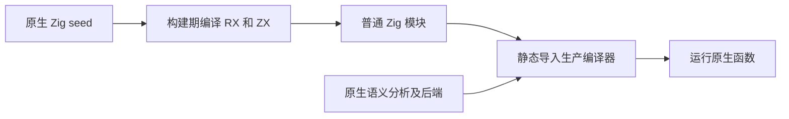
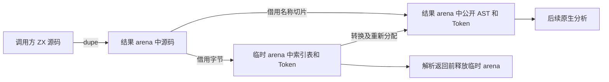

# 自举零拷贝与零运行时核查

## Intent：最终目标

确认当前生产自举链路是否遵守零拷贝和 zero runtime，分别核对数据所有权与生成执行方式，不把两个指标混为一谈。

## Data：可用证据

开始核查的 HEAD 为 `7362399f6042c69e68defdb12cec85aac7b55c85`。工作区已有其他修改，本次仅增加本记录，不修改正式源码。以当前源码和本次生成产物为证据，历史文档仅用于定位。

核查顺序：生产构建接线 → ZX/RX 解析适配 → 图与路径适配 → 生成 Zig 的依赖与执行结构。

## Edges：边界与限制

- 零拷贝指数据缓冲及中间表示是否重复物化；切片、指针或标量按值传递本身不等于深复制。
- zero runtime 按仓库契约指生成普通 Zig、静态链接，不依赖 zxc 专用运行库、解释器、动态加载层，也不原样嵌入专用运行库。正常算法执行、内存分配和 Zig 标准库调用不构成违规。
- 本次不新增测试、不调用浏览器、不改正式实现；构建生成检查不等于全量回归、性能测量或完整自举固定点验证。

## Answer：交付格式与成功标准

交付逐项结论、可定位的源码证据、架构与数据流图，并明确结论覆盖范围和不能证明的部分。

### 核查结论

| 指标                          | 结论                       | 实际边界                                                                     |
| ----------------------------- | -------------------------- | ---------------------------------------------------------------------------- |
| 整条自举编译管线零拷贝        | 不成立                     | 源码复制、Token/AST 重建、部分状态列表首次写入复制均存在                     |
| 局部借用与零拷贝读取          | 成立                       | 名称、普通原文及输入切片可借用；不能扩大为所有阶段                           |
| zero runtime                  | 已核查自举链路符合仓库定义 | 11 份生成模块仅导入 std，RX 编排降低为直接调用，未发现专用运行库或解释执行层 |
| 与手写 Zig 完全相同的运行成本 | 未证明                     | 无性能、分配次数或机器码对照，现有重建边界本身有额外成本                     |
| 完整编译器自举                | 本次不能确认完成           | 构建仍以原生 seed 生成部分模块；语义分析和生成器仍有 Zig 实现                |

### 零拷贝证据与根因

1. `packages/compiler/src/zx/frontend/parse.zig:29–30`：`dupe(u8, source)` 和 `dupe(u8, file_name)` 使公开结果拥有独立输入。`35–39` 使用临时 arena 运行生成解析器；`62–63` 再转换 AST 和 Token。独立表达式入口 `parse_expression.zig` 使用相同所有权策略。
2. `program_adapter/context.zig:9–11` 重新分配 Type、Expression、Block 数组；`program_adapter/root.zig:70–71` 分配 Token/Comment 数组并逐项转换。名称文本在 `context.zig:23–24` 通过源码切片借用，没有逐名称复制字符。
3. `packages/compiler/src/rx/syntax_adapter/root.zig:10、14、35、48` 重新构建 Node、Attribute、Text、children 数组。`syntax_adapter/value.zig:4` 对无解码需求的值直接返回源码切片；`15、26` 对分片/实体解码结果分配并复制。RX XML 入口 `zx/frontend/attribute.zig:15、36` 使用同一结果 arena 保存生成索引表及转换后的树，未像 ZX 入口那样独立释放临时表。
4. `packages/compiler/src/rx/dependency_graph/prepare.zig` 将原生模块及 AST 依赖关系物化为 offsets/targets/issues。新生成的 `graph.zig:2974–2978、3011–3015` 等分支在状态列表首次写入时调用 `allocator.dupe`，之后由 started 标志复用。不能把该策略说成每步必然复制整表，也不能说成零复制。
5. `packages/compiler/src/rx/path_segments/adapter.zig:19、30` 分配规范化路径并复制各片段。这是连续字符串输出的物化成本，与专用运行时无关。

主要根因是**公开 API 的独立所有权、扁平索引表与原生 AST 两套布局、不可变/借用列表到可写缓冲的转换**。Arena 管理生命周期，并不会自动消除复制。不是所有分配都属于复制：首次创建解析节点属于算法输出；重复生成另一套等价结构才是此次关注的迁移成本。

### zero runtime 证据

- `packages/compiler/build/parser.zig` 的 `generate` 在构建期执行 seed 生成普通 Zig；`modules` 使用 `b.createModule` 静态接入生成源码。
- `packages/compiler/build/compiler.zig` 通过构建选项选择生产生成 Parser；seed 的 `parser == null` 使用原生实现。这是构建时分支，不是运行时动态选择解释器。
- `packages/compiler/build/generate_parser.zig` 对 RX/ZX 项目推导后调用 `compiler.zig.emit`；生成器 `packages/genz/src/zx/lower.zig:47–115` 以结构化声明生成类型、普通函数及入口，未原样嵌入运行库。
- 本次成功执行 `zig build bootstrap-parser bootstrap-lexer -Doptimize=ReleaseSafe -p /tmp/zxc-zero-audit-20261006 -j2`。11 份产物的 `@import` 均仅有 `std`。
- 本次 `parser.zig:98827` 的入口直接串接六个函数，与 `parser/program.rx` 的静态编排对应；没有运行时解释 RX 图。`graph.zig:3404` 同样直接调用生成函数。
- 保留 `ArenaAllocator`、边界检查、错误返回、正常解析状态机不违反此定义；它们是普通 Zig 程序执行语义。解析 ZX/RX 语法本身也不等于用解释器执行已编译应用。

具体文件大小、摘要、构建边界见 [生成证据](自举零拷贝核查/生成证据.md)。关键词搜索仅为辅助，结论同时依据构建接线、生成器实现与实际入口。

### 架构图

### 数据流图

### 后续改进方向与边界

优先统一后续阶段消费的索引表表示，消除 AST/Token 的重复物化；再按调用方生命周期决定是否增加借用或所有权转移入口。不能只删掉 `dupe`，否则公开结果可能引用已经失效的调用方缓冲。状态列表应在证明独占后复用，保留共享输入可观察性。路径拼接和转义解码仍需按输出契约处理，不以“零拷贝”口号强行消除必要的新值构造。本次只核查，不实施这些接口变更。

### 自我复核

- 对零拷贝的否定有实际生产路径中的确定反例，不依赖性能猜测。
- 对 zero runtime 的肯定只覆盖当前核查的自举模块及其构建路径，不等同于全仓库所有宿主、所有特性或未来生成结果的普遍证明。
- 没有将 `zx_type_*` 类型别名、正常 arena 或编译器解析状态机误判为专用运行时；也没有仅凭“静态链接”放过嵌入运行库的可能性。
- 本次生成成功不代表最终发行构建、全量回归、零分配或 stage1/2/3 固定点通过。
- 工作区存在并发修改，产物记录为当时工作区生成，并保留摘要；不宣称来自干净固定检出。未修改既有正式源码或新增测试。
