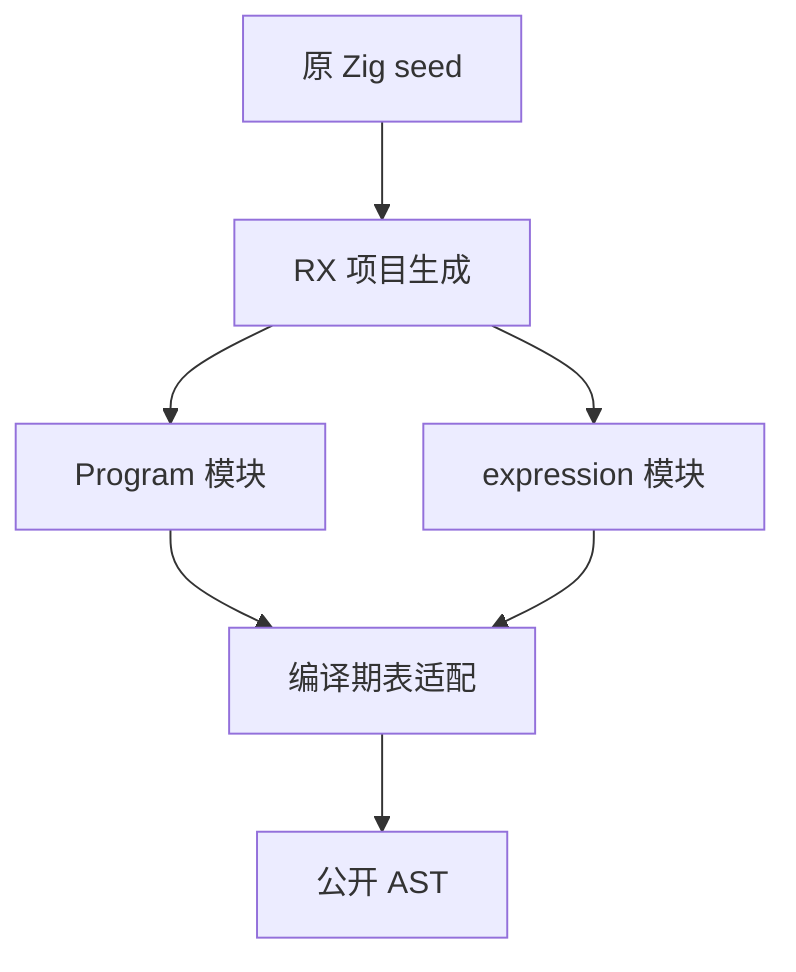

# 表达式入口自举迁移

## Intent：最终目标

把生产 parse_expression 切换为 RX＋ZX 生成解析器，保持完整表达式、EOF 及诊断契约；RX 属性的可用表达式限制仍由既有属性检查执行。

## Data：现有实现

Program 已生产接线。现有 parser/expression.rx 接收 source、start、depth、minimum、allow_lambda，调用 expressions/parse；输出同时含表达式表、类型表与状态块表。parse_expression.zig 仍调用原 Zig Parser.expression(0)。

## Edges：边界与限制

不放宽 RX 属性的函数调用、lambda、状态块限制。不通过包装虚构 Program 源码添加语法。seed 仍使用原 Zig parser，避免 RX 属性解析在生成器中形成自依赖。只复用既有材料，不新增测试用例、不全量测试。

## Answer：实施与验收

新增 expression_text.rx 编排现有 expression.rx 与 expressions/finish，后者在 ZX 中收口诊断和 EOF；构建生成第二个静态表达式模块；AST 索引表适配按实际表类型在编译期实例化，供 Program 和 expression 共用。新生产入口调用生成器后转换 AST，Zig 适配不判断 EOF。

```zig
const parsed = try generated.execute(&temporary, owned_source);
```




验收要求：发行构建、现有表达式材料对照、真实 RX 自身生成。完成后更新实际结果与自我复核，不把计划当成功。

## 实施结果与核对

- 新增 `expression_text.rx`，输入完整源码字符串，复用原 `expression.rx`，由 ZX diagnostic/finish 校验 EOF 并选择词法、类型和表达式诊断。原参数化 expression.rx 接口保留。
- 抽出 expressions/result.zx 共享输出模型，避免 finish/diagnostic 与 parse 互相导入形成环。
- generate-parser 同一 seed 构建产出 Program 和 expression 两个静态模块；生产 frontend 显式导入二者，seed 不导入二者。bootstrap-parser 安装两个生成文件。
- AST 适配按实际表类型编译期实例化；两种生成模块的 Zig 名义类型不同，不能直接互换，未用运行时类型擦除或复制适配逻辑解决。
- 生产 parse_expression 的成功路径只执行生成模块、转换 AST 和 token/comment 元数据；EOF 及诊断优先级不留在 Zig 生产路径中。旧 Zig 实现仅供 seed 分支使用。
- 已有 24 份源码提取出 359 个不同表达式片段，覆盖 18 类节点（含异步、等待、取消、lambda、状态块和模板）；完整 AST/诊断与原解析器一致，6 个独立片段按原规则产生诊断。未编造新用例。
- 发行构建通过；新 CLI 重新生成 expression_text.rx，SHA-256 与切换前产物一致：`de77cbcaef259c80db0fa855c4e15eadee71bb21fdd6e9852d5ff78538733b6f`。
- 使用新 CLI 运行既有 RX 属性调用限制专项，37 项全部通过；未放宽调用、回调和嵌套属性限制。
- 未新增测试用例、未运行全量测试。适配改动先尝试 grit，当前安装不支持使用的 Zig pattern，随后按明确类型与字段路径修改并检查 diff。

自我复核：Program 与完整表达式入口均已进入生产自举；359 个片段与专项不能证明所有语言行为，但真实发行构建和自身 RX 再生成支持本阶段接线。RX XML 解析、类型语义、所有权、IR、后端及 CLI 仍未完成 RX＋ZX 自举，整体目标保持未完成。
