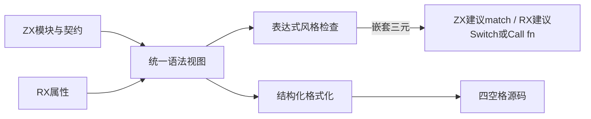

# 表达式风格与默认四空格

## Intent：最终目标

在不可变输入修正完成后，统一落实两项明确要求：lint 禁止多层三元表达式：ZX 提示使用 match，RX 的 value 提示使用 Switch 标签或提取到 ZX 后通过 Call fn 取得判断结果；默认缩进为四个空格。

## Data：可用证据

不可变输入已在 ac024c3a 完成并推送。当前 lint 的表达式遍历已经同时借用 Native 与 Indexed AST；ZX 模块和契约通过此入口，RX 属性有独立的共用校验入口。当前 ZX/RX 格式化仅调整空行并保留缩进，JSON 使用 tab，仓库 Prettier 的 tabWidth 虽为 4 但 useTabs 为 true，因此仅修改配置不足以落实默认空格。

## Edges：边界与限制

- 单层三元保留；同一列表中的两个独立单层三元不构成嵌套。
- 三元的条件、真分支、假分支中的后代三元均受限，括号、调用参数、对象、模板和换行不能绕过。lambda 与状态块是独立执行体，其内部重新检查。
- 语法解析仍接受三元结构，风格检查归 lint。格式化及迁移工具不必先通过语义或 lint，避免无法修复待迁移源码。
- 迁移只使用现有生产 AST 与源码 span。保持惰性选择、作用域和单次求值，不重写为可能重复求值的布尔组合。注释和字面量原文不得丢失。
- 缩进只修改语法空白，保护字符串、模板正文、CDATA、混合文本和 YAML 块标量，不修改内容数据。
- 不新增测试用例、不执行全量测试、不做浏览器检查。更新与新契约直接冲突的已有断言及生成器；其他会话变更保持原状。
- 所有逻辑属于编译、lint 与格式化，不向生成应用加入运行库。

## Answer：交付与成功标准

1. ZX 与 RX 表达式共用嵌套检查，诊断指向内层表达式；ZX 提示 match，RX value 提示 Switch 标签或 Call fn。RX 不按 ZX 的方案迁移为 match，具体流程重组由所在标签的语义决定。
2. 当前自举源码完成结构化迁移，seed 与生产构建均可用，不设置自举豁免。
3. 官方格式化与仓库配置默认输出四个空格；说明支持范围及内容保护边界。
4. 完成相关既有专项、发行构建、格式化幂等及实际诊断复核，记录自我检查并提交推送。

## 执行记录

已确认输入修正的专项与提交完成。本阶段先构建使用现有 parser 的迁移工具，再启用新门禁，避免门禁与自举源码形成构建互锁。已复用生产 token、XML 节点与现有空白编辑器完成缩进，未引入新的源码解析器。

## 实施结果

- 新增 style 诊断；ZX 与 RX 共用结构检查，分别建议 match 与 Switch／Call.fn。RX 的单文件 lint、属性分析与项目构建均接入对应入口。
- 19 个自举 ZX 文件共 63 个三元节点完成迁移。迁移器使用正式 parser 和 token 位置，只替换判断标点并保留其它原文；每个文件写回前重新解析并检查剩余嵌套。
- 优先尝试了 grit 的 JavaScript 规则，能识别简单 ZX 三元。但 ZX 还包含 match 与状态块，因此正式迁移依赖自身 AST；没有将 JavaScript 的部分识别能力当作完整 ZX 解析。
- 9 个现有运行夹具与 4 个配套生成器同步为 match，未新增测试用例。额外发现两条 match 所有权断言仍使用旧消费语义，已按已生效的不可变列表规则更新。
- ZX 默认格式化先应用导入／空行编辑，再基于同一版本文本的 token 处理四空格；无需修改时复用已有 token。模板及字符串 token 内部、注释正文不重写。
- RX 使用已解析节点确定四空格层级，保护混合文本、CDATA 与属性值；JSON 使用标准库 indent_4；仓库 Prettier 关闭 tab 并保留 tabWidth 4。
- YAML 延续既有字段间空行格式化，保留输入的缩进、锚点与标量正文。本次未将其扩展为结构重排器，也未用空格倍增处理块标量。

## 验证记录

- 三元规则发行构建、四空格发行构建，以及自举源码格式化后的最终发行构建均通过。
- 19 个自举文件官方 fmt 写回后，重复 fmt --check 全部通过。
- 保存 ac024c3a 的原始 position.zx 进行真实 lint：在内层三元位置得到 style 诊断并提示 match；迁移后的正式文件 lint 通过。见 [实际诊断结果](实际诊断结果.json)。
- 配置格式化专项通过，包含 JSON 数字词法保留、重复键拒绝与全部分配失败。
- ZX 导入排序、RX 格式化及 match 模块类型专项首轮发现旧两空格预期、旧诊断文本与旧消费断言；更新后 Zig 专项 13/13 通过，RX CLI 内容保护／LF/CRLF／执行前后结果对比通过。导入排序 CLI 的剩余两空格预期修正后，真实运行专项单独通过。
- RX 运行夹具显式要求外部 z3，初次环境中命令名不存在；重跑使用此前已有的本地 z3 绝对路径，没有改为绕过证明或安装新依赖。
- 跨模块 match 与 switch 标量执行专项通过。

## 自我复核

这次同时改变风格门禁与默认格式，但没有让 parser 拒绝旧表达式结构，故迁移与 fmt 仍能读取不符合 lint 的源码。迁移保持有序、惰性的分支选择；没有把复杂判断改成可能重复求值的布尔组合，也没有对自举源码设置豁免。

缩进以结构空白为边界。保护模板正文与 XML 内容比强行调整每一物理行更重要，因此不宣称已经提供全语法行宽、引号或 YAML 重排能力。现有专项能够支持所列路径的结论，不能等同于整个语言的形式化证明；完整自举目标仍需后续语义与后端工作。
