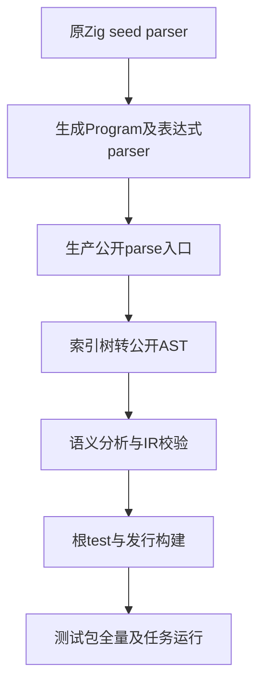

# 解析器自举回归计划

## Intent：最终目标

在生产Program与独立表达式解析入口切换为RX＋ZX生成解析器后，对真实新入口执行既有仓库回归，检查语言行为、诊断、IR、生成执行、库边界及任务运行是否仍成立。

## Data：可用证据

复用release-safe-regression干净固定检出bd5b60f5a11942dbe4844bb9418428cbcc2dad1d，包含aeeb5f20的Program自举、568331c4的独立表达式自举，以及本会话五部分任务测试。已阅读parse.zig、parse_expression.zig、build/parser.zig：普通生产入口执行生成解析器，再把索引树转换为拥有独立arena的公开AST；seed构建明确保留原Zig parser，避免生成依赖循环。实现会话的210份源码对照不能代替全部正式回归。

Zig0.17及既有Z3工具可用；验证solver沿用/tmp/zxc-z3-5.1.0/z3-5.1.0-x64-osx-13.3/bin/z3。已核对根build.zig.zon：conformance直接指向packages/test，因此根test统一包含RX、compiler、CLI及测试包全量。只执行这次根test及后续发行构建，不重复执行同一测试包；声明、实例和原文审阅数量仍分别记录。

## Edges：边界与限制

本部分先运行既有门禁，不修改生产或为迁移放宽旧断言。所有命令在固定工作树执行，继续保留主检出的其他会话WIP。限制-j2避免并行编译造成不必要资源压力；先根test全量，再发行构建。若出现失败，先区别构建环境、夹具组织与真实实现缺陷，只把实际生产复现发给指定实现会话。修复后记录新的固定提交，不把前后生产版本混为同一快照。

全量回归不能证明AST适配层每个指针都拥有正确生命周期，也不能替代尚待51,159份Test262原文审阅；完成现有回归后再建立AST拥有关系与分配失败专项。新旧parser差分只证明一致性，必须保留已有独立语义预期作为成功标准。

## Answer：交付格式与成功标准

先保存版本、干净状态、工具及源码树指纹，然后运行以下顺序；成功以真实退出码及完整构建总结为准，明确实际运行与缓存。

```sh
ZXC_TEST_SOLVER=/tmp/zxc-z3-5.1.0/z3-5.1.0-x64-osx-13.3/bin/z3 zig build test -Doptimize=ReleaseSafe -j2 --summary all

zig build -Doptimize=ReleaseSafe -j2 --summary all

```

运行日志和结果统一存放同名资源目录。完整回归后再次核对源码没有变化，独立提交push记录；若真实缺陷阻断，则先保留失败证据并按用户要求反馈，不虚报通过。




## 自我批判

自举成功生成代码不等于公开入口兼容，210个对照样例也不能覆盖所有AST所有权或错误路径。版本锁定与源码前后核验优先于数量报告；全量通过仍不夸大为全Test262目标完成。当前计划不是已通过证据。

## 首轮观察与分部分迁移

首轮固定bd5b60f5日志保留。进程后续没有可恢复的根最终总结或退出码；其中36/40是build_modes嵌套构建，不是根test结果。因此该日志只作失败观察，不能标记根全量已通过或完整运行失败计数。

已定位到调用/字符串生成器未同步、动态import仍带.zx、正常导入分组、旧Call绑定、标准声明生成顺序等契约迁移。每部分独立固定版本运行原门禁，再提交push，原断言与计数层级保持。标准声明生成器排序属于真实生产问题，已反馈指定实现会话并由a34f4eab修复；本会话不改生产。

| 已提交部分                  | 提交                | 验证边界                                           |
| --------------------------- | ------------------- | -------------------------------------------------- |
| 调用/字符串生成器与CR原字节 | aba3eac4 / defce881 | 五个完整--check；目录案例不新增                    |
| cache/watch/owned动态导入   | cf26b77e            | 五个既有门禁                                       |
| URL与正常夹具格式           | fd6364da            | 五个既有门禁                                       |
| match导入换序               | 3833ff40            | 原运行规范化；另两个public analyze声明保留换序语义 |
| RX磁盘项目与Store来源       | 5684e487            | 既有RX CLI项目门禁                                 |
| Gateway目标与固定ctx        | a68b7588            | 原48Zig实例及86脚本检查                            |
| HTTP/Process/StdIO来源      | 0087a0fb            | 原136Zig实例及46/50/70脚本检查                     |
| NAPI/Wasm状态入口           | 3f977b60            | 原平台协议、声明、async和发布门禁                  |

后续生产又提交RX XML解析153232cb、路径归一化b20f1685及依赖图8788cff2自举。各部分结果仅对应其实际固定基线；最终根回归须选择后续干净提交并保存新指纹，不能拿不同快照的分项通过相加为完整根通过。库发布和诊断/循环最后来源仍在独立门禁阶段，不预填成功。

## 下一轮执行方式

配套执行根回归.py在启动前要求固定检出干净，记录版本、源码树与工具；每条真实命令完成后立即保存退出码、日志哈希和执行后检出。根test失败或源码改变就结束；只有根test成功且源码未改变，才执行发行构建。两条门禁均成功后才写完成。这样，即使交互进程句柄无法恢复，也能读取子进程实际保存的退出码，避免再次只留下不完整日志。脚本只组织既有命令，不新增测试或生产运行层。

## 第二轮固定快照与继续恢复

第二轮从干净 ca727e2c 固定检出执行根 ReleaseSafe。该快照包含前期迁移，仍有正常 import 前缀、引用后缀、RX 字段和规范清单输出的遗漏；完整命令仍在执行时只保存阶段观察，不写最终退出或根通过。根工作树不随主检出后续提交改变，所有修正先在另一固定检出按原门禁验证。

| 已完成部分             | 提交     | 验证边界                                                                       |
| ---------------------- | -------- | ------------------------------------------------------------------------------ |
| 编译器 RX 图/字段夹具  | 9b24f8b5 | Debug/ReleaseSafe 各 39 原 Zig 实例，512 图对照保持                            |
| Store 嵌套 module 来源 | 799c04cd | Debug/ReleaseSafe 各 78 原 Zig 实例，借用/伪造/OOM 保持                        |
| 模块产物原依赖名       | 4a513351 | Debug/ReleaseSafe 各 14 原 Zig 实例，销毁原分析后读取保持                      |
| 枚举证明来源           | 61ee52a6 | ReleaseSafe 74 原 Node 实例，真实 Z3 39 证明/21 反例/14 不可满足前提           |
| 原生构建共享来源       | 246be5f3 | 构建模式及原生代际 ABI，原声明重排/缓存/重定位/资源保持                        |
| 包清单与安装边界       | bd38cd57 | ReleaseSafe 2035 原 Node 实例，含 243 原 flags 组合及精确包权限诊断            |
| 模块 records 原引用名  | b7e831d5 | Debug/ReleaseSafe 各 10 原 Zig 实例，路径/span/digest/缓存生命周期保持         |
| compiler 相对后缀负例  | 3202ee26 | Debug/ReleaseSafe 各 309 原 frontend Zig 实例，精确 module/source_index 保持   |
| 自举 ZX 前缀           | 767e2ae9 | Debug/ReleaseSafe 各 34 原 Zig 实例，ZX/RX 两路线语义/parity/短 token/资源保持 |
| 求值与 CLI 运行前缀    | 5428317a | ReleaseSafe 求值 1085 与 CLI 30 原 Zig 实例，trace 与精确输出保持              |
| 标准库导入分组         | a8895db4 | ReleaseSafe 18876 原 Zig 实例，6193 原 URL 对照另分别通过两条库消费路线        |

各部分新增测试声明、目录案例和 Test262 原文审阅均 0；它们恢复现有测试目的，不能将不同固定检出的成功相加为根通过。标准库剩余夹具门禁已经完成，正式 a8895db4 并 push。复用另一干净检出 rx-schema-regression 固定 a8895db4 启动第三轮根测试和发行构建；第二轮仍在独立 ca727e2c 检出继续完成，完整最终日志与真实退出记录各自保存，互不更新源码。两条根命令各限制 -j2，不额外并行分项门禁。新固定提交须包含主检出已提交的纯标量降低优化、RX path 与 file schema 自举，以及以上最终夹具。

自我复核：原始 import specifier、规范 .zx 文件路径、公开面故意非法引用是三种不同契约；正常前缀排序不能覆盖刻意的格式诊断或无 lint 的换序语义材料。动态清单需要保留完整规范对象期待，不能通过忽略 concurrent/errors 字段放宽比较。本轮只把真实生产缺陷发送指定实现会话，夹具滞后不发送消息。

## 第二轮完整退出

第二轮固定 ca727e2c 于 2026-10-06T04:45:14 UTC 完整结束，根测试退出1，执行后提交、根树与工作树状态均保持原样。根摘要为5545/5636步骤、86562/86673测试实例通过（34失败步骤、111失败实例）；摘要不能直接当作全部实际执行或新增案例数。该轮未进入发行构建。大部分旧导入、specifier与包预期已在后续分项正式同步；最后还实际暴露子进程夹具在根嵌套构建中重复拼接包目录的基础设施问题，另由专项根入口复现并修正，不混入生产API缺陷。该隔离检出在完整日志与结果保存后重新用于新固定生产版本的诊断和AST专项验证；第三轮固定 a8895db4 仍保持原样继续运行。

## 第四轮固定检出

复用清洁parser-lifetime-regression检出，固定7362399f；包括两个标准生成器模板同步、子进程根/包路径修正、42cfbb39诊断拥有关系修复，以及正式4个AST和15个诊断生命周期声明。第三轮固定a8895db4继续独立收集完整退出；第四轮不覆盖旧来源或日志。仍由同一根runner先test、仅退出0且源码快照未变后才发行。两轮各-j2，无源码覆盖式修复。
