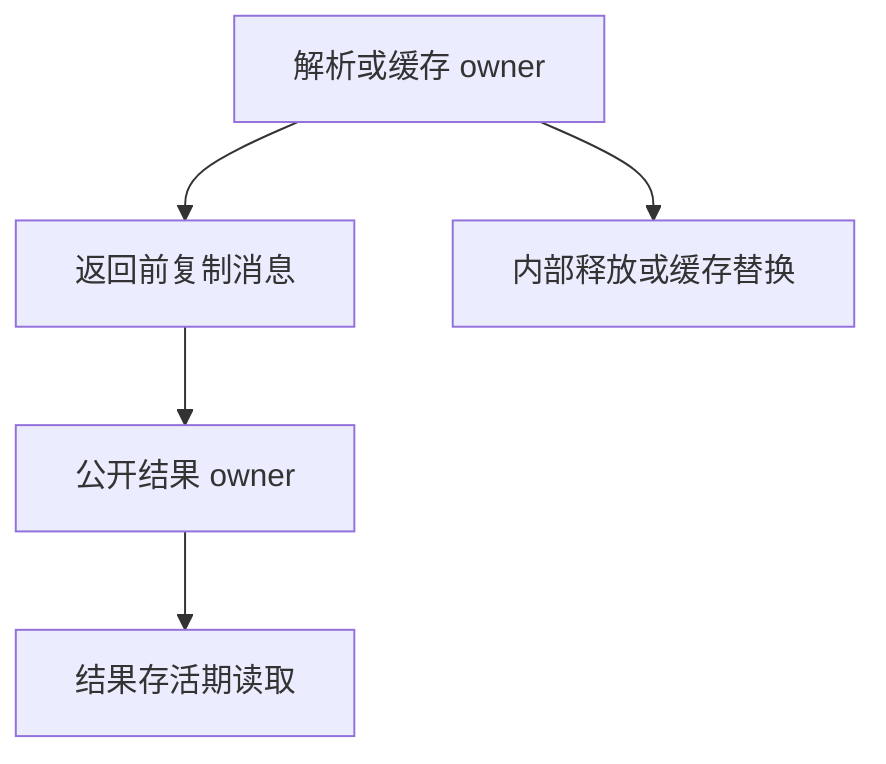
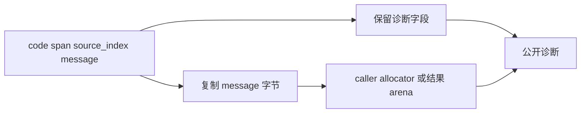

# 解析诊断拥有关系修复

## Intent

公开结果存活期间，诊断全文不依赖解析结果或缓存存活。

## Data

沿用测试线程既有 diagnostic_driver.zig。其 retained allocator 在逻辑释放时回写内存，已复现十三条公开返回路径的消息失效；不新增用例、不修改驱动。

## Edges

只修 compiler.Result 与 AnalysisResult 的消息拥有边界。前者沿用 clone(caller allocator) 与 Diagnostic.deinit；后者将消息复制至结果 arena，并清除独立 message_allocator。不能把局部 arena allocator 指针保存在 Diagnostic 中，也不扩展字段或 deinit 契约。

## Answer

root compile/ZX format 的 parse 错误独立 clone；root 两种项目预检错误构造自持 arena 的结果；Project.load 把缓存错误消息复制到项目结果 arena。保留 code/span/source_index，OOM 正常传播并清理。

修复后使用同一驱动核验全文；细粒度生命周期与 OOM 正式用例由测试线程负责。

## 核验结果与自我复核

在本目录执行 `zig build -Doptimize=safe -j2` 成功。既有驱动输出 `checked=13 failures=0`，全部诊断全文、code、span 与 source_index 保持正确；四种缓存替换在缓存释放前的检查也全部为 true。没有执行全量测试。

复制发生在公开结果与内部解析／缓存 owner 分离的位置，避免扩大整个 AST 的复制范围。新增分配的失败沿现有 OutOfMemory 返回，arena 的 errdefer 负责清理。本轮驱动验证消息生命周期，不等同于已完成逐分配点 OOM 覆盖；该部分交由测试线程的正式用例核验。
