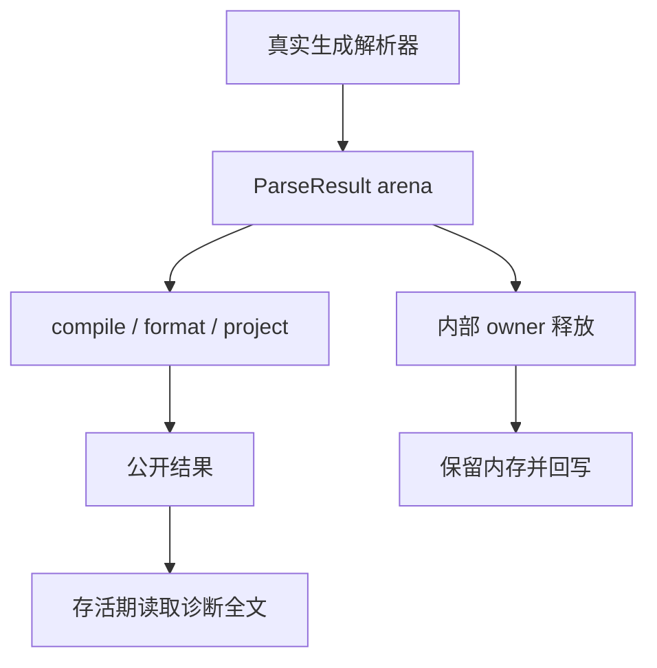
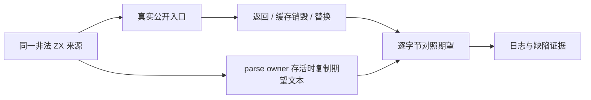

# 解析诊断生命周期核验计划

## Intent：最终目标

确认公开编译、格式化与项目分析入口的诊断文本能否在返回结果存活期间独立于解析 arena 和缓存读取；实际缺陷才反馈指定实现会话。

## Data：可用证据

固定 93084c88（相关生产代码与 a8895db4 相同）的 generated parse 将诊断文本复制到 ParseResult.arena。root.compileWithContext 与 ZX format 直接返回 Diagnostic 后 defer 销毁解析结果。root 项目早退及 project.load 的 cached diagnostic 也复制切片，返回 AnalysisResult 的 arena 不拥有文本。Diagnostic.clone 有显式独立释放契约，AnalysisResult.deinit 仅销毁 arena。只读审计尚不代替运行证据。

## Edges：边界与限制

先在 docs 保存最小可执行驱动。隔离检出使用真实 generated parser 及公共 compiler 模块；用保留底层地址并在逻辑 free 回写的 allocator 观察失效，不构造假 parser、不访问已解除映射的页、不改生产实现。成功标准必须读取全文字节，不能只看 code、span 或长度。编译/格式化、带/不带缓存的两层项目 API 分开记录；输入来源保持相同。正式测试之后依据真实证据最小加强，缓存成功结果生命周期不代替错误结果。

## Answer：交付格式与成功标准

交付驱动、接线草稿、固定来源指纹、真实日志和结果。缺陷须在调用返回或外部 cache 销毁/替换后表现为文本改变，且 parse result 本身持有 owner 时全文正确。反馈含准确入口、触发输入、期望/实际字节及最小拥有关系建议。生产修复后使用相同驱动验证，并覆盖分配失败与释放，不扩展运行库。

## 自我批判

释放回写是通用诊断工具，不是按特定消息设定的失败模拟。必须确认失效发生在 API 的内部 owner 结束，而非驱动提前销毁返回结果；只有观察到真实生成消息改变，才能反馈生产缺陷。静态 lint 消息没有同样 owner，不机械扩大修改范围。

## 实际复现记录

ReleaseSafe 驱动退出 1，13 条公开路径全部在结果存活期读到被释放回写的诊断消息。parse control 的全文为 expected an identifier，syntax，span 106:107；外层结果消息变成 22 个 0xa5。四条缓存替换路线在 cache 尚存活时即失败；控制 parsed owner 始终存活。首次更短来源在签名位置被拒绝，作为先行观察保留，最终来源采用合法签名、仅函数体非法。已按用户授权向指定实现会话反馈实际缺陷及两个生产 owner 文件的最小拥有关系建议；等待正式提交后重用相同驱动。

## 正式回归落点

在 compiler/tests/diagnostics/ 下按独立结果与项目结果分为 result_test.zig、project_test.zig，共享来源与精确诊断比较留 fixture.zig。原 integration_root 绑定公共 compiler 模块，区别于 frontend 测试中的模块别名。13 条已实际复现的入口/失效边界各有独立声明，两个 owner 的分配失败声明遍历既有路线；同时加强已有 ZX formatter lexical 错误声明的全文字节读取。code、span、source_index 全部保持精确期待；成功标准是正式修复后 Debug/ReleaseSafe 原集成门禁及格式化资源门禁通过、无泄漏。

## 同驱动修复验证

实现会话正式修复42cfbb39后，固定95854c90使用完全相同的最终驱动与输入，ReleaseSafe退出0、23/23构建步骤通过。13条路线全部保持完整消息、code和span；四条replacement在cache销毁之前与之后都保持文本。此结果是实际修复证据，尚不代替正式集成测试的泄漏与分配失败门禁。

## 最终正式门禁

固定95854c90下，Debug/ReleaseSafe编译器test各28/28步骤、372/372实例实际通过，三个测试运行步骤均无缓存；其中原5个集成实例与新增15个诊断独立声明合为20，前端的4个新增AST声明属于另一部分。13个入口/边界声明读取完整消息与精确code/span/source_index，两个OOM声明遍历全部路线并检查释放。原ZX导入格式库门禁各27/27步骤、10/10既有实例实际通过，三个测试步骤无缓存；其中原invalid import资源声明由长度检查增强为全文比较，未新增重复声明。所有测试、完整草稿与固定检出一致。

本部分只落正式测试和证据；两个生产owner修复由指定实现会话的42cfbb39提供。没有将失败驱动当成正式通过，也没有将同一批声明在两种模式下的重复执行相加为新增覆盖。生成诊断文本由正确结果owner持有，保留原字段和释放契约，未新增zxc运行库。
