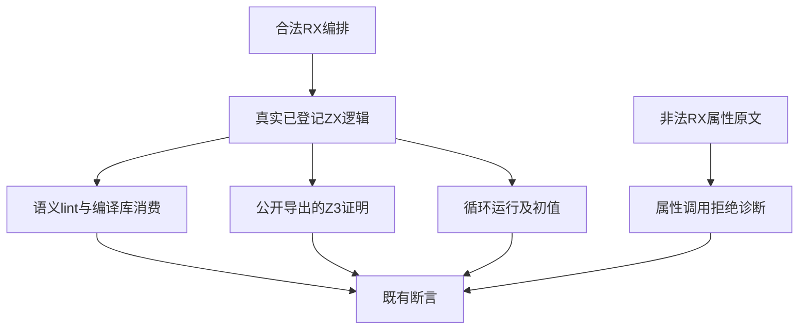

# 诊断与循环夹具契约同步计划

## Intent：最终目标

完成既有语义lint、公开验证与循环CLI夹具的最终RX契约迁移，保留源码不可访问、证明集合、状态可达检查、循环初值与属性调用拒绝的原验证目的。

## Data：可用证据

五份现有WIP仍有Call.name及ctx结果；loop_policy两条RX拒绝诊断已正确改为RX values cannot contain calls or callbacks。iterate正向材料已有真实calculate.zx，把计算从RX属性移到ZX逻辑层；成熟value_policy/fixtures/call.rx采取同一路线。五份合法RX每份一次调用，不存在结果冲突。各driver真实落盘来源并比较清理前字节；无需增加模块别名或生产注册。

## Edges：边界与限制

七份既有测试来源，无新增测试声明、不改生产、无UI。保留loop_policy两条非法属性原文；Store格式拒绝的replace变异不能格式化成成功；Route.service保持。保留compiled损坏digest/缺公开模块断言和不可变源字节，public proof的sha256名称/数量/Z3结果，ZX ensures(out == in)保持。iterate的真实calculate.zx与业务original/result/values/count/index保持，既有输入、循环结果和原输入不变断言保持。

五份合法RX只去Call.name并改真实$ctx.identity/flow/read/calculate。loop_policy现有两条诊断变更原样收录。保存迁移前WIP字节与最终同路径草稿，避免把历史中间材料误称正式通过。

## Answer：交付格式与成功标准

固定检出执行既有test-semantic-lint、test-public-verification、test-iterate-cli、test-loop-policy，ReleaseSafe、-j2，记录真实Z3与Node/Zig门禁结果、退出码和实际/缓存。七份正式/草稿/检出一致；成功后独立提交push并核验提交后哈希，不将原声明重复执行或脚本检查算新覆盖。

## 自我批判

loop迁到ZX是语言边界调整，仍需验证计算与原输入均保持；不能只删掉RX内联用例。合法材料修结果名不代表负例也应规范化，reachable Store故意格式变异和非法RX属性必须继续被拒绝。Z3不可用属于环境障碍，不能用预填unsat结果替代真实证明。

## 首轮诊断与最小扩展

固定f2c9ab2e首轮退出1；公开Z3证明、loop_policy、iterate、RX/workspace/compiled语义lint已通过。semantic_lint/project_test.ts的基础main与循环dependency仍使用带.zx的import，12项项目检查被更早的模块语法拒绝遮蔽。只增加这一份正式来源，保存原字节，并将两处import改为无后缀；文件map键、导出文件路径和真正缺失/格式变异/循环构造都保持，不改任何断言。

这份新增来源是既有项目lint测试的输入材料，原本不属于out→name WIP清单；完整门禁揭示后按当前导入契约同步，不能将先前失败归为生成parser缺陷或放宽预期。首轮日志完整保留，最终需重跑四个完整既有门禁。

## 最终执行记录

固定f2c9ab2e，设置既有ZXC_TEST_SOLVER，完整重跑四个既有门禁，ReleaseSafe、-j2，退出0，43/43构建步骤。八个Node驱动共82个实际声明实例，无运行缓存：语义lint options5、workspace15、compiled16、project13、RX18；公开验证8、loop_policy2、iterate5。无顶层Zig run test步骤。

七份正式来源、草稿、固定检出逐字节一致。真实Z3证明、编译库无原始源码消费、可达Store故意格式变异、缺失依赖与循环、文件字节不变、普通导入名与void调用、loop初值和原输入不变均通过。新增声明、目录案例及Test262审阅均0。第一轮完整失败日志保留，不计通过。

测试期间主检出新提交f1f35ffb标量loop栈局部值优化；本部分门禁仍固定在f2c9ab2e，不能声称已验证该新优化。后续根全量使用包含f1f35ffb的干净固定提交，另记实际结果。
